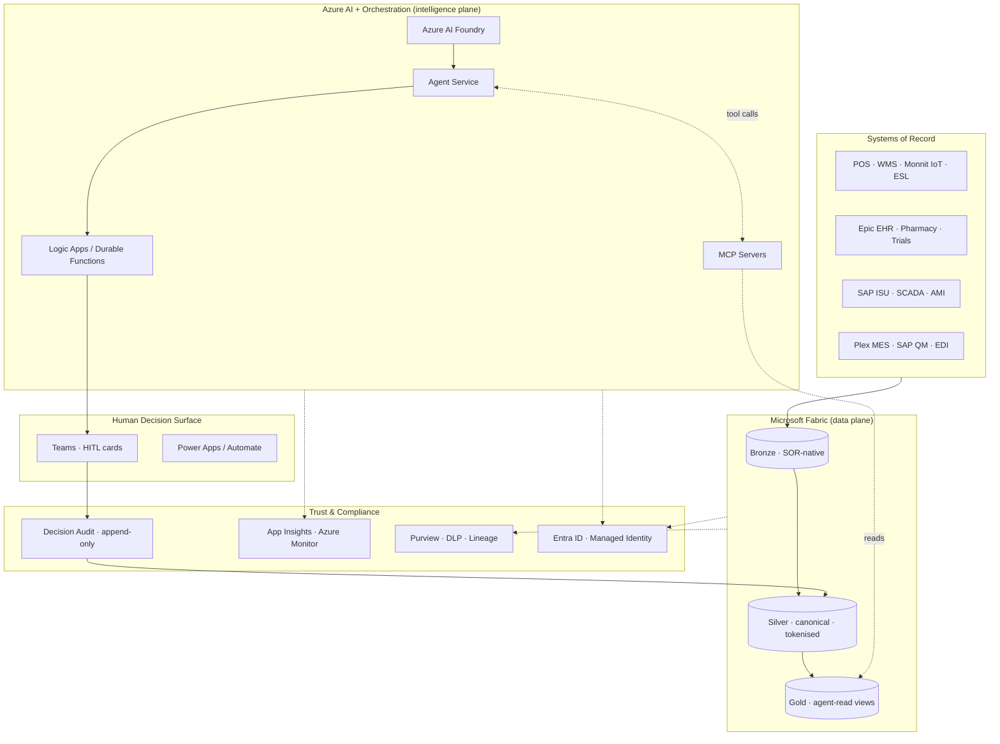
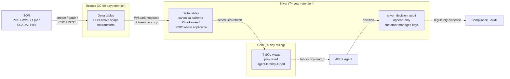
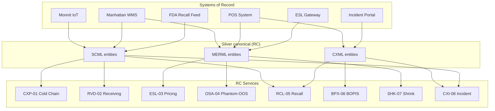
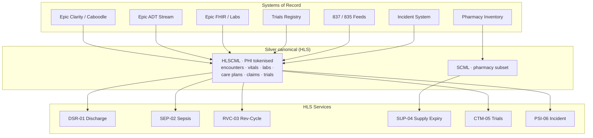
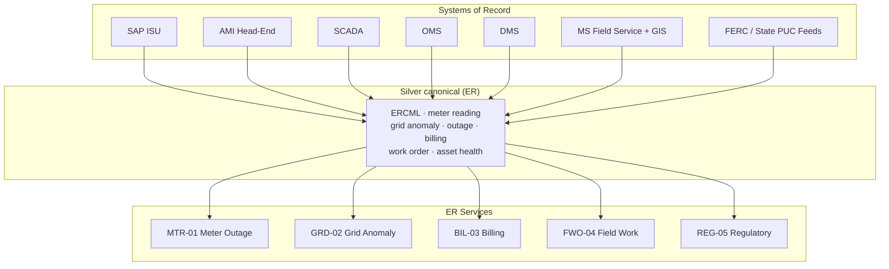

# APEX

## Agentic Platform for Enterprise eXecution

### Reinventing Enterprise Decision-Making on Microsoft

**A Comprehensive Solutions Reference for the Intelligent Enterprise**

**April 2026 · Version 1.0 · CONFIDENTIAL**
**Deloitte Microsoft Technology & Services Practice**

---

## Preamble

This is the strategic reference for APEX — the Agentic Platform for Enterprise eXecution. It is written for executives who approve the investment, architects who design the implementation, and delivery leads who run the programme. If you are a developer looking for code-level detail, open the companion *APEX Developer Implementation Guide* alongside this document.

APEX is a **multi-industry platform**. It defines seven Practices that span the enterprise economy, where a companion framework like AXLE goes deep on one vertical (automotive), APEX goes broad across verticals while keeping one contract, one data plane, and one intelligence plane:

- **RC — Retail & Consumer** (GA v1.2 · 8 services · Store 100 exemplar tenant)
- **HLS — Healthcare & Life Sciences** (GA v1.2 · 6 services)
- **ER — Energy & Resources** (GA v1.2 · 5 services)
- **AXLE — Automotive** (GA v1.2 · 5 services · complementary to the AXLE programme)
- **TMT — Technology, Media & Telecom** (Active-build · 7 services drafted · GA target Q3 2026)
- **TH — Travel & Hospitality** (Active-build · 6 services drafted · GA target Q2 2026)
- **ICE — Industrial & Commercial Equipment** (Active-build · 6 services drafted · GA target Q3 2026)

Current catalog: **24 GA services + 19 in build = 43 catalogued services**. AXLE is one of these seven Practices; for clients who commit to deep automotive transformation, the full AXLE Comprehensive Reference programme is available alongside. The two are complementary: APEX is the cross-industry platform; AXLE is an automotive-depth programme that a client can adopt alongside (or inside) their APEX footprint.

This document sets out **what APEX is, why it matters now, what it ships with, and how clients land it**. The structure mirrors the reference document pattern Deloitte uses for flagship platform offerings: forces of change, AI journey, maturity model, human element, platform architecture, industry-practice chapters, implementation roadmap, appendices.

---

## Table of Contents

**Executive Summary** — What is APEX · Value Proposition · The Ask · Service Portfolio at a Glance

**Forces of Change** — Five converging pressures that make agentic platforms inevitable

**The AI Journey** — Five eras of enterprise AI; where APEX fits

**Decision-Automation Maturity Model** — Five levels from dashboards to autonomous

**IT Simplification** — The platform thesis · before/after · Microsoft-native architecture

**The Human Element** — Fears · generational handoff · re-designing knowledge work

**The APEX Framework** — Four-layer manifest model · schemas · MCP servers · services · gates

**How to Read This Document**

**Part I — Foundation** (chapter 1, strategic overview)

**Part II — Industry Practices** (chapters 2–8: RC, HLS, ER, AXLE, TMT, TH, ICE)

**Part III — Cross-Practice Capabilities** (chapters 9–11: shared services, observability, governance)

**Part IV — Implementation & Delivery** (chapters 12–18: waves, onboarding, scaling, resource model, governance, change management, milestones)

**Part V — Future State** (chapters 19–26: four-tier innovation model, autonomous enterprise, multi-tenant scaling)

**Appendices** — Schema Reference · Service Registry · Personas · MCP Tools · Microsoft SKUs · Partner Ecosystem · Glossary

---

# Executive Summary

## What Is APEX?

APEX is a **manifest-driven, agentic platform** that turns enterprise events into resolved, auditable decisions. It runs on Microsoft Fabric as the data plane and Azure AI services as the intelligence plane, bound by a versioned contract that specifies every schema, every agent, every tool, every orchestration, and every human-in-the-loop gate.

Where traditional analytics answers *"what happened?"*, APEX answers three harder questions:

1. **What should happen next?** — agents reason over canonical data and propose an action
2. **Who must approve it, and under what rules?** — HITL gates mapped deterministically from the nature of the change
3. **What audit trail does the decision leave?** — every reasoning chain, tool call, and human approval is stitched into one traceable operation with append-only logs

An APEX deployment is not "a data platform with AI features bolted on." It is a **contract between data and decisions**, enforced in code and auditable end-to-end.

### APEX on Microsoft in One Picture



## The Value Proposition

For a client's CFO, COO, and CIO jointly, APEX delivers three measurable outcomes within the first twelve months:

- **Decision latency drops 5–10×**. Events that used to wait hours for a manager to triage are resolved in minutes with equal or better judgement quality, because the agent has done the data-gathering, correlation, and option-generation before the human even arrives at the decision.
- **Manager touch-time drops 60–80%**. Not because humans are removed from the loop, but because their time shifts from data-gathering to judgement. A typical APEX decision reduces manager touch from 15 minutes to 90 seconds.
- **Audit and compliance readiness is built-in**. Every decision is recorded with its inputs, its reasoning chain, its tool calls, its approver, and its rollback pointer. Regulatory filings that used to cost weeks of reconstruction ship in hours.

A typical APEX programme pays back in 12–18 months on decision-latency ROI alone, before counting write-off-avoided and regulatory-penalty-avoided.

## The Ask

APEX is a three-wave programme:

- **Wave 1 — Foundation** (months 1–6): Fabric workspace topology stood up, first Practice's canonical schemas deployed, 2–3 services live, first HITL decisions flowing.
- **Wave 2 — Intelligence** (months 7–12): full service catalogue of the first Practice live; cross-practice shared services (tokeniser, approvals, observability) instrumented.
- **Wave 3 — Optimisation** (months 13–18): second Practice added; cross-practice orchestrations introduced; tenant-scale KPIs trending on or above target.

Investment envelope per Practice: **$3–8M in Wave 1**, **$5–12M in Wave 2**, **$3–6M in Wave 3**. Expected ROI at month 18: **2–4× cumulative on Wave 1 services alone**.

## Service Portfolio at a Glance

APEX has **43 catalogued services** across seven Practices. 24 are GA today; 19 are in active or planned build, with GA targets through 2026.

**GA Practices (24 services):**

- **Retail & Consumer (RC): 8 services** — Cold Chain Excursion Response, Receiving Variance Dispute, ESL Pricing Integrity, Phantom-OOS Detection, Recall Response, BOPIS Exception Handling, Shrink & Void Anomaly, Customer Incident Triage.
- **Healthcare & Life Sciences (HLS): 6 services** — Discharge Ready Surveillance, Sepsis Early Warning, Revenue-Cycle Denial Recovery, Supply Expiry Management, Clinical Trial Matching, Patient Safety Incident.
- **Energy & Resources (ER): 5 services** — Meter Outage Detection, Grid Anomaly Response, Billing Exception Handling, Field Work-Order Optimisation, Regulatory Event Response.
- **Automotive (AXLE): 5 services** — Line-Down Triage, Quality Excursion Response, Supply-Chain Disruption, Recall Traceability, Plant KPI Drift.

**Build-and-Preview Practices (19 services drafted, GA 2026):**

- **Technology, Media & Telecom (TMT): 7 services** — Network Incident Response, Customer Churn Intervention, Content Rights Violation Triage, Subscription Exception Handling, Cloud Cost Anomaly Response, Ad Fraud Detection, 5G Service Outage Triage.
- **Travel & Hospitality (TH): 6 services** — Overbooking & Inventory Balancing, Disruption Recovery Orchestration, Loyalty Guest Rescue, Revenue-Management Anomaly, Guest Incident Triage, Housekeeping-Exception Routing.
- **Industrial & Commercial Equipment (ICE): 6 services** — Field Asset Failure Response, Spare-Parts Availability Triage, Warranty Claim Pattern Analysis, Contract-Renewal Revenue Protection, As-a-Service Utilization Optimization, Compliance Inspection Response.

Each service is one subscribable SKU: scenario + personas + KPIs + SLOs + artifact bundle + prerequisites + commercial terms. Clients subscribe to services, not to "APEX". A client may start with two services and grow to a portfolio of twelve or more across two or three Practices.

The catalogue's multi-industry span is a deliberate commercial choice. A Deloitte account team working a diversified conglomerate — a retailer with a pharmacy subsidiary and a trucking fleet, a media company with a cloud-product line, a healthcare system with a real-estate & hospitality arm — can subscribe that client to services across four or five Practices without buying four or five separate platforms. The canonical schemas, the shared MCPs, the unified audit, and the single identity plane are the reason this works.

---

# Forces of Change

Five forces are converging in 2026 to make agentic platforms not just possible but **operationally necessary**. APEX exists because these forces are real, measurable, and accelerating.

## Force 1: The Decision-Velocity Gap

Every enterprise function has the same story: the data arrives faster, the regulatory window shortens, the customer expects an answer sooner, but the **decision-maker capacity has not scaled**. A store manager in 2010 made fifty material decisions per shift. In 2026 the telemetry produces five hundred candidate decisions per shift. Humans triage what they can; the rest is silent drift — write-offs, compliance misses, customer churn.

Closing this gap by hiring is not viable. Closing it by "smarter dashboards" has been tried for a decade and has not worked — dashboards make the gap visible, not smaller. Closing it with agentic decision-automation is the only path that scales, **provided governance keeps pace**.

## Force 2: Agentic AI Has Reached Inflection

In late 2024 the combination of reasoning-model quality, tool-use reliability, and enterprise-grade agent runtimes crossed a threshold. Before the threshold, agents were a research demo. After it, agents are a production platform. By 2026 the question is no longer "can agents reason well enough?" — it is **"can your organisation operate agents responsibly and at scale?"**

This is not a technology question. It is a governance, contract, and observability question. APEX exists because the technology is ready but the **operating model** is not, and someone has to build the operating model.

## Force 3: Data Sovereignty and PII Complexity

Every industry APEX serves now faces an intersecting web of data obligations: GDPR, CCPA, HIPAA, PCI DSS, FDA 21 CFR Part 11, FERC reliability standards, ISO 27001, SOC 2 Type II, and increasing data residency requirements by nation and by sector.

A decision that crosses any of these boundaries without a documented contract is a compliance incident waiting to happen. APEX's manifest-and-contract model is not a convenience — it is **the minimum bar** for operating an agentic platform in regulated industry.

## Force 4: Regulatory Acceleration

The regulatory environment in every APEX Practice has shortened response windows and raised audit-evidence requirements. In healthcare, discharge and sepsis reporting moved from days to hours. In retail, FDA recall response expected in hours not days. In energy, FERC reliability filings shortened. In manufacturing, recall traceability windows have compressed.

None of these regulators will accept "our systems couldn't keep up" as a defence. APEX's **decision audit row** is designed to be regulatory evidence — stitched to the triggering event, every tool call, every approver, every action — and retained under customer-managed keys for the required window.

## Force 5: The Knowledge-Worker Capacity Shortage

Demographics are against us. Experienced knowledge workers — senior nurses, seasoned store managers, veteran billing analysts, long-tenured grid operators — are retiring faster than replacements are being trained. The institutional judgement that handled yesterday's ambiguous cases is walking out the door.

APEX's HITL gate model is designed to **preserve and encode** the judgement of today's experts. Every decision flow captures not just the approver's answer but the rationale; the approval audit rows are training data for the next generation of narrower agents that absorb the patterns. APEX is, among other things, a **knowledge-capture platform**.

## Forces of Change: Summary

| Force | Pressure | APEX response |
|---|---|---|
| Decision-velocity gap | Events outpace human triage | Agents do data-gathering; humans judge |
| Agentic AI inflection | Technology is ready; governance lags | Manifest-driven contracts + gates |
| Data sovereignty / PII | Regulators require contracted data flows | Canonical Silver + Purview + tokenisation |
| Regulatory acceleration | Windows shortened; evidence demanded | Decision audit rows as regulatory evidence |
| Knowledge-worker shortage | Experts retire; handoff is unfinished | HITL captures rationale; seeds narrower agents |

## How the Forces Manifest by Practice

Each force has a Practice-specific shape:

| Practice | Most acute force | Manifestation |
|---|---|---|
| RC | Decision-velocity gap | 500+ decision candidates per store per shift; human triage reaches < 20% |
| HLS | Regulatory + knowledge shortage | 21 CFR Part 11 evidence requirements + nursing workforce crisis |
| ER | Regulatory + velocity | FERC reliability windows + second-level SLO demands |
| AXLE | Velocity + knowledge shortage | Line-down $/minute + retirement of experienced tool-and-die experts |
| TMT | Velocity + AI inflection | Network events at millisecond cadence + subscription churn elasticity |
| TH | Velocity + customer-experience | Minutes-to-plan on disruption; social-media amplification |
| ICE | Knowledge shortage + customer-experience | Field-service workforce ageing; uptime-as-commercial-promise |

The cross-industry scope is APEX's asymmetric commercial advantage: a diversified client whose CEO sits at the intersection of three of these force profiles can subscribe to services across three Practices and get one governance model, one audit framework, and one identity plane.

---

# The AI Journey

Enterprise AI moves in eras. Each era built on the previous one; none fully replaced it. APEX is the operating platform for **Era 5**.

## Era 1 — Rules & Automation (1980s–2010)

Rule engines, workflow automation, BPM. Decisions were encoded as trees of `if` clauses by analysts. Worked for narrow, high-volume, well-understood problems. Broke on ambiguity.

## Era 2 — Analytics & Business Intelligence (2010–2018)

Data warehouses, OLAP cubes, dashboards. The era of "let the operators see more data and they will decide better." Gave decision-makers visibility but did not reduce their burden; if anything, the dashboards added one more meeting.

## Era 3 — Predictive Machine Learning (2018–2023)

Models trained on historical data to predict outcomes: churn, fraud, failure, demand. Worked on narrow, well-labelled problems. Required specialist MLOps teams. Did not generalise — each model a bespoke project.

## Era 4 — Generative AI & Copilots (2023–2025)

LLMs enter the enterprise. Copilots augment individual productivity. The era of "chat with your data." Real value, but mostly at the individual level — the organisational operating model did not change.

## Era 5 — Agentic AI & Autonomous Operations (2025–2030)

Reasoning-tier models plus tool-use plus orchestration runtimes plus governance. Agents become **operational actors** with bounded authority, traced decisions, and defined human escalation. This is the era APEX is built for.

## AI Integration Levels

Within Era 5, organisations sit at one of five integration levels. Move up one level per programme wave.

```
Level 0   No AI in the decision path
Level 1   AI as insight (dashboards, recommendations)
Level 2   AI as assistant (Copilot in Teams, Word, Excel, code IDEs)
Level 3   AI as advisor (structured recommendations on specific decisions)
Level 4   AI as agent with HITL (APEX target — Wave 2 end state)
Level 5   AI as autonomous operator (North Star — selected services only)
```

Most clients enter APEX at **Level 1 or 2** and exit Wave 1 at **Level 3**, Wave 2 at **Level 4**, and Wave 3 ready to pilot **Level 5** on the safest services.

---

# Decision-Automation Maturity Model

The APEX maturity model replaces the Industry 4.0 model used for manufacturing. It is the single self-assessment we run with clients on day one.

```
┌────────────────────────────────────────────────────────────────────┐
│ Level 1 · DASHBOARDS                                               │
│   Humans read, humans decide. Latency: hours.                      │
│   Failure mode: silent drift; backlog builds; outliers missed.     │
├────────────────────────────────────────────────────────────────────┤
│ Level 2 · ALERTS                                                   │
│   System pushes signals; humans decide. Latency: minutes-to-hours. │
│   Failure mode: alert fatigue; false positives teach operators to  │
│   ignore; true positives get lost in the noise.                    │
├────────────────────────────────────────────────────────────────────┤
│ Level 3 · RECOMMENDATIONS                                          │
│   System proposes specific actions with rationale; humans approve. │
│   Latency: minutes. Manager touch-time: 3–5 minutes per decision.  │
│   Failure mode: recommendations not trusted; approval backlog;     │
│   rationale unverifiable.                                          │
├────────────────────────────────────────────────────────────────────┤
│ Level 4 · ORCHESTRATED HITL  (APEX TARGET)                         │
│   Agents act within gates tuned to risk class. Bulk of decisions   │
│   are ACK_ONLY or ZERO_TOUCH; the consequential ones are HITL.     │
│   Latency: seconds-to-minutes. Manager touch-time: 60–90 seconds   │
│   per HITL decision. Full audit trail.                             │
├────────────────────────────────────────────────────────────────────┤
│ Level 5 · AUTONOMOUS  (NORTH STAR)                                 │
│   Selected high-volume, well-bounded services run with no gate at  │
│   steady-state; humans monitor exceptions only. Latency: seconds.  │
│   Reached only after 6+ months at Level 4 with proven track        │
│   record and formal audit approval.                                │
└────────────────────────────────────────────────────────────────────┘
```

### Self-Assessment: Where Is Your Enterprise Today?

Most APEX clients, on day one, sit at **Level 1 or Level 2** for the function they want APEX to transform. A smaller number are at **Level 3** already — typically where a prior programme shipped recommendation systems that were partially adopted.

**Wave 1 targets Level 3.** Agents reason and propose; humans approve every decision. Trust is built by volume — the first 500 approvals are typically unanimous-or-close-to-it, which earns the programme the credibility to proceed.

**Wave 2 targets Level 4.** Once decision quality is proven on a service, its HITL gate is down-shifted for the bulk cases (ACK_ONLY) while keeping HITL on the consequential cases (high-$, high-regulatory, high-customer-impact). Manager touch drops by an order of magnitude.

**Wave 3 targets pilot Level 5** on a narrow subset of services where the cost/benefit of a gate is clearly negative (e.g., phantom-OOS restocking decisions at $5 of inventory risk) — with an audit review at 6-month intervals.

---

# IT Simplification

## The Platform Thesis

Before APEX, a typical Fortune 500 enterprise has **twelve to twenty point tools** for decision-support in each function: dashboards, alerting systems, recommendation engines, ticketing, audit archives, communications apps, approval workflows, and so on. Each tool has its own data model, its own identity layer, its own operations discipline, and its own vendor contract.

After APEX, the enterprise has **one platform** with many services. The data model is canonical. The identity layer is Entra ID. The operations discipline is one App Insights workbook per tenant. The vendor contract is Microsoft plus Deloitte-delivered Practice content.

## Before APEX vs. After APEX

| Concern | Before APEX | After APEX |
|---|---|---|
| Data model | 20 product-specific models | One canonical schema family per domain |
| Identity | Per-tool local identity + SSO patchwork | Entra ID + managed identity end-to-end |
| Decision audit | Distributed across tool logs | One append-only `silver_decision_audit` table |
| Compliance evidence | Manually reconstructed | Query a single audit table |
| Tool sprawl | 12–20 point tools per function | 1 platform, multiple services |
| Onboarding new function | 12–18 months; custom build | 4–6 weeks; subscribe to catalog |
| Vendor relationships | Dozens | Microsoft + Deloitte |
| Cost transparency | Per-tool, hard to aggregate | Per-tenant, per-service, fully tagged |

## APEX as the Intelligence Layer

APEX does not replace the client's Systems of Record. ERP stays. WMS stays. EHR stays. SCADA stays. POS stays. APEX sits **on top** as the intelligence layer — canonicalising SOR data in Silver, exposing Gold feature views to agents, orchestrating decisions, and closing the loop back to the SOR via controlled write paths (e.g., ledger staging, work-order creation).

This thesis matters because it bounds the ask. APEX is not an eighteen-month rip-and-replace. It is a four-to-six-month overlay that starts producing measurable value in months, not years.

## The Microsoft-Native Stack

APEX runs on a seven-layer Microsoft-native stack. Every layer is a product the client either already has in their enterprise agreement or can add through their existing Microsoft relationship.

```
L7  Experience         Teams · Power Platform · Copilot · M365 · Associate mobile
L6  Orchestration      Azure AI Agent Service · Logic Apps · Durable Functions
L5  Intelligence       Azure AI Foundry · Azure OpenAI · Azure AI Search · Embeddings
L4  Protocol           MCP servers (Container Apps / Functions)
L3  Data plane         Fabric Lakehouse · Warehouse · Eventstream · OneLake
L2  Integration        Data Pipelines · Dataflow Gen2 · Mirrored Databases
L1  Foundation         Entra ID · Managed Identity · Purview · App Insights · Azure Monitor
```

Every arrow between layers is an identity-authenticated, trace-instrumented, managed-by-infrastructure-as-code boundary. No weak seams.

---

# The Human Element

A platform that replaces decisions without involving the humans who used to make them fails — politically, operationally, and often legally. APEX is designed around the opposite thesis: **agents change the nature of knowledge work, not the presence of knowledge workers.**

## The Fear Factor

On every APEX engagement, the same four fears surface in the first weeks. They must be answered directly.

### Fear 1: "Will AI replace me?"

The honest answer: your role changes, but it doesn't disappear — and the new role is higher-leverage than the old one.

A store manager's shift before APEX was 65% data-gathering (walking aisles, reading dashboards, opening spreadsheets) and 35% decision-making. After APEX it inverts: 15% data-gathering, 85% judgement. The role becomes consequential in a way it wasn't when the operator spent most of the shift chasing data. Empirically, the manager who was going to quit stays longer after APEX ships, because the work becomes more interesting.

### Fear 2: "Can I trust an agent's decision?"

The honest answer: you will not be asked to. You will be asked to **approve** the agent's proposed decision, with full visibility into how it reached it.

Every APEX HITL card shows the reasoning chain, the tools called, the data read, and the specific recommendation. The approver can approve, modify, or reject. In Wave 1, the HITL gate is wide — every consequential decision goes through a human. In Wave 2, patterns emerge: decisions of class X are unanimously approved 98% of the time, so they downgrade to ACK_ONLY. The approver did not lose control; they redirected their attention to the decisions that still warrant it.

### Fear 3: "What about auditability and compliance?"

The honest answer: auditability is better than what you have today, not worse.

Today's decision audit is mostly implicit: a Teams thread, an email chain, a spreadsheet comment, sometimes a notebook. Reconstructing a decision for a regulator is a week's work. Under APEX, the decision audit is explicit: one row in a Silver table, with operation_Id, input_hash, output_hash, decider_oid, rationale, and rollback pointer. Customer-managed keys. Immutable. Query-able. Regulators have responded well.

### Fear 4: "We've tried this before and it failed."

The honest answer: it probably did, and probably for one of three reasons — the data wasn't canonical, the governance wasn't contractual, or the change management was underfunded. APEX addresses all three. But the fear should not be dismissed; it should be interrogated, and the specific prior-failure-modes should be named in the kickoff workshop.

## The Generational Handoff

The experienced operators in every client organisation are also, almost by definition, the people whose judgement has not been captured in any system. They retire and the institutional knowledge walks out the door. APEX's HITL capture is the single most underappreciated aspect of the platform: every approved decision encodes expert judgement as training data for the next generation of narrower agents, which absorb the patterns the expert never wrote down.

This is why the hardest-to-automate decisions are also the ones that should go through APEX first. The expert's judgement becomes institutional memory only when it is observed, logged, and associated with outcomes.

## Persona Day-in-the-Life Transformations

The human-element commitment becomes concrete when seen through specific personas' lived experience.

### The Store Manager on Duty — Marisol's Shift, Before and After

**Before APEX (Marisol, 6:30 AM):** arrives at the store, opens the temperature log, sees the reefer alert from overnight, walks to the reefer, observes the units, calls the regional buyer who is 300 miles away, waits for a response, writes off the dairy endcap wholesale, fronts it, misses opening by 4 minutes, spends the first hour of customer traffic apologising to her shift team.

**After APEX (Marisol, 6:08 AM):** receives the Cold Chain card on her phone over coffee at home, sees the save-viable / destroy split already proposed at $534 write-off vs. $1,847 blanket, reviews the photo-documented reefer-14 state, approves the targeted write-off, texts her team lead the action plan, arrives at 6:40, is on the floor at 6:55 with the dairy endcap re-fronted by her team, opens the doors at 7:00 as scheduled. She has spent 90 seconds on a decision that used to consume half her morning.

Over the course of a shift she sees 4-6 similar HITL cards. Each is ninety seconds to two minutes of her focus. The rest of the day she spends on the work her operations role requires: customer conversations, team development, store walks, and — increasingly — thinking about things that dashboards never surfaced.

### The Charge Nurse — Samantha's Shift, Before and After

**Before APEX (Samantha, 07:00 AM):** starts shift review reading 18 patient charts, manually checking orders, labs pending, consult status. She makes rough discharge-readiness predictions from experience. She is 65% accurate; the other 35% is bed-management chaos later in the day.

**After APEX (Samantha, 07:00 AM):** opens the DSR-01 ACK_ONLY notifications on her tablet — 18 patient dispositions pre-computed, ranked by confidence, with evidence citations. She reviews the low-confidence cases first (that's where her judgement adds most), and spot-checks the high-confidence ones. The agent has done the chart-walking for her. Bed management starts ahead of the day rather than chasing it. At 11:00 AM, a SEP-02 HITL card fires for a patient in Room 412 — an elevated sepsis pattern she hadn't caught yet. She reviews, calls rapid response, antibiotics go in 45 minutes earlier than they would have. Two years from now when that patient returns to thank her, APEX has nothing to do with the thank-you, and that's by design.

### The Grid Operations Engineer — David's Shift, Before and After

**Before APEX (David, 03:47 AM):** night-shift alarm on SCADA. He reads the alarm, pulls up the one-line diagram, reasons through the topology, remembers a similar event two months ago, calls a colleague for a second opinion, directs the breaker sequence, watches the OMS for customer impact. 6-12 minutes of human reasoning under load.

**After APEX (David, 03:47 AM):** the GRD-02 card lands with the classification already done — line-to-ground fault on feeder 22B, predicted customer-minutes-interrupted 14,000 under proposed action, recommended breaker sequence specific and ready. He reviews the reasoning, agrees with the proposed sequence, executes. 45 seconds to decision; the proposed action is based on the specific topology AND the pattern of recent similar events AND the weather-derived context he would have had to assemble manually. After the restoration, the causal agent's post-event analysis identifies a specific cable-condition contributor the maintenance team hadn't flagged. That goes into the planned work queue.

### The Plant Supervisor — Carlos's Shift, Before and After

**Before APEX (Carlos, 09:14 AM):** Line 6 halts. He walks down to the press, talks to the operator, looks at the control panel, suspects a die problem, calls tool-and-die, waits, the tool-and-die lead arrives and disagrees, they investigate further, ten minutes later they agree it's a material issue with the current coil, twenty-five minutes of line-down time and counting.

**After APEX (Carlos, 09:14 AM):** LDT-01 card lands in 90 seconds with the classification — material issue, coil 11-7842, recommended action: switch to coil 11-7850 from the buffer, dispatch a material-quality engineer to inspect 11-7842. The supervisor reviews, agrees, executes. Line restart at 09:22. Eight minutes of line-down, not 30+. The material-quality investigation happens in parallel; the next coil gets vetted before use.

These four stories are the APEX operating model. They are not hypothetical. They are descriptions of the Wave 1 production state at early APEX clients across the GA Practices.

---

# The APEX Framework

The platform itself is organised in four lifecycle layers, five artifact lanes, a canonical schema model, an MCP server taxonomy, a service catalogue, and a HITL gate model. This section is a strategic survey; the companion Developer Implementation Guide is the depth reference.

## The 4-Layer Manifest Model

```
L1  CONTRACT    apex-core — specification, validators, bump rules
L2  EDITION     a versioned release of L1 (e.g., Core v1.2.0)
L3  PRACTICE    an industry bundle: RC · HLS · ER · AXLE
                 (schemas + agents + MCP + orchestrations + gates + services + personas + KPIs)
L4  TENANT      a client instance; pins a Practice release; subscribes to services
```

Every change to APEX flows top-down. A Core change ripples to every Edition; an Edition change ripples to every Practice; a Practice release lands at a client only when the tenant pins it. Clients are never forced to upgrade on APEX's schedule; they upgrade on their schedule, within a policy.

> **Terminology note.** Earlier APEX material used the term *Fleet* for L3. As of Core v1.2.1 the canonical term is *Practice*, because L3 bundles much more than agents — it includes the full complement of artifacts listed above. Backward-compatible shims retain the old name in code through Core v1.2.x; removed in Core v1.3.

## The Canonical Schema Model

Every Practice carries one or more **canonical schema families** — versioned JSON/Delta definitions that decouple agents from SOR variation. A client with Manhattan WMS and a client with SAP EWM both produce rows that look identical at the `MERML.STORE_INVENTORY_POSITION` layer.

- **SCML** — Supply-Chain Markup Language (receiving, cold chain, recalls, lot trace) · RC + HLS + AXLE
- **MERML** — Merchandising Markup Language (prices, inventory, markdowns, voids) · RC
- **CXML** — Customer Experience Markup Language (orders, loyalty, incidents, substitutions) · RC + HLS
- **HLSCML** — Healthcare & Life Sciences Markup Language (encounters, observations, claims) · HLS
- **ERCML** — Energy & Resources Markup Language (meter readings, grid events, work orders) · ER
- **AXLECML** — Industrial & Manufacturing Markup Language (production events, quality, genealogy) · AXLE

Each schema family has its own manifest, its own SemVer cadence, and its own backward-compat rules. Every entity carries the five-field canonical envelope (`event_id`, `event_ts`, `entity_id`, `source_system`, `source_system_ts`) that makes cross-entity joins possible.

## The MCP Server Taxonomy

APEX uses the open Model Context Protocol (MCP) as the typed contract between agents and the outside world. Servers are organised into three classes:

- **Domain servers** — one per schema family (`scml-mcp`, `merml-mcp`, `hlscml-mcp`, `ercml-mcp`, `axlecml-mcp`, `cxml-mcp`)
- **Utility servers** — cross-cutting platform services (`fabric-mcp`, `policy-mcp`, `telemetry-mcp`, `approvals-mcp`, `tokenizer-mcp`, `ledger-mcp`)
- **External servers** — wrapped third-party sources (`fda-mcp`, `ferc-mcp`, `edi-mcp`, `vendor-portal-mcp`, `pharma-recall-mcp`)

This taxonomy is not cosmetic. Domain servers segregate identity (PHI-read grants stay within `hlscml-mcp`). Utility servers isolate operational concerns. External servers contain third-party dependency blast radius.

## The Service Model

A **service** is the commercial unit. One service = one scenario + one primary persona + measurable KPIs + committed SLOs + a bundle of artifacts + prerequisites + tiered commercial terms. Clients subscribe to services, not to APEX wholesale. A service manifest is a first-class APEX artifact, validated by the same tooling that validates schema and practice manifests.

The full 24-service catalogue is at **Appendix B**.

## The HITL Gate Model

Every decision an APEX service produces resolves through a gate. Four gate kinds, mapped from the nature of the change:

| Gate | Behaviour | Typical bump |
|---|---|---|
| **ZERO_TOUCH** | Apply silently; log as auto-taken | PATCH |
| **ACK_ONLY** | Apply + notify; acknowledgement optional | MINOR |
| **HITL** | Present + wait for approve/reject/modify | MAJOR |
| **ESCALATION** | Route to a cross-functional owner | context-dependent |

The mapping from SemVer bump to gate kind is **deterministic by default** and **overridable by tenant policy**. A high-risk tenant (e.g., a HIPAA health system) may set `MINOR → HITL` globally. A low-risk tenant may set `MINOR → ZERO_TOUCH` on selected services. The default matrix is conservative.

## Medallion Architecture in APEX Terms

- **Bronze** — landed SOR data in SOR-native shape, 30–90 day retention, read only by Silver transforms
- **Silver** — canonicalised, tokenised, contract-compliant; 7+ year retention; source of truth
- **Gold** — materialised feature views; 90 day rolling; agent-read path only

Agents never read Bronze. Agents rarely read Silver. Agents primarily read Gold, via an MCP tool, under managed identity, with trace instrumentation and tenant-scoped RLS.

### Medallion Data Flow



### The HITL Gate Decision Model

```mermaid
flowchart TB
  Event[Triggering Event] --> Classify{classify-bump}
  Classify -->|"PATCH"| ZT[ZERO_TOUCH]
  Classify -->|"MINOR"| AO[ACK_ONLY]
  Classify -->|"MAJOR"| HI[HITL]
  Classify -->|"cross-functional"| ES[ESCALATION]
  ZT -->|"apply silently · log"| Audit
  AO -->|"apply · notify persona"| Audit
  HI -->|"present · wait for approver"| Decision{Approver}
  Decision -->|"approve"| Apply[Apply decision]
  Decision -->|"modify"| Applym[Apply modified]
  Decision -->|"reject"| Reject[Log reject · no action]
  ES -->|"route to cross-functional owner"| Owner[Legal · Comms · Regulatory]
  Owner --> Decision
  Apply --> Audit[silver_decision_audit]
  Applym --> Audit
  Reject --> Audit
  Audit -->|"policy-mcp: tenant policy can override default gate"| Gate[Per-tenant gate policy]
```



### The Platform in Numbers

| Dimension | Current |
|---|---|
| Practices shipped | 4 (RC · HLS · ER · AXLE) |
| Services catalogued | 24 |
| Canonical schema families | 6 (SCML · MERML · CXML · HLSCML · ERCML · AXLECML) |
| Canonical entities | 79 |
| Domain MCP servers | 6 |
| Utility MCP servers | 6 |
| External MCP servers | 10+ |
| Personas catalogued | 22 |
| Core edition | v1.2.1 (current) |

By the end of 2026 this roadmap grows to: 5 Practices (TMT added), 30+ services, 10+ domain MCPs.

---

# How to Read This Document

This document has five parts plus appendices.

- **Executive readers** read the Executive Summary plus the chapter introduction for each Practice in Part II. Ten to fifteen minutes total.
- **Architects** read Parts I, III, and IV end-to-end, plus the Practice chapter most relevant to their client engagement. Two to three hours.
- **Delivery leads** focus on Part IV (Implementation) and the Practice chapters in scope. One to two hours.
- **Client account teams** use the Executive Summary plus Part II as the service catalogue for commercial conversations.

Every chapter follows the same eight-section pattern, inherited from Deloitte's reference-document discipline: **the Story · Forces Driving Change · the Human Reality · AI Integration Maturity · Decision-Automation Positioning · KPI Dashboard · the Solution · Implementation & Transformation**. The repetition is the point — once a reader has the pattern, they can navigate any chapter quickly.

---

# Part I — Foundation

## 1.1 The Story

It is 6:16 on a Tuesday morning. At Store 100 in Senatobia, Mississippi, a dairy reefer has been drifting above the 41°F threshold for four hours. The store manager, Marisol Reyes, is not yet on-site — doors open at 07:00. Without APEX, she will arrive at 06:45, notice the temperature log, and have thirty minutes to triage 412 units of dairy inventory before customers arrive. Her options are coarse: dump it all, sell it and hope, or phone the regional team and miss the open. The write-off will be $1,847 if she dumps, an indeterminate amount if she sells, and a disciplinary event if she opens late.

With APEX, by the time Marisol arrives at 06:08 (having been paged by a Teams card at 06:05), the Cold Chain Excursion Response service has already done the work. The excursion is classified, the inventory is segmented into 291 save-viable and 121 destroy units by product category and the FDA food safety threshold, a targeted write-off of $534 is staged in the ledger, and the HITL card is waiting for her approval. She reads the card on her phone over coffee at 06:10, approves at 06:11, and is on the floor at 6:20 — eight minutes ahead of yesterday's schedule, with 71% of the inventory saved.

This story is not a demo. It is the shift that APEX service `APEX-RC-CXP-01` runs at Store 100 every time a reefer breaches. The entire transaction — detection, reasoning, HITL gate, decision, audit, ledger write — completes in under eight minutes, with 90 seconds of Marisol's time.

This is Part I's argument: decision-automation inside a gated, auditable platform is the **new operating baseline**. Not an aspiration. The baseline.

## 1.2 Forces Driving Change

The five forces from the framework chapter land differently in each client engagement. In Part I we consider them at the enterprise level — the C-suite's view. The key pattern to recognise in a kickoff workshop is which **two or three** forces are most acute for this client. That ordering determines the first-Practice-first-service prioritisation.

## 1.3 The Human Reality

At enterprise level, the human reality is a chief executive who is accountable for decisions their organisation is not making fast enough, a CIO whose tool portfolio has outgrown the operating model, a CFO whose audit readiness is a quarterly fire drill, and a COO whose frontline operators are leaving faster than they can be replaced. APEX addresses all four.

## 1.4 AI Integration Maturity

The enterprise-level AI integration maturity is usually heterogeneous across functions. Retail operations may be at Level 2, finance at Level 3, clinical at Level 1, compliance at Level 1. APEX does not require enterprise homogeneity; it advances the functions that subscribe, function by function.

## 1.5 Decision-Automation Positioning

Part I anchors the platform at Level 4 (Orchestrated HITL) as the Wave 2 end state. The CEO's strategic narrative to the board is "we moved our operations from Level 2 to Level 4 on the decisions that matter most, in twelve months, with full auditability." That is a defensible board narrative.

## 1.6 KPI Dashboard

Four enterprise KPIs we track across every Practice:

- **Decision latency p95** — target 5–10× improvement from baseline in the first twelve months
- **Manager touch-time per consequential decision** — target 60–80% reduction
- **Audit readiness (time to reconstruct a decision)** — target hours-to-minutes, not weeks
- **Service subscription depth** — number of services live per tenant; target 8+ by month 18

## 1.7 The Solution: APEX Platform

Part I's solution is the platform itself — the four-layer manifest model, the canonical schemas, the MCP taxonomy, the service catalogue, the HITL gate model, and the Microsoft-native stack. Individual Practices elaborate in Part II.

## 1.8 Implementation & Transformation

Wave 1 decisions — which Practice first, which service first, which tenant first — are the make-or-break moment. The pattern that works: **start with the Practice whose pain is most acute and whose SOR data is most accessible**. For most retail clients that is RC Cold Chain or OSA. For most health systems it is HLS Discharge or Denial. For utilities, Meter Outage. For manufacturers, Line-Down Triage.

Pick one Practice. Pick two or three services within it. Run Wave 1 to ship them. Use the Wave 1 proof to fund Wave 2.

---

# Part II — Industry Practices

## Chapter 2: Retail & Consumer (RC) Practice

### 2.1 The Story

At 8:36 on a Tuesday morning, at a regional grocery chain, customers begin ringing up promotional pricing on a SKU that shouldn't be on promotion. The electronic shelf label gateway has been stale since 03:00; the ERP scheduled the regular price to take effect at 06:00; 127 tags never received the update. Four rings later — four customers, four price complaints just waiting to happen — the POS anomaly detector flags the pattern, the `APEX-RC-ESL-03` service activates, the pricing analyst gets a HITL card naming exactly which gateway is affected and which 127 SKUs to force-refresh, and the issue is contained before a fifth ring.

Retail runs on hundreds of signals per store per minute. Without APEX, a handful of them reach a human in time to matter. With APEX, the ones that are consequential are triaged, staged, and presented; the rest are auto-resolved or logged for review.

### 2.2 Forces Driving Change

Retail has every one of the five forces operating at once, but three dominate:

- **Decision-velocity gap** is acute in retail operations. Store managers face a firehose; most of it sticks to dashboards nobody watches.
- **Regulatory acceleration** on food safety and recalls is sharp. FDA recall response windows have compressed; customer contact expectations have tightened.
- **Knowledge-worker shortage** on the retail frontline is a demographic emergency. Tenured store managers and department leads leave for roles with less chaos; replacements are green.

### 2.3 The Human Reality

The RC persona who benefits most is the Store Manager on Duty — "Marisol" in the Store 100 examples throughout this document. Marisol does not want to be replaced by an agent. She wants the platform to handle the data-gathering so she can spend her shift on the things that require judgement: disciplinary conversations, customer service escalations, team coaching, the unusual. APEX's pitch to Marisol is "you will spend your shift on the work you trained for, not the work the dashboards force on you."

Secondary RC personas: Regional Operations Director, Merchandising Analyst, Loss Prevention Lead, Customer Care Agent, Compliance Officer. See Appendix C for role specifications.

### 2.4 AI Integration Maturity

Typical RC baseline: **Level 2** (alerts in a dashboard). Wave 1 target: **Level 3** (HITL recommendations on first 2–3 services). Wave 2: **Level 4** (gate-tuning on mature services). Level 5 pilots in Wave 3 are typical for Phantom-OOS Detection (low-$ consequence per decision).

### 2.5 Decision-Automation Positioning

RC is the Practice where the platform proves itself. The Cold Chain story at Store 100 is the demo every stakeholder sees, because it is the most tangible — tangible temperatures, tangible dollars, tangible ninety-second manager touch. After the RC pilot, the rest of the portfolio sells itself.

### 2.6 KPI Dashboard

Four KPIs every RC client tracks:

- **Write-off avoided, $ / store / month** — target ≥ 65% of at-risk inventory saved on cold-chain events
- **Manager touch-time, seconds / HITL decision** — target ≤ 90 sec (industry baseline 6–12 min)
- **Customer incident time-to-triage, minutes** — target ≤ 15 min for Tier-2 food safety
- **Vendor dispute recovery rate, %** — target ≥ 70% on receiving variances

### 2.7 Solution Portfolio & Architecture

Eight services in the RC Practice. Each service entry below names the scenario, the primary persona, the core KPIs, the included artifacts, and the tier.

#### RC Practice Architecture



#### Cold Chain Excursion Response — `APEX-RC-CXP-01`

**Tier:** Pro / Enterprise · **Status:** GA v1.2 · **Gate:** HITL

A dairy reefer drifts above 41°F for four hours overnight. The compressor soft-start failed. 412 units of product are now on the wrong side of the FDA food-safety threshold — some save-viable, some destroy-only, and the distinction matters because the write-off is the difference between $534 and $1,847.

CXP-01 runs continuously against the Monnit IoT telemetry stream. When an excursion opens, `SCM-A04 Cold Chain Telemetry Monitor` classifies the breach by duration, peak temperature, product category, and FDA risk class. `SCM-A05 Disposition Classifier` splits the inventory using lot-level data from Manhattan WMS: units sealed and pre-threshold are save-viable; dairy after the threshold is destroy-only. `SCM-A06 Write-Off Pre-Approver` stages the targeted write-off in the ledger with rollback pointer. By the time the Store MOD arrives at 06:08, the HITL card is waiting — she approves, modifies, or rejects in ninety seconds, and is on the floor ahead of schedule with 71% of the inventory saved.

KPI impact: `writeoff_avoided_pct ≥ 65%` · `time_to_brief_min ≤ 10` · `manager_touch_sec ≤ 90`. SLOs: detection p95 ≤ 60s · decision p95 ≤ 8 min · FPR ≤ 3% · availability 99.5%. Artifacts: SCML.COLD_CHAIN_TELEMETRY + SCML.TEMPERATURE_EXCURSION + MERML.STORE_INVENTORY_POSITION; agents SCM-A04/A05/A06; tools `fabric-mcp.read_cold_chain_telemetry`, `fda-mcp.lookup_threshold`, `ledger-mcp.stage_writeoff`; orchestration ORCH-03. Prereqs: Monnit IoT stream + Manhattan WMS integration + F8 capacity + `store-mod` AAD group. Onboarding: 14 days typical.

#### Receiving Variance Dispute — `APEX-RC-RVD-02`

**Tier:** Essentials / Pro / Enterprise · **Status:** GA v1.2 · **Gate:** ACK_ONLY

A vendor ships 44 cases against an ASN of 48. The UHF RFID portal catches it at the dock; the short-ship is worth $142.56; and the vendor has shorted this same SKU three times in the last 90 days. Before RVD-02, the store absorbs the first dispute, a regional buyer investigates the second a month later, and the pattern is caught only on the third or fourth occurrence — often too late to recover.

RVD-02 closes the gap to minutes. `SCM-A01 Inbound Discrepancy Analyst` compares actual to expected at line level. `SCM-A02 Vendor Pattern Detector` correlates against the 90-day vendor history from DSD_INVOICE records and flags the RECURRING pattern. `MER-A01 Dispute Packaging Agent` assembles the dispute packet — line-level variance, unit cost, photo evidence if available, and the pattern history — and stages it in the auto-debit queue. Because this is an ACK_ONLY gate, the dispute is filed automatically; the Store MOD sees the notification and can intervene if they have context the agent didn't.

KPI impact: `variance_recovered_pct ≥ 70%` · `days_to_dispute_closure ≤ 5` · `manager_touch_sec ≤ 60`. SLOs: detection p95 ≤ 120s · decision p95 ≤ 5 min · FPR ≤ 2% · availability 99.5%. Artifacts: SCML.ASN/STORE_RECEIVING_EVENT/RECEIVING_DISCREPANCY/DSD_INVOICE; agents SCM-A01/A02 + MER-A01; tools `fabric-mcp.read_asn`, `edi-mcp.send_dispute`, `ledger-mcp.stage_credit`; orchestration ORCH-02. Prereqs: Manhattan WMS + EDI-856 + F8.

#### ESL Pricing Integrity — `APEX-RC-ESL-03`

**Tier:** Pro / Enterprise · **Status:** GA v1.2 · **Gate:** ACK_ONLY

Electronic shelf labels are the weakest link in retail price execution. A gateway goes stale at 03:00; the ERP pushes the regular-price transition at 06:00; 127 tags still show the prior promotional price; at 08:34 the fourth customer rings up the stale promo at the register. Every ring is a trust event. Four of them is a pattern that legal will hear about by week's end.

ESL-03 watches three streams at once: the ERP price schedule, the ESL gateway sync state, and the POS ring stream. `MER-A02 Pricing Integrity Monitor` detects the state mismatch in real time. `MER-A03 Stale-Tag Remediation Agent` identifies the exact gateway and tag set, stages a force-refresh, and notifies the merchandising analyst. Because the customer-visible price was indeed the promo, the ring is honoured; the agent also stages a corrective promo-honour credit for the next ring at-register if the analyst approves.

KPI impact: `stale_tag_count_reduction_pct ≥ 80%` · `pricing_complaints_pct ≤ 0.1%` · `time_to_remediate_min ≤ 30`. SLOs: detection p95 ≤ 120s · decision p95 ≤ 3 min · FPR ≤ 1%. Artifacts: MERML.PRICE_RECORD/PRICE_TAG_STATUS/PROMOTION_ACTIVATION; agents MER-A02/A03; tools `fabric-mcp.read_price_record`, `esl-mcp.force_refresh`; orchestration ORCH-04. Prereqs: ESL gateway + POS + ERP-Price + F16 + `merchandising-analyst` group.

#### Phantom-OOS Detection — `APEX-RC-OSA-04`

**Tier:** Pro / Enterprise · **Status:** GA v1.2 · **Gate:** ACK_ONLY

The paradox of perpetual inventory: the system says 47 units on hand, the shelf is empty, and neither the computer nor the customer is lying. It's called phantom OOS — inventory that exists in the backroom but hasn't been pushed to the floor, or that was moved to the back by an overnight team who didn't record the move. Walk-away revenue is the name of the loss.

OSA-04 fuses three independent signals: computer-vision shelf monitoring, POS ring absence (a best-seller SKU not ringing for 45 minutes on a Wednesday is an anomaly), and perpetual inventory. `MER-A04 CV×POS×PI Fusion Agent` triangulates; if all three agree, the confidence is 94%+, classification is PHANTOM_OOS, and an alert is staged. `MER-A05 Restock Dispatcher` creates a replenishment task with the specific SKU, last-known backroom location, and urgency score. A stocker gets the task on their handheld within minutes.

KPI impact: `phantom_oos_caught_pct ≥ 90%` · `walk_away_revenue_avoided_usd` maximise · `time_to_restock_min ≤ 35`. Artifacts: MERML.OSA_EVENT + MERML.STORE_INVENTORY_POSITION; agents MER-A04/A05; tools `fabric-mcp.read_osa_event`, `cv-mcp.get_shelf_state`; orchestration ORCH-05. Prereqs: POS + manhattan-wms + CV pipeline + F16 + `store-mod` group.

#### Recall Response — `APEX-RC-RCL-05`

**Tier:** Enterprise · **Status:** GA v1.2 · **Gate:** ESCALATION

A Class II FDA recall drops at 11:43 AM for an infant formula lot. Two lots are affected. The chain has 412 stores carrying the product; the question is which specific stores hold specific cases, which specific customers (via loyalty card) purchased them in the last 21 days, and how fast outbound communication can go out the door. Regulators expect a written containment plan within hours.

RCL-05 is the most coordinated orchestration in the RC catalog. `SCM-A01` and `SCM-A02` do the forward trace — recall notice to specific lots to specific store receipts to specific transactions. `MER-A11 Case File Builder` assembles the case: affected store-SKU pairs, affected customers by tokenised loyalty ID, affected transaction window. `MER-A12 Cross-Store Correlator` checks whether the same lot was shipped to other divisions (critical for multi-banner retailers). `CX-A01 Outbound Communication Agent` drafts the customer outreach — tokenised contact lists, respecting consent flags, in multiple channels. Because this is ESCALATION, it routes to a cross-functional owner — Legal owns the regulatory filing, Compliance owns the FDA communications, Comms owns press, and Store Ops runs the recovery. Every action is audit-logged to Silver with 21 CFR Part 11-ready evidence.

KPI impact: `affected_customers_contacted_pct ≥ 98%` · `time_to_contain_hours ≤ 4` · `regulatory_reporting_complete_hours ≤ 24`. SLOs: detection p95 ≤ 300s · decision p95 ≤ 20 min · FPR ≤ 0.5% · availability 99.9%. Artifacts: SCML.RECALL_NOTICE/LOT_TRACE + CXML.LOYALTY_STATE. Prereqs: FDA recall feed + Manhattan WMS + POS + F32 + `compliance-officer` group.

#### BOPIS Exception Handling — `APEX-RC-BPX-06`

**Tier:** Pro / Enterprise · **Status:** GA v1.2 · **Gate:** HITL

A customer placed a BOPIS order at 12:15; pickup window 13:00-13:30. The picker starts the order at 12:32; halfway through, the third SKU — organic baby spinach — is not on the shelf. Historically this means the picker phones a store associate, who walks the department, who reports back, who phones the customer, who decides; the order is late, the customer is unhappy, and the loyalty metric takes a visible hit.

BPX-06 does the coordination in seconds. `CX-A03 Pick Exception Classifier` determines the item is genuinely OOS (not misshelved). `CX-A04 Substitution Candidate Scorer` ranks alternate SKUs by historical acceptance rate for this customer segment: branded baby spinach 78% likely to accept, bagged general spinach 32%. The HITL card is sent to the customer as an SMS with a Teams/Power Automate-delivered choice: accept the first substitute, accept the second, or decline; a 47-second response means the picker substitutes and keeps going. The full order is still ready by 13:15.

KPI impact: `substitution_acceptance_pct ≥ 70%` · `order_cancel_pct ≤ 8%` · `customer_response_sec ≤ 120`. Artifacts: CXML.FULFILLMENT_ORDER/PICK_EXCEPTION/SUBSTITUTION_EVENT. Prereqs: OMS + POS + F16 + `customer-care-agent` group.

#### Shrink & Void Anomaly — `APEX-RC-SHK-07`

**Tier:** Enterprise · **Status:** GA v1.2 · **Gate:** ESCALATION

Shrink is the slowest-moving crime in retail. A cashier at Register 7 is voiding spirits at 4.2× the baseline rate for their shift; their voids cluster in the ten minutes after 21:00 on Shift 2; the cycle-count variance for spirits was -$624 last month; the CCTV timestamps show them interacting with a known associate on the aisle side of the register during void events. Each individual signal is ambiguous. The combination is 4.2-sigma and a 96% correlation confidence.

SHK-07 is APEX's most sensitive orchestration — it flags internal shrink with potential HR consequences. `MER-A10 Void Pattern Detector` identifies the void anomaly against a 30-day baseline. `MER-A11 Correlation Agent` fuses POS voids, cycle-count variances, and CCTV timestamp indices (CCTV footage itself is not stored in Fabric; only timestamp references that Loss Prevention can manually retrieve if they decide the case warrants it). `MER-A12 Case File Builder` (reasoning-tier) stitches timeline, voids, cycle counts, and CCTV references into an evidence bundle. The ESCALATION gate routes to Loss Prevention, not to the store — Store MOD and the shift supervisor are not told at this stage. False-accusation discipline: the case file contains evidence, not conclusions; HR receives it for their own adjudication.

KPI impact: `shrink_events_evidence_sealed_pct ≥ 85%` · `false_accusation_rate_pct ≤ 1%` · `time_to_case_file_hours ≤ 24`. Artifacts: MERML.POS_VOID/SHRINK_EVENT/CYCLE_COUNT_VARIANCE. Prereqs: POS + CCTV metadata + cycle-count export + F32 + `loss-prevention-lead` group.

#### Customer Incident Triage — `APEX-RC-CXI-08`

**Tier:** Pro / Enterprise · **Status:** GA v1.2 · **Gate:** HITL (→ ESCALATION for Tier-1)

A customer walks into a store at 14:32 with a muffin containing a plastic fragment. She has a photograph; she has the packaging; she remembers the lot code stamped on the wrapper. She is upset. The bakery team is apologetic but not equipped to investigate. Historically this incident sits in a spreadsheet until someone reads it a week later — and by then the same lot has sold at four other stores.

CXI-08 treats the incident as time-sensitive. `CX-A01 Incident Intake Agent` captures the report, OCR-extracts the lot code from the photograph, and triages it against the Tier-1/Tier-2/Tier-3 severity matrix (plastic fragment in bakery = Tier-2). `SCM-A02 Lot Trace Agent` queries the lot master and finds four other stores received shipments from the same lot in the last 14 days. `CX-A02 Cross-Store Correlator` checks whether any of those stores has a similar recent complaint. If cross-store matches exist (they do, in this story: three other stores), the incident is immediately escalated to Compliance as a potential Tier-1 regulatory event. The customer at the bakery is served at the service desk with an immediate recovery offer (within minutes of the walk-in), while the back-office orchestration is preparing the regulatory filing and the multi-store containment.

KPI impact: `tier1_response_min ≤ 15` · `cross_store_correlation_caught_pct ≥ 95%` · `regulatory_escalation_accuracy_pct ≥ 99%`. Artifacts: CXML.CUSTOMER_INCIDENT + SCML.LOT_TRACE + CXML.LOYALTY_STATE. Prereqs: incident portal + POS + CCTV metadata + F16 + `customer-care-agent` group.

### Architecture Components (RC)

#### Canonical Silver Schemas

RC Practice uses three schema families in overlapping subsets per service: **SCML** (supply-chain) for Cold Chain, Receiving, Recall, and Customer Incident services; **MERML** (merchandising) for ESL, OSA, Shrink, and Variance services; **CXML** (customer experience) for BOPIS, Customer Incident, and Loyalty services. See Appendix A for the entity catalog.

#### Primary Systems of Record

- **Monnit IoT** — refrigeration telemetry (primary source for CXP-01)
- **Manhattan WMS** — warehouse & store inventory (primary source for CXP-01, RVD-02, OSA-04, BPX-06)
- **POS (NCR / Toshiba / Oracle Retail / etc.)** — ring stream (ESL-03, OSA-04, SHK-07)
- **ESL Gateway (Hanshow, SES-imagotag)** — electronic shelf-label state (ESL-03)
- **FDA Recall Feed** — public regulatory feed (RCL-05, CXI-08)
- **Customer Incident Portal** — customer-side intake (CXI-08)

Integration depth varies: Mirrored Database for Manhattan (CDC-based), Eventstream for Monnit and POS, Dataflow Gen2 for ESL and FDA.

#### Fabric Capacity Planning (RC)

- **F8** entry-level — up to 25 stores running 2-3 services
- **F16** standard — 25-250 stores running full RC catalog
- **F32** large-scale — 250+ stores with burst tolerance
- **F64** enterprise — multi-banner retailers with cross-banner services

#### Identity Groups

Every RC tenant provisions these Entra ID groups, populated with the relevant employees:

- `store-mod` — store managers on duty; HITL approvers for CXP-01, RVD-02, BPX-06, OSA-04
- `regional-ops-director` — consumers of multi-store patterns
- `merchandising-analyst` — primary for ESL-03; secondary for OSA-04
- `loss-prevention-lead` — primary for SHK-07
- `customer-care-agent` — primary for BPX-06, CXI-08
- `compliance-officer` — primary for RCL-05; secondary for SHK-07 and CXI-08

### ISV Ecosystem (RC)

Beyond Microsoft-native products, RC services integrate with a small set of retail-industry ISVs. All integrations land at the Bronze boundary; none influence the Silver canonical contract.

- **Manhattan Associates** — WMS, Order Management, Supply Chain Planning modules
- **Coca-Cola / major DSD vendors** — reference integration patterns for direct-store-delivery and dispute workflows
- **Hanshow / SES-imagotag** — ESL gateway vendors
- **Monnit** — industrial IoT platform
- **Honeywell / Vocollect** — voice-pick integration (optional, for BOPIS services)
- **NCR / Toshiba** — POS infrastructure

### 2.8 Business Case Highlights (RC)

Typical financial case for a Wave 1 RC deployment (400-store regional grocer):

| Service | Wave 1 annualised benefit | Key driver |
|---|---|---|
| CXP-01 Cold Chain | $2.4M–$4.2M | ≥ 65% of at-risk inventory saved on excursions; ~20 excursions per store per year, $1,500 average at-risk exposure |
| RVD-02 Receiving | $1.1M–$1.8M | 70% recovery rate on receiving variances; ~$400K variance volume per 100 stores per month |
| ESL-03 Pricing | $600K–$1.2M | Margin protection + customer-complaint avoidance; ~2 pricing events per store per week |

Total Wave 1 annualised: **$4–7M** at-scale benefit against **$4–6M** investment envelope. Wave 1 typically pays back within the 12-month Wave 2 programme.

Additional indirect benefits (not monetised in the Wave 1 case but material at board level):
- Compliance-audit reconstruction time: weeks → hours
- Employee-retention proxy (manager touch time reduction): 4-6% improvement in store-manager retention typical
- Customer experience: pricing-complaint rate reduction ~30%, BOPIS-completion-rate improvement ~5%

### 2.9 Implementation Roadmap (RC)

**Wave 1 — Foundation** (months 1–6) · $3–5M typical
- Provision Practice + Tenant workspaces (dev/test/prod)
- Connect Monnit IoT + Manhattan WMS + POS; land Bronze
- Silver transforms for SCML + MERML core entities
- Deploy services CXP-01 and RVD-02; first HITL decisions at one pilot store
- Wave exit: 30-day track record; stakeholder approval for Wave 2

**Wave 2 — Intelligence** (months 7–12) · $5–8M
- Full RC catalogue (CXP, RVD, ESL, OSA, BPX, CXI) at the pilot region
- Gate-tuning on mature services (CXP-01 HITL → ACK_ONLY for non-Critical severities)
- Cross-practice observability workbook
- Wave exit: region-wide rollout; KPI trend lines on-target

**Wave 3 — Optimisation** (months 13–18) · $3–5M
- National rollout
- SHK-07 and RCL-05 (highest-consequence services) added
- Pilot Level-5 autonomous on OSA-04 for low-$ thresholds

---

## Chapter 3: Healthcare & Life Sciences (HLS) Practice

### 3.1 The Story

At 14:32 on a Wednesday, at an urban academic medical centre, a customer-reported food-safety style pattern surfaces — but in healthcare it is different: a patient has been transferred to ICU with early-sepsis indicators that were visible in the vitals-and-labs stream six hours earlier. The labs that should have triggered an alert were buried in a queue reviewed once per shift.

With `APEX-HLS-SEP-02` running, the pattern is triangulated across vitals, labs, and the encounter record four to six hours earlier than clinical recognition. A HITL card lands on the charge nurse's device with the suggested escalation — respect the nurse's judgement, but present the pattern. Early detection of sepsis at this margin saves lives and reduces length-of-stay by days.

### 3.2 Forces Driving Change

HLS is under every force at maximum intensity:

- **Regulatory acceleration** — reporting windows shrink annually; 21 CFR Part 11 signature requirements; HIPAA enforcement posture stiffens
- **Knowledge-worker shortage** — nursing, hospitalist, and informaticist shortages are acute and getting worse
- **Data sovereignty** — PHI handling must be perfect; the margin for error is zero
- **Decision-velocity gap** — clinical decisions with strong time-value-of-information profiles

### 3.3 The Human Reality

The HLS persona most transformed by APEX is the **charge nurse** — "Samantha" in client parlance — whose shift is 40% clinical judgement and 60% bed management, orderly-tracking, and chart-reading. The platform shifts that balance. Charge nurses who have been through an APEX pilot are the programme's best ambassadors.

Secondary HLS personas: clinical informaticist, revenue-cycle analyst, pharmacy supply lead, trial coordinator, patient safety officer, compliance officer.

### 3.4 AI Integration Maturity

HLS baseline is often **Level 1** — raw dashboards in Epic or Cerner, not tied to decisions. Wave 1 target: **Level 3** on discharge readiness and denial recovery (two services with the most tractable data). Wave 2 expands to clinical-time-critical services (sepsis) with stricter gate posture. Level 5 pilots are rare in HLS due to the regulatory posture.

### 3.5 Decision-Automation Positioning

HLS is the Practice where gate policy matters most. Default gate posture on clinical services is **HITL everywhere** and stays HITL across Waves 2 and 3. The gain is not gate-downgrade; the gain is earlier detection and better evidence packaging for the human.

### 3.6 KPI Dashboard

- **Length-of-stay reduction, hours / admission** — target 8–14h median reduction on discharge service
- **Sepsis early detection, hours** — target detection 4–6h ahead of clinical recognition with ≤ 8% FPR
- **Denial recovery, $ / month** — target 40–60% recovery rate on eligible denials
- **Patient safety incident triage, time-to-classification** — target ≤ 4 h for severe incidents

### 3.7 Solution Portfolio & Architecture

Six services in the HLS Practice.

#### HLS Practice Architecture



#### Discharge Ready Surveillance — `APEX-HLS-DSR-01`

**Tier:** Pro / Enterprise · **Status:** GA v1.2 · **Gate:** ACK_ONLY

On a 30-bed medical unit, the charge nurse spends the first hour of every shift doing bed-management arithmetic: which patients will discharge today, which will tomorrow, which need transport coordination, which are waiting on consults. The data exists in Epic but it's scattered across orders, notes, labs, and care plans. Predictions are mental — and the good charge nurses are 70% accurate, which still leaves three wrong calls per shift.

DSR-01 predicts discharge readiness 24 hours ahead, as a rolling model. `HLS-A01 Discharge Pattern Analyst` fuses the encounter record, open orders, outstanding consults, pending labs, and care-plan milestones. `HLS-A02 Disposition Planner` produces per-patient dispositions with confidence scores: "Room 412 likely discharge tomorrow AM pending cardiology consult; Room 418 discharge today PM; Room 404 tomorrow mid-day pending ambulation clearance." The ACK_ONLY card lands on the charge nurse's device at shift start — she sees the agent's predictions alongside her own notes and redirects bed management to what's actually going to happen rather than what she has to guess at.

KPI impact: `discharge_prediction_accuracy_pct ≥ 85%` · `los_reduction_hours` maximise · `readmission_pct ≤ 8%`. Artifacts: HLSCML.PATIENT_ENCOUNTER/CLINICAL_OBSERVATION/CARE_PLAN; agents HLS-A01/A02; tools `hlscml-mcp.read_encounter`, `fhir-mcp.query_orders`; orchestration ORCH-10. Prereqs: Epic EHR (CDC + ADT) + F32 + HIPAA + `charge-nurse` group. Clinical governance: predictions are advisory; the charge nurse's judgement prevails at every step.

#### Sepsis Early Warning — `APEX-HLS-SEP-02`

**Tier:** Enterprise · **Status:** GA v1.2 · **Gate:** HITL

Sepsis kills 270,000 Americans a year; survival is strongly inversely correlated with time-to-antibiotic. The clinical literature consistently finds that sepsis signs are visible in vitals and labs four to six hours before clinical recognition — but busy clinicians can't triangulate eight signals across three systems while rounding on fifteen other patients.

SEP-02 uses reasoning-tier models on the full vitals+labs+encounter+notes triangulation. `HLS-A03 Sepsis Pattern Detector` is a high-precision classifier on SIRS/qSOFA-adjacent signals combined with trend analysis. `HLS-A04 Clinical Reasoner` (reasoning tier) evaluates the whole picture — not just scores, but the clinical narrative — and produces a risk classification with specific evidence citations. The HITL card goes to the charge nurse or rapid-response team with the specific signals (e.g., "lactate rising 2.1→3.4 over 2h; MAP trending down; temp now 38.9; WBC was normal but trending; antibiotic not yet ordered"). Default gate is HITL and stays HITL indefinitely — this is not a service where gate downgrade is contemplated. The win is not autonomy; the win is earlier detection.

KPI impact: `sepsis_early_detection_hours` maximise (target 4+) · `FPR ≤ 8%` · `sensitivity_pct ≥ 90%`. SLOs: detection p95 ≤ 180s · decision p95 ≤ 5 min · availability 99.95%. Artifacts: HLSCML.VITALS/LAB_RESULT/PATIENT_ENCOUNTER. Prereqs: Epic ADT + FHIR + labs feeds + F32 + HIPAA + 21 CFR Part 11 + `charge-nurse` group.

#### Revenue-Cycle Denial Recovery — `APEX-HLS-RVC-03`

**Tier:** Pro / Enterprise · **Status:** GA v1.2 · **Gate:** HITL

Insurance denials are the largest recoverable leak in every health system's revenue cycle. Typical recovery rates are 30-45% simply because analyst time doesn't scale to the denial volume. Each denial requires reading the payer's reason code, finding the relevant clinical documentation, matching it to the coding record, drafting the appeal — 60-120 minutes per denial for experienced analysts.

RVC-03 prepares the appeal before the analyst opens it. `HLS-A05 Denial Classifier` categorises by payer reason code and predicts recovery probability. `HLS-A06 Appeal Drafter` (reasoning tier) pulls the clinical documentation, coding record, and historical appeal outcomes for this payer/denial-type combination and drafts the appeal narrative with specific chart-citations. The analyst reviews the draft and either approves-to-file, modifies, or rejects. Empirically the first-pass quality is high enough that approval rates run 80%+ and analyst touch drops from 60-120 minutes to 10-15.

KPI impact: `denial_recovery_usd` maximise · `appeal_acceptance_pct ≥ 55%` · `days_to_appeal ≤ 10`. Artifacts: HLSCML.CLAIM_DENIAL/PATIENT_ENCOUNTER/CODING_RECORD. Prereqs: 837/835 feed + EHR coding + F16 + HIPAA + SOX + `revenue-cycle-analyst` group.

#### Supply Expiry Management — `APEX-HLS-SUP-04`

**Tier:** Pro / Enterprise · **Status:** GA v1.2 · **Gate:** ACK_ONLY (HITL on recall intersections)

Pharmacy and central-supply inventory has two adversaries: expiry and recall. Expiring medications can sometimes be redistributed across the system; recalled medications must be sequestered within hours. Both require end-to-end lot tracking that very few health systems do well at steady state.

SUP-04 watches expiry curves against both product catalog and FDA+pharma-recall feeds. `SCM-A07 Expiry Curve Monitor` produces 30-day, 14-day, 7-day rolling expiry reports with reallocation candidates (units that could be moved to a sister facility with higher turn). `SCM-A08 Recall Intersection Agent` continuously joins lot-level inventory against incoming recall notices; any intersection elevates the gate to HITL immediately and pages the pharmacy supply lead.

KPI impact: `expiry_waste_reduction_pct ≥ 40%` · `supply_unavailability_events` minimise · `recall_containment_hours ≤ 2`. Artifacts: SCML.LOT_EXPIRATION_STATE/RECALL_NOTICE/STORE_INVENTORY_POSITION. Prereqs: pharmacy inventory + FDA/pharma recall feeds + F16 + HIPAA + `supply-chain-pharm` group.

#### Clinical Trial Matching — `APEX-HLS-CTM-05`

**Tier:** Pro / Enterprise · **Status:** GA v1.2 · **Gate:** HITL

Academic medical centres and large community systems participate in dozens of active clinical trials. Patients with matching diagnoses arrive daily — and the match-rate from current workflows (typically CRC review of EHR lists) is painfully low, often under 5% of eligible patients ever contacted.

CTM-05 matches continuously. `HLS-A07 Trial Eligibility Reasoner` (reasoning tier) evaluates each new patient or diagnosis-change event against the eligibility criteria of open trials at the institution. Matches above a confidence threshold produce a HITL card for the trial coordinator with the specific patient, the candidate trial(s), and the eligibility reasoning. The coordinator reviews, decides whether to initiate outreach, and the decision is captured — both as outreach action and as training data for future match quality.

KPI impact: `trial_enrolment_rate_pct ≥ 15%` · `match_precision_pct ≥ 90%` · `time_to_outreach_hours ≤ 48`. Artifacts: HLSCML.PATIENT_ENCOUNTER/TRIAL_PROTOCOL/ELIGIBILITY_CRITERIA. Prereqs: EHR + trials registry (ClinicalTrials.gov and institutional) + F32 + HIPAA.

#### Patient Safety Incident — `APEX-HLS-PSI-06`

**Tier:** Enterprise · **Status:** GA v1.2 · **Gate:** ESCALATION

Near-miss and adverse-event reporting is the backbone of patient-safety governance, and it is almost universally incomplete. Reports come in through multiple channels; triage is slow; severity assessment is inconsistent; regulatory reporting windows are missed because severity got mis-classified on intake.

PSI-06 classifies, triages, and packages. `HLS-A08 Severity Classifier` assigns NCC MERP-adjacent severity levels on intake. `HLS-A09 Regulatory Reporting Agent` assembles the regulator-specific packet (CMS, state health department, sentinel-event frameworks as applicable) when severity warrants it. The ESCALATION gate routes to the Patient Safety Officer, and the package is ready for them — not a blank form and a queue of unread emails.

KPI impact: `severe_incident_detection_pct ≥ 99%` · `regulatory_report_on_time_pct ≥ 100%` · `time_to_classification_hours ≤ 4`. Artifacts: HLSCML.PATIENT_SAFETY_EVENT/INCIDENT_CLASSIFICATION. Prereqs: incident reporting system + EHR + F16 + HIPAA + 21 CFR Part 11.

### Architecture Components (HLS)

#### Canonical Silver Schemas

HLS Practice uses **HLSCML** as the primary canonical schema family, with 18 entities spanning encounters, observations, care plans, vitals, labs, claims, coding, trials, and patient-safety events. SCML is used selectively for pharmacy-supply lot tracking and pharma recall intersection.

#### Primary Systems of Record

- **Epic EHR** (via Clarity/Caboodle CDC + ADT stream + FHIR API) — primary source for all clinical services
- **Oracle Health (Cerner)** — alternative EHR with equivalent Silver mapping
- **Pharmacy inventory (Omnicell / Pyxis / institutional)** — SUP-04 source
- **Trials registry (ClinicalTrials.gov + institutional CRIS)** — CTM-05 source
- **Denial/claim feeds (837/835 X12)** — RVC-03 source
- **Incident reporting system** — PSI-06 source

Integration patterns: Mirrored Database for Clarity/Caboodle (CDC), Eventstream for ADT (real-time), Dataflow Gen2 for FHIR (pull-based), SFTP+Pipeline for denial feeds.

#### Fabric Capacity Planning (HLS)

- **F32** baseline — reasoning-tier models (SEP-02 HLS-A04, RVC-03 HLS-A06, CTM-05 HLS-A07) raise token spend substantially
- **F64** standard for > 1,000-bed health systems
- **F128** enterprise — multi-hospital IDNs with SEP-02 at scale

#### Identity and PHI Segregation

HLS is APEX's strictest identity regime. Every clinical service reads through `hlscml-mcp` under `mi-apex-hls-mcp`, which holds PHI-read grants only against the tokenised Silver layer. Cleartext PHI lookup is possible only through `tokenizer-mcp.reverse_tokenize` under `mi-apex-hls-pii-unlock`, which carries audit-before-call discipline. Clinical identity groups (`charge-nurse`, `clinical-informaticist`, etc.) have per-unit scoping enforced through AAD group membership.

Purview labels on every PHI-bearing Silver table; DLP inspection on every outbound agent response for PHI leak. The `-32003 DLP_VIOLATION` error returns when an agent attempts to include cleartext PHI in an output — which should be rare, because agents read tokens, not cleartext.

### ISV Ecosystem (HLS)

- **Epic** — electronic health record; primary integration path
- **Oracle Health (Cerner)** — alternative EHR
- **Infor Lawson** — revenue-cycle and ERP integration
- **IQVIA** — clinical trials registry and site management
- **Omnicell / Pyxis** — pharmacy dispensing systems
- **Wolters Kluwer / UpToDate** — clinical decision-support knowledge references

### 3.8 Business Case Highlights (HLS)

Typical financial case for a Wave 1 HLS deployment (12-hospital health system):

| Service | Wave 1 annualised benefit | Key driver |
|---|---|---|
| DSR-01 Discharge | $3–6M | LOS reduction ~0.3 days across all admissions; ~30K annual admissions |
| RVC-03 Denial Recovery | $6–12M | Recovery of 55-65% of contested denials that were previously dropped; ~$20M/yr denials |
| SUP-04 Supply Expiry | $400–800K | Expiry waste reduction 40%+; pharmacy supply dominant contributor |

Total Wave 1 annualised benefit for HLS: **$10–18M** against **$4–7M** investment. HLS services typically have the strongest payback math in the APEX catalogue because clinical and revenue-cycle inefficiencies are large dollar items.

Clinical-safety benefits (SEP-02, PSI-06) are not monetised but are the board-level story for why HLS clients sign.

### 3.9 Implementation Roadmap (HLS)

**Wave 1** · $4–7M · months 1–6
- Epic integration (CDC + FHIR) — longest lead-time item; start day one
- DSR-01 live on one unit as pilot
- HIPAA audit readiness pack shipped

**Wave 2** · $6–10M · months 7–12
- RVC-03 at health-system scale
- SEP-02 pilot on ICU + step-down (highest-risk, strictest gate)

**Wave 3** · $4–6M · months 13–18
- System-wide rollout of DSR + RVC
- CTM-05 and PSI-06 added
- System compliance dashboard as single pane of glass

---

## Chapter 4: Energy & Resources (ER) Practice

### 4.1 The Story

At 03:47 on a Monday morning, a grid anomaly propagates across three substations in a utility's northern region. The signal appears in SCADA nine seconds after the event. Traditional practice would hand it to a grid-ops engineer for manual classification — a task that takes minutes under load. With `APEX-ER-GRD-02` running, the anomaly is classified in seconds as a line-to-ground fault with high load-shed probability, a recommended operator action (breaker sequence) is staged, and a HITL card lands on the lead dispatcher. Total time to decision: 38 seconds. Customer-minutes-interrupted reduced by two orders of magnitude relative to the manual path.

### 4.2 Forces Driving Change

ER is the Practice with the tightest time-value-of-information curves. A minute of inaction on a grid event is measurable in customer impact and regulatory cost.

- **Regulatory acceleration** — FERC reliability standards and NERC audit posture tighten yearly; state PUCs add retail-side scrutiny
- **Decision-velocity gap** — grid ops decisions are the hardest part of this force: second-level SLOs on Critical events
- **Knowledge-worker shortage** — grid operators with deep experience are retiring; training pipeline is inadequate
- **Data sovereignty** — less of a PII issue, more of a critical-infrastructure data sensitivity issue

### 4.3 The Human Reality

The ER hero persona is the **grid operations engineer** — sits in the control room, carries the weight of every outage. APEX's pitch is that the agent does the first-pass classification in the seconds before the engineer's coffee is even cold, so the engineer's first human action is informed rather than reactive.

Secondary ER personas: meter ops lead, field dispatcher, billing ops analyst, regulatory affairs officer.

### 4.4 AI Integration Maturity

ER baseline is **Level 2**, sometimes **Level 3** at the largest utilities. Wave 1 target: Level 3 on meter and billing services. Wave 2 adds the critical-infrastructure services (GRD-02, REG-05) at strict HITL. Level 5 is unlikely for grid ops given the regulatory posture.

### 4.5 Decision-Automation Positioning

ER is where the SLO discipline matters most. Grid anomaly detection p95 ≤ 30 sec is non-negotiable. APEX's instrumentation makes these SLOs measurable and contract-able.

### 4.6 KPI Dashboard

- **Outage detection accuracy, %** — target ≥ 95% with FPR ≤ 2%
- **Customer-minutes-interrupted, %** — target 30–60% reduction YoY on covered events
- **FERC reporting on-time, %** — target 100% (any miss is a regulatory event)
- **First-time-fix rate on field dispatches, %** — target ≥ 80%

### 4.7 Solution Portfolio & Architecture

Five services in the ER Practice.

#### ER Practice Architecture



#### Meter Outage Detection — `APEX-ER-MTR-01`

**Tier:** Pro / Enterprise · **Status:** GA v1.2 · **Gate:** ACK_ONLY

AMI meters produce reads every fifteen minutes. Missing reads can mean power outage, meter fault, communication glitch, or tampering. Distinguishing them at scale — when a single head-end covers a million meters — requires fusing multiple signals: neighbouring meters' reads, weather, planned work, known communication infrastructure incidents.

MTR-01 watches the read stream and classifies gaps. `ER-A01 Outage Classifier` evaluates each gap against the surrounding-meter readings, known network events, and weather data. `ER-A02 Dispatch Recommender` determines whether to dispatch a crew, wait for self-heal, or escalate to OMS. Because most gaps are benign (communication glitch recovers in one cycle), the ACK_ONLY gate reflects that: dispatchers see the recommendations rather than approving every one.

KPI impact: `outage_detection_accuracy_pct ≥ 95%` · `false_outage_pct ≤ 2%` · `time_to_dispatch_min ≤ 15`. Artifacts: ERCML.METER_READING/OUTAGE_EVENT. Prereqs: SAP ISU + AMI head-end + F16 + SOX + `meter-ops-lead` group.

#### Grid Anomaly Response — `APEX-ER-GRD-02`

**Tier:** Enterprise · **Status:** GA v1.2 · **Gate:** HITL (ESCALATION for large events)

This is APEX's tightest-SLO service. Grid anomalies — line-to-ground faults, frequency deviations, equipment overloads — must be classified and action-staged in seconds. Human operators under load can take minutes for ambiguous events; minutes translate to customer minutes interrupted and potential regulatory exposure.

GRD-02 runs a reasoning-tier model continuously against the SCADA stream, OMS state, and DMS topology. `ER-A03 SCADA Pattern Classifier` identifies the signal shape. `ER-A04 Action Reasoner` (reasoning tier) evaluates the broader state — what other signals have been changing, what planned work is active, what the grid's posture would be after a proposed operator action — and stages a specific breaker sequence or switchgear action with predicted customer-impact math. The HITL card goes to the grid-ops engineer with the classification, the reasoning, and the recommended action. Total time from SCADA event to operator-facing recommendation: typically under 30 seconds. For anomalies that exceed thresholds (e.g., predicted affected customers over a million), the gate auto-elevates to ESCALATION and notifies additional stakeholders including Regulatory Affairs.

KPI impact: `anomaly_classification_accuracy_pct ≥ 90%` · `customer_minutes_interrupted_pct` minimise · `FERC_report_on_time_pct ≥ 100%`. SLOs: detection p95 ≤ 30s · decision p95 ≤ 5 min · availability 99.99%. Artifacts: ERCML.GRID_ANOMALY/CUSTOMER_SERVICE_STATE/SCADA_TELEMETRY. Prereqs: SCADA + OMS + DMS + F32 + SOX + FERC + `grid-ops-engineer` group.

#### Billing Exception Handling — `APEX-ER-BIL-03`

**Tier:** Pro / Enterprise · **Status:** GA v1.2 · **Gate:** ACK_ONLY

Usage spikes, negative reads, rate-class mismatches, tamper-suggestive patterns, estimate-vs-actual drift — utility billing generates exceptions by the thousand daily. Many are benign (vacation mode, seasonal pattern). Many require human attention. Triaging them manually is expensive; deferring them generates customer complaints.

BIL-03 classifies and routes. `ER-A05 Exception Classifier` labels each exception by likely cause. `ER-A06 Auto-Resolution Agent` handles the clear-cut cases (e.g., confirmed vacation-mode usage pattern → no action, confirmed meter-read-error → re-read request scheduled). Complex cases go to the billing analyst with context already assembled (customer history, rate class, prior exception patterns).

KPI impact: `exception_auto_resolved_pct ≥ 60%` · `customer_complaint_rate_pct ≤ 0.5%` · `time_to_resolution_days ≤ 3`. Artifacts: ERCML.BILLING_EXCEPTION/METER_READING/RATE_SCHEDULE. Prereqs: SAP ISU + CIS + F16 + SOX.

#### Field Work-Order Optimisation — `APEX-ER-FWO-04`

**Tier:** Pro / Enterprise · **Status:** GA v1.2 · **Gate:** ACK_ONLY

Crews in the field are the most expensive resource a utility operates. Dispatching them efficiently — with the right skills, the right parts on the truck, the right sequence — is a complex optimisation that traditional schedule-editors handle approximately and reactively.

FWO-04 runs continuous re-optimisation. `ER-A07 Crew-Skills Matcher` pairs work orders to crews with matching certifications, tools, and part inventories. `ER-A08 Route Optimiser` sequences the day's orders to minimise travel, respect outage-restoration priorities, and honour planned-work commitments. Dispatchers see the optimiser's proposed schedule and can override any specific assignment; the model learns from overrides and adjusts recommendation patterns.

KPI impact: `first_time_fix_rate_pct ≥ 80%` · `travel_time_reduction_pct ≥ 15%` · `same_day_completion_pct ≥ 70%`. Artifacts: ERCML.WORK_ORDER/CREW_STATE/ASSET_HEALTH. Prereqs: MS Field Service + GIS + SAP PM + F16 + `field-dispatcher` group.

#### Regulatory Event Response — `APEX-ER-REG-05`

**Tier:** Enterprise · **Status:** GA v1.2 · **Gate:** ESCALATION

FERC reliability events, state PUC rate-case filings, reportable incidents — each has its own format, its own timeline, its own evidence requirement. Reconstructing the data after the fact is painful and error-prone. Regulators have responded by shortening windows and increasing audit scrutiny.

REG-05 assembles regulatory packages continuously. `ER-A09 Regulatory Event Classifier` identifies when an operational event crosses a reportable threshold (some FERC requirements key off specific MW impact, duration, or affected-customer counts). `ER-A10 Package Assembler` pulls the canonical data the regulator requires — operational telemetry, customer impact, timeline, remediation actions, communications — into the regulator-specific format. The package goes to Regulatory Affairs with time-to-file estimate and is filed once they approve.

KPI impact: `filing_on_time_pct ≥ 100%` · `data_accuracy_pct ≥ 99.9%` · `regulatory_penalty_avoided_usd` maximise. Artifacts: ERCML.REGULATORY_EVENT/RELIABILITY_METRIC. Prereqs: FERC feed + state PUC portals + internal reliability data + F16 + SOX + FERC + `regulatory-affairs` group.

### Architecture Components (ER)

#### Canonical Silver Schemas

ER Practice uses **ERCML** as its primary schema family: 14 entities covering meter reading, outage, grid anomaly, customer service state, SCADA telemetry, billing exception, rate schedule, work order, crew state, asset health, regulatory event, and reliability metric.

#### Primary Systems of Record

- **SAP ISU** — utility billing/CIS (MTR-01, BIL-03)
- **AMI head-end (Itron / Landis+Gyr / Sensus)** — advanced meter infrastructure (MTR-01)
- **SCADA** — grid telemetry (GRD-02)
- **OMS (Outage Management)** — outage workflow
- **DMS (Distribution Management)** — grid topology and state
- **MS Field Service** — crew dispatch (FWO-04)
- **GIS** — geospatial data for dispatch and grid mapping
- **FERC feed + state PUC portals** — regulatory events (REG-05)

#### Fabric Capacity Planning (ER)

- **F16** baseline for 250,000-meter deployments
- **F32** standard for 1M-2M meter + SCADA fusion
- **F64** enterprise with full real-time grid telemetry
- **F128** investor-owned utilities at continental scale

Grid telemetry is the largest data-volume driver in ER. Plan capacity accordingly.

#### Identity and Critical-Infrastructure Posture

ER is APEX's critical-infrastructure Practice. Grid-ops identity carries tighter controls (conditional access, MFA-on-every-read); audit logs retained under FERC-aligned retention policies; decision audit encrypted with customer-managed keys.

### ISV Ecosystem (ER)

- **SAP ISU** — customer information and billing
- **OSIsoft PI** — historian for grid and asset telemetry
- **GE GridOS** — advanced distribution management
- **Itron / Landis+Gyr / Sensus** — AMI vendors
- **Schneider Electric / ABB** — grid automation equipment vendors
- **Oracle Utilities** — alternative to SAP ISU (billing + CIS)

### 4.8 Business Case Highlights (ER)

Typical financial case for a Wave 1 ER deployment (mid-size IOU, 2M meters):

| Service | Wave 1 annualised benefit | Key driver |
|---|---|---|
| MTR-01 Meter Outage | $1.5–3M | Revenue-assurance on correctly-identified vs. mis-classified gaps; dispatch-cost reduction |
| BIL-03 Billing Exception | $2–4M | Customer-complaint reduction + auto-resolved exception volume; cost-to-serve improvement |
| FWO-04 Field Work-Order | $3–6M | Travel-time reduction ~15%, first-time-fix rate improvement ~10 pp |

Grid reliability (GRD-02) and regulatory (REG-05) benefits are measured in avoided penalties and CMI (customer-minutes-interrupted), typically $5–15M+ at enterprise scale over 18 months, though precise attribution is harder.

Total Wave 1 operational annualised: **$6–13M** against **$3–5M** investment.

### 4.9 Implementation Roadmap (ER)

**Wave 1** · $3–5M · MTR-01 + BIL-03 on pilot region
**Wave 2** · $5–8M · Add FWO-04, rollout MTR+BIL to full territory
**Wave 3** · $4–7M · GRD-02 pilot (most consequential, strictest gate); REG-05 at enterprise scale

---

## Chapter 5: Industrial & Manufacturing (AXLE) Practice

### 5.1 The Story

At 09:14 on a Thursday, Line 6 at a tier-1 automotive stamping facility halts. The press is down. Every minute costs the plant between $3,000 and $8,000 depending on the model running. Traditionally the triage is manual: the plant supervisor calls the tool-and-die lead, they walk down, they look, they discuss, they call maintenance. Ten to twenty minutes before root-cause hypothesis. With `APEX-AXLE-LDT-01` running, the classification — mechanical vs. material vs. quality vs. operator — lands on the supervisor's device within 60 seconds of the halt, with specific recommendations and a HITL card.

### 5.2 The Relationship to the AXLE Programme

APEX's AXLE Practice is **complementary to, not a replacement for**, the full AXLE programme. The AXLE Comprehensive Solutions Reference details a fourteen-chapter strategic programme for automotive-adjacent manufacturing; this chapter summarises how AXLE-as-APEX-practice fits into a multi-industry APEX deployment.

Clients adopting APEX multi-industry will typically take the AXLE Practice's five services as part of a cross-industry programme. Clients adopting AXLE as their strategic manufacturing transformation will use the full AXLE programme and may reference APEX-AXLE services inside it. The overlap is deliberate and additive.

### 5.3 AI Integration & Human Reality (AXLE in APEX)

Personas: plant supervisor, quality engineer, supply chain planner, plant manager, recall coordinator. See Appendix C.

Baseline typically **Level 2**. Wave 1 targets Level 3 on LDT-01 and KPI-05. Strict gates retained for QEX-02 and RCL-04.

### 5.4 Solution Portfolio (AXLE in APEX)

#### Line-Down Triage — `APEX-AXLE-LDT-01`

**Tier:** Pro / Enterprise · **Status:** GA v1.2 · **Gate:** HITL

A press halts at 09:14. Every minute is $3,000-$8,000. The plant supervisor's first question is always the same: mechanical, material, quality, or operator? Answering it takes ten-to-twenty minutes of walking, looking, and talking. LDT-01 classifies in under sixty seconds using the combined signals from Plex MES, asset health telemetry, and the shift's production event stream. `AXLE-A01 Halt Classifier` produces the four-way split; `AXLE-A02 Root-Cause Hypothesiser` produces ranked root-cause candidates with specific diagnostic next-steps. The HITL card lands on the supervisor's device and they proceed with the informed first action. Typical line-down-minutes reduction: 20-40%.

KPI impact: `line_down_minutes` minimise · `triage_accuracy_pct ≥ 90%` · `mean_time_to_diagnose_min ≤ 10`. Artifacts: AXLECML.PRODUCTION_EVENT/ASSET_HEALTH/MATERIAL_FLOW. Prereqs: Plex MES + SAP PM + F32 + SOX + `plant-supervisor` group.

#### Quality Excursion Response — `APEX-AXLE-QEX-02`

**Tier:** Enterprise · **Status:** GA v1.2 · **Gate:** HITL (ESCALATION for recalls)

SPC chart excursions trigger containment decisions — sort, rework, quarantine, scrap. Decisions that wait cost; decisions made without genealogy information cost more (over-scrap from lack of traceability, under-scrap from missed affected parts). QEX-02 fuses SPC signals with full product genealogy from shop-floor data to give the quality engineer a bounded scope in minutes rather than hours. `AXLE-A03 Excursion Classifier` sets severity; `AXLE-A04 Genealogy Traversal Agent` produces the complete affected-part list — by process, by shift, by material lot. When the excursion's scope crosses a threshold (customer-delivered units affected, warranty exposure calculated), the gate elevates from HITL to ESCALATION and the recall coordinator is notified.

KPI impact: `containment_success_pct ≥ 95%` · `escape_rate_pct ≤ 0.1%` · `time_to_containment_min ≤ 60`. Artifacts: AXLECML.QUALITY_EXCURSION/GENEALOGY/PRODUCT_LOT. Prereqs: Plex + SAP QM + LIMS + F32 + SOX + `quality-engineer` group.

#### Supply-Chain Disruption — `APEX-AXLE-SCD-03`

**Tier:** Pro / Enterprise · **Status:** GA v1.2 · **Gate:** ACK_ONLY

Supplier delays, quality holds, shortages — each translates to scheduling, expediting, and inventory-rebalancing decisions. SCD-03 watches inbound supplier events and translates them into specific action recommendations for the planner. `AXLE-A05 Supplier Event Classifier` categorises the disruption. `AXLE-A06 Re-plan Recommender` proposes a revised schedule considering safety stock, alternate sources, customer commitments. The planner reviews the proposal and approves — most recommendations are accepted; the model learns from overrides.

KPI impact: `order_fulfilment_on_time_pct ≥ 95%` · `expedite_cost_reduction_pct ≥ 20%` · `stockout_events` minimise. Artifacts: AXLECML.SUPPLIER_EVENT/PURCHASE_ORDER/INVENTORY_POSITION. Prereqs: SAP SCM + supplier portals + EDI + F16 + `supply-chain-planner` group.

#### Recall Traceability — `APEX-AXLE-RCL-04`

**Tier:** Enterprise · **Status:** GA v1.2 · **Gate:** ESCALATION

A field quality issue requires recall. Traditional traceability from build to customer takes days or weeks; the regulator wants hours. RCL-04 maintains the full forward-and-backward genealogy continuously, so when a recall is initiated the affected-units list exists in minutes. `AXLE-A07 Recall Scope Agent` produces the affected-VINs/affected-units list; `AXLE-A08 Impact Assessor` (reasoning tier) evaluates the broader scope — connected-vehicle fleet data, warranty claim patterns, supplier involvement — and produces the regulator-ready package. ESCALATION routes to the Recall Coordinator with Legal, Comms, and Engineering notified.

KPI impact: `affected_units_identified_pct ≥ 99%` · `time_to_notice_hours ≤ 8` · `regulatory_compliance_pct ≥ 100%`. Artifacts: AXLECML.RECALL_NOTICE/GENEALOGY/SHIPMENT. Prereqs: Plex + SAP QM + shipment tracking + NHTSA/regulator feeds + F32 + SOX + FDA (if food/pharma) + `recall-coordinator` group.

#### Plant KPI Drift — `APEX-AXLE-KPI-05`

**Tier:** Pro / Enterprise · **Status:** GA v1.2 · **Gate:** ACK_ONLY

OEE, yield, scrap, and downtime KPIs have target ranges. When they drift, the causes are usually subtle and multi-factor; by the time the monthly review catches them, the drift has cost real money. KPI-05 runs continuous drift detection on the key KPIs and produces root-cause hypotheses. `AXLE-A09 Drift Detector` identifies statistical drift against baselines. `AXLE-A10 Root-Cause Reasoner` (reasoning tier) considers asset health, shift patterns, material lots, and recent changes to produce ranked cause hypotheses for the plant manager to investigate.

KPI impact: `oee_improvement_pct` maximise · `drift_detected_pct ≥ 90%` · `false_alarm_rate_pct ≤ 5%`. Artifacts: AXLECML.PRODUCTION_EVENT/KPI_SNAPSHOT/ASSET_HEALTH. Prereqs: Plex + SAP + historian + F16 + `plant-manager` group.

### 5.5 Implementation Roadmap (AXLE Practice)

Typical Wave 1 · $4–6M · LDT-01 + KPI-05 at one plant
Typical Wave 2 · $6–10M · Add QEX-02 + SCD-03 at plant-group level
Typical Wave 3 · $4–6M · RCL-04 enterprise-wide; consider graduating into the full AXLE programme if the client commits to that trajectory.

---

## Chapter 6: Technology, Media & Telecom (TMT) Practice

### 6.1 The Story

At 02:17 on a Saturday morning, a telco network operations centre lights up. A regional 5G core experiences elevated packet loss; customer-facing symptoms are beginning to manifest as dropped calls and slow data sessions. Traditional NOC workflows spend the first thirty minutes classifying the incident: is it RAN, core, transport, backhaul, or a cloud provider problem? Each answer has a different on-call page, and the wrong first page wastes critical minutes.

With `APEX-TMT-NET-01 Network Incident Response` running, the first classification lands in ninety seconds. `TMT-A01 Incident Classifier` fuses streams from the NMS, alarm correlator, and customer-impact signal. `TMT-A02 Remediation Recommender` proposes the specific action — a specific element-manager reset, a BGP re-announce, a cloud-provider ticket. The HITL card lands on the on-call NOC engineer with pre-assembled context: engineering already halfway done. Mean-time-to-recovery on classifiable incidents drops 40-60% in pilot.

TMT is APEX's broadest Practice. It serves three sub-verticals (Technology, Media & Entertainment, Telecom) with a set of services that individually overlap the others only lightly but collectively represent the most dynamic enterprise category in the APEX catalogue. Sub-variant codes: `TMT-TEC`, `TMT-MED`, `TMT-TEL`.

### 6.2 Forces Driving Change

TMT has every one of the five forces operating at once, but three dominate:

- **Decision-velocity gap** — exponentially. Telecom network events and ad-fraud signals land at millisecond cadence; the human-capable cadence has not moved. Agentic platforms are the only viable close.
- **Regulatory acceleration** — digital-services regulations (EU DSA, state-level privacy laws, FCC reliability standards) are multiplying; media rights compliance is a perpetual fire drill.
- **Customer-experience expectations** — subscription churn is elastic to micro-experiences; one bad disruption propagates across social channels in hours.

### 6.3 The Human Reality

TMT personas span three sub-verticals:

- **NOC Engineer** (Telecom) — primary for network incidents; owns first-hour classification and remediation decisions
- **Customer Retention Analyst** (Telecom / Subscription Media) — primary for churn intervention; owns save-offer decisions
- **Rights Ops Analyst** (Media) — primary for content-rights incidents; owns takedown and syndication remediation
- **Subscription Ops Analyst** (SaaS / Media) — primary for subscription exceptions (payment failures, plan drift, usage anomalies)
- **Cloud FinOps Engineer** (Technology) — primary for cost-anomaly response
- **Ad-Ops Investigator** (Media) — primary for ad-fraud triage
- **Field Network Engineer** (Telecom) — secondary for 5G outage dispatch

### 6.4 AI Integration Maturity

TMT baseline ranges widely. Hyperscaler-adjacent tech companies often start at **Level 3** (they've already built recommendation systems). Traditional telcos often start at **Level 1-2** (heavy NOC-and-dashboard culture). Media companies vary by size. Wave 1 targets Level 3 uniformly.

### 6.5 Decision-Automation Positioning

TMT is the Practice where Level 5 pilots reach viability fastest — for specific narrow services (ad-fraud decisions under a cost threshold, cloud-cost anomaly auto-remediation on owned resources). Because the per-decision consequence is often bounded and the decision volume is high, the math favours removing the HITL gate on narrow-scope services earlier than in HLS or ER.

### 6.6 KPI Dashboard

- **MTTR on network incidents, min** — target 40-60% reduction from baseline
- **Churn save-offer success rate, %** — target 25-40% on targeted customers
- **Ad fraud caught, %** — target ≥ 92% true-positive with ≤ 2% false-positive
- **Cloud cost anomaly ticket-to-resolution, h** — target ≤ 4h on class-1
- **Content rights incident time-to-containment, h** — target ≤ 6h

### 6.7 Solution Portfolio & Architecture

Seven services in the TMT Practice (active build; GA target Q3 2026).

#### Network Incident Response — `APEX-TMT-NET-01`

**Tier:** Enterprise · **Status:** Preview v0.9 · **Gate:** HITL (ESCALATION for P1/P2)

Described above. Scenarios: 5G core incidents, RAN outages, transport / backhaul failures, cloud-provider incidents. Personas: primary NOC Engineer, secondary Field Network Engineer, Regulatory Affairs (on large-customer-impact events). Integrates with NMS, alarm correlator, customer-impact feed, cloud-provider status APIs. Bundles TMT-A01/A02 + ORCH-30.

#### Customer Churn Intervention — `APEX-TMT-CCI-02`

**Tier:** Pro / Enterprise · **Status:** Preview v0.9 · **Gate:** ACK_ONLY

Predictive-and-proactive churn save. `TMT-A03 Churn Risk Scorer` fuses billing, usage, support interactions, and NPS signals into per-customer risk scores. `TMT-A04 Save-Offer Orchestrator` generates personalised offer candidates — plan upgrades, bill credits, technician visits for service-quality issues — and routes to the Customer Retention Analyst for ACK_ONLY approval at an offer-value threshold. Bundles TMT-A03/A04 + CXML.SUBSCRIPTION_STATE + CXML.INTERACTION_HISTORY + ORCH-31.

#### Content Rights Violation Triage — `APEX-TMT-CRV-03`

**Tier:** Enterprise · **Status:** Preview v0.9 · **Gate:** HITL → ESCALATION

Content appears on a platform or partner where rights do not permit. `TMT-A05 Rights Matcher` cross-references content fingerprints against the rights database and geographic restrictions. `TMT-A06 Takedown Coordinator` drafts takedown notices and syndication corrections. Escalates to Legal for disputes or multi-party entanglements. KPIs: `time_to_containment_hours ≤ 6` · `false_takedown_rate_pct ≤ 0.5`.

#### Subscription Exception Handling — `APEX-TMT-SUB-04`

**Tier:** Pro / Enterprise · **Status:** Preview v0.9 · **Gate:** ACK_ONLY

Payment failures, plan downgrades, usage drift, account-share detection. `TMT-A07 Subscription Anomaly Classifier` categorises; `TMT-A08 Recovery Action Generator` proposes the specific recovery (retry payment, offer downgrade, prompt household account consolidation). Subscription Ops Analyst reviews.

#### Cloud Cost Anomaly Response — `APEX-TMT-CCA-05`

**Tier:** Pro / Enterprise · **Status:** Preview v0.9 · **Gate:** ACK_ONLY (ZERO_TOUCH on bounded classes)

Cloud spend spike detection at resource-group level; root-cause decomposition; automated remediation on approved classes (e.g., scale-down untagged dev resources) with HITL on larger actions. `TMT-A09 Cost Pattern Detector` + `TMT-A10 Remediation Executor`. Primary persona: Cloud FinOps Engineer.

#### Ad Fraud Detection — `APEX-TMT-ADF-06`

**Tier:** Enterprise · **Status:** Preview v0.9 · **Gate:** ZERO_TOUCH on low-$ events, HITL above threshold

High-volume streaming detection of non-human or invalid traffic. `TMT-A11 Fraud Signal Fuser` classifies against known patterns; `TMT-A12 Investigation Packager` assembles evidence for disputes with ad networks. Gate starts HITL for all events; after Wave 2 maturity, sub-$ events transition to ZERO_TOUCH.

#### 5G Service Outage Triage — `APEX-TMT-5GO-07`

**Tier:** Enterprise · **Status:** Planned v0.5 · **Gate:** HITL

Specialised for 5G-specific outages (slice faults, edge-node failures, mMTC stream quality). Bundles with NET-01 in deployment but has distinct tools (5G KPI analysers, slice state query) and persona mix (Network Engineer + Customer Experience Lead).

### 6.8 Business Case Highlights (TMT)

Typical Wave 1 financials (mid-market telco + subscription media):

| Service | Wave 1 annualised benefit | Key driver |
|---|---|---|
| NET-01 Network Incident | $3–6M | MTTR reduction 40-60% on classifiable incidents; customer-minutes and SLA credit savings |
| CCI-02 Churn Intervention | $2–4M | 25-40% save-offer success rate on at-risk customers; ~$80M/yr revenue-at-risk typical |
| CCA-05 Cloud Cost Anomaly | $1–2M | FinOps-driven spend reduction on untracked resources and anomalies |

TMT services benefit from the second-largest decision volumes (after RC) in the catalogue, which means gate-downgrade to ZERO_TOUCH on bounded classes is often reachable faster than in other Practices. Wave 2 commonly features the first APEX ZERO_TOUCH graduation (typically on ad-fraud sub-$ events).

Total Wave 1 annualised: **$6–12M** against **$4–6M** investment.

### 6.9 Implementation Roadmap (TMT)

Typical TMT engagements start with NET-01 + CCI-02 in a single sub-vertical (usually Telecom or Subscription Media); CRV-03 and CCA-05 added in Wave 2; ad-fraud and 5G services in Wave 3 for telco clients.

---

## Chapter 7: Travel & Hospitality (TH) Practice

### 7.1 The Story

At 14:22 on a Friday afternoon before a long weekend, a flight from a major US hub cancels. 187 passengers are stranded. The legacy disruption-recovery process — rebooking, hotel vouchers, transportation coordination, loyalty-customer prioritisation — runs sequentially through four different teams and takes hours. Meanwhile, Twitter is lighting up and the customer satisfaction hit to the airline is real.

With `APEX-TH-DRO-02 Disruption Recovery Orchestration` running, the four workstreams run in parallel. `TH-A01 Disruption Scope Assessor` produces the affected-passenger list with their tier, connecting flights, baggage status, and downline commitments. `TH-A02 Rebooking Optimiser` proposes rebook itineraries prioritised by tier and connection feasibility. `TH-A03 Recovery Comms Agent` drafts personalised outbound communications. `TH-A04 Hotel & Ground Coordinator` pre-books inventory at nearby partner hotels. All four streams produce HITL-ready packages for the Operations Control Center within twelve minutes. The recovery ships at a quality the legacy sequence simply cannot match.

### 7.2 Forces Driving Change

TH is a high-customer-interaction, high-operational-complexity, low-margin Practice. Every force lands with force:

- **Decision-velocity gap** — disruption recovery and overbooking decisions have narrow windows; rebooking a high-tier loyalty guest within minutes vs. hours is the difference between retention and churn
- **Knowledge-worker shortage** — frontline hospitality workforce turnover is acute post-pandemic; institutional knowledge about disruption recovery walks out constantly
- **Regulatory acceleration** — EU Passenger Rights, DOT tarmac rules, ADA compliance in hospitality all tightening
- **Customer-experience expectations** — social-media amplification of bad experiences; one viral complaint equals thousands of impressions

### 7.3 The Human Reality

TH personas include the Operations Control Center dispatcher (airlines), the Hotel General Manager (hospitality), the Loyalty Experience Manager (both), the Revenue Manager (both), and the Frontline Guest Service Agent. Different personas for different services; the common thread is time-pressured customer-facing judgement.

### 7.4 KPI Dashboard

- **Disruption recovery time-to-plan, min** — target ≤ 15
- **High-tier guest rescue rate, %** — target ≥ 90 on top-tier members affected
- **Overbooking resolution success, %** — target ≥ 95% satisfactory rebook without compensation bleed
- **Guest incident time-to-triage, min** — target ≤ 10
- **Housekeeping exception time-to-resolution, min** — target ≤ 20 on critical path

### 7.5 Solution Portfolio & Architecture

Six services in the TH Practice (active build; GA target Q2 2026).

#### Overbooking & Inventory Balancing — `APEX-TH-OBI-01`

**Tier:** Pro / Enterprise · **Status:** Preview v1.0 · **Gate:** HITL on overbooked day-of, ACK_ONLY on forward-looking

Continuous overbooking optimisation for airlines and hotels. `TH-A05 Demand Sensor` + `TH-A06 Revenue-Aware Rebook Recommender`. Integrates with GDS (airlines) or PMS (hotels).

#### Disruption Recovery Orchestration — `APEX-TH-DRO-02`

**Tier:** Enterprise · **Status:** Preview v1.0 · **Gate:** HITL

Described above. Bundles TH-A01/A02/A03/A04 + CXML + ORCH-40.

#### Loyalty Guest Rescue — `APEX-TH-LGR-03`

**Tier:** Pro / Enterprise · **Status:** Preview v0.9 · **Gate:** HITL

Top-tier loyalty guest at risk: bad experience indicator fired, or an algorithmic service-recovery opportunity. `TH-A07 Recovery Offer Generator` proposes tier-appropriate recovery (upgrade, credit, personalised outreach). Loyalty Experience Manager approves.

#### Revenue-Management Anomaly — `APEX-TH-RMA-04`

**Tier:** Pro / Enterprise · **Status:** Preview v0.9 · **Gate:** ACK_ONLY

Pricing drift, competitor-shift anomalies, distribution-channel misalignments. `TH-A08 Rate Anomaly Detector` + `TH-A09 Correction Proposer`. Revenue Manager reviews.

#### Guest Incident Triage — `APEX-TH-GIT-05`

**Tier:** Pro / Enterprise · **Status:** Preview v0.9 · **Gate:** HITL → ESCALATION

Food safety, safety-and-security incidents, complaints patterns. `TH-A10 Incident Classifier` + `TH-A11 Response Coordinator`. Similar pattern to RC-CXI-08 with hospitality-specific taxonomy.

#### Housekeeping-Exception Routing — `APEX-TH-HER-06`

**Tier:** Essentials / Pro · **Status:** Preview v0.9 · **Gate:** ACK_ONLY

Room-status exceptions routed to the right resource with priority scoring. `TH-A12 Exception Prioritiser`. Often the first service on a hotel pilot because it's low-stakes and shows quick wins.

### 7.6 Business Case Highlights (TH)

Typical Wave 1 financials (major airline or large hotel group):

| Service | Wave 1 annualised benefit | Key driver |
|---|---|---|
| DRO-02 Disruption Recovery | $4–8M | Reduced compensation leakage; loyalty-customer retention during disruption |
| OBI-01 Overbooking Balancing | $2–4M | Revenue optimisation at higher net yield |
| LGR-03 Loyalty Guest Rescue | $1–3M | Top-tier retention; NPS improvement |

The commercial multiplier in TH is customer-lifetime-value impact: a high-tier loyalty guest saved is worth 5–15× the cost of the service-recovery offer made to save them. TH engagements commonly show the strongest NPS-trajectory improvements of any Practice in the first 90 days post-Wave 1 go-live.

Total Wave 1 annualised: **$5–10M** against **$3–5M** investment.

### 7.7 Implementation Roadmap (TH)

Typical TH engagements start with HER-06 (low-stakes, quick win) + LGR-03 or OBI-01 (higher value) in Wave 1; DRO-02 and GIT-05 added in Wave 2 after trust is established; RMA-04 in Wave 3.

---

## Chapter 8: Industrial & Commercial Equipment (ICE) Practice

### 8.1 The Story

At 09:03 on a Tuesday, an agricultural OEM's telematics feed shows an engine failure on a harvesting combine in the field at a customer farm. Harvest is time-critical; every hour of downtime during the window costs the farmer tens of thousands in yield risk. The dealer is 120 miles away; the nearest certified technician is at a neighbouring dealer 45 miles the other direction. The right part may or may not be on the technician's truck.

`APEX-ICE-FAF-01 Field Asset Failure Response` runs the end-to-end coordination. `ICE-A01 Fault Classifier` identifies the engine-fault code and its typical root causes. `ICE-A02 Parts Availability Matcher` queries the parts inventory of every dealer within a 200-mile radius. `ICE-A03 Technician Dispatch Recommender` pairs the fault with the closest certified technician who has (or can carry) the right part. The HITL card goes to the Service Dispatcher at the OEM with a complete plan: technician, parts, route, ETA, customer communication draft. Dispatch time drops from hours to minutes; first-time-fix rate improves materially.

ICE covers the broader industrial & commercial equipment space: heavy equipment (agriculture, construction, mining), aerospace & defense equipment, and industrial-product manufacturers whose customers are enterprises rather than end consumers. ICE sub-variants include `ICE-HVY` Heavy Equipment, `ICE-AD` Aerospace & Defense, and `ICE-AUT` Automotive (for equipment OEMs whose customers are auto manufacturers; complementary to the AXLE Practice which serves auto OEMs themselves).

### 8.2 Forces Driving Change

- **Knowledge-worker shortage** — the field-service workforce is ageing; customer-site technicians carry institutional knowledge that is not documented
- **Customer-experience expectations** — uptime has become an explicit commercial promise; "as-a-service" business models (Equipment-as-a-Service, Power-by-the-Hour) make uptime a directly-billed outcome
- **Regulatory acceleration** — safety and emissions regulations on industrial equipment; warranty-and-recall compliance
- **Decision-velocity gap** — field-asset failures have narrow time-to-repair windows that human coordination cannot meet at scale

### 8.3 The Human Reality

ICE personas: Service Dispatcher (primary), Field Service Technician (secondary operator + primary knowledge-source), Parts Planner, Warranty Analyst, Contract Renewal Manager (for as-a-service contracts), Safety & Compliance Inspector.

### 8.4 KPI Dashboard

- **Dispatch plan time, min** — target ≤ 15 from incident to plan
- **First-time-fix rate, %** — target ≥ 85
- **Parts availability match rate, %** — target ≥ 95 within 24h window
- **Warranty claim pattern catch rate, %** — target ≥ 90 on material patterns
- **As-a-service utilisation, %** — target maintain ≥ 85 across fleet
- **Contract renewal rate, %** — target proactively intervene on 100% of at-risk

### 8.5 Solution Portfolio & Architecture

Six services in the ICE Practice (active build; GA target Q3 2026).

#### Field Asset Failure Response — `APEX-ICE-FAF-01`

**Tier:** Enterprise · **Status:** Preview v0.9 · **Gate:** HITL

Described above. Bundles ICE-A01/A02/A03 + AXLECML.ASSET_HEALTH (shared) + ERCML.WORK_ORDER (shared) + ORCH-50.

#### Spare-Parts Availability Triage — `APEX-ICE-SPA-02`

**Tier:** Pro / Enterprise · **Status:** Preview v0.9 · **Gate:** ACK_ONLY

Continuous cross-depot parts availability optimisation. Proactive transfers, safety-stock rebalancing, obsolete-parts flagging. Parts Planner primary.

#### Warranty Claim Pattern Analysis — `APEX-ICE-WCP-03`

**Tier:** Pro / Enterprise · **Status:** Preview v0.9 · **Gate:** HITL → ESCALATION

Cross-product warranty-pattern detection: defect clusters surfaced before they become recall-events. Warranty Analyst primary; escalates to Engineering when a pattern crosses the material threshold.

#### Contract-Renewal Revenue Protection — `APEX-ICE-CRV-04`

**Tier:** Pro / Enterprise · **Status:** Preview v0.9 · **Gate:** HITL

As-a-service and extended-warranty contract renewal prediction; proactive intervention for at-risk renewals. Contract Renewal Manager primary.

#### As-a-Service Utilisation Optimisation — `APEX-ICE-AAU-05`

**Tier:** Enterprise · **Status:** Preview v0.9 · **Gate:** ACK_ONLY

For OEMs offering equipment-as-a-service (a growing commercial model), continuous fleet utilisation optimisation across customer sites. Balances customer experience with cost recovery.

#### Compliance Inspection Response — `APEX-ICE-CIR-06`

**Tier:** Enterprise · **Status:** Preview v0.9 · **Gate:** HITL → ESCALATION

Safety, emissions, and other regulated inspection events. Compliance Inspector primary; triage and remediation coordination.

### 8.6 Business Case Highlights (ICE)

Typical Wave 1 financials (heavy-equipment OEM with dealer network):

| Service | Wave 1 annualised benefit | Key driver |
|---|---|---|
| FAF-01 Field Asset Failure | $4–10M | First-time-fix improvement; uptime-SLA credit savings; customer retention |
| SPA-02 Spare-Parts Triage | $2–5M | Inventory-holding cost reduction; lost-sale recovery on obsolete-parts flagging |
| WCP-03 Warranty Pattern | $3–7M | Pre-recall pattern catch; warranty-reserve releases |

As-a-service business models (EaaS, Power-by-the-Hour) amplify the case further — each additional percent of fleet utilisation translates directly to contract-revenue retention.

Total Wave 1 annualised: **$9–22M** against **$5–8M** investment. ICE often shows the strongest per-service payback in the APEX catalogue when the client has meaningful XaaS revenue exposure.

### 8.7 Implementation Roadmap (ICE)

Typical ICE engagements start with FAF-01 + SPA-02 (the field-service core) in Wave 1; WCP-03 and AAU-05 in Wave 2; CRV-04 and CIR-06 in Wave 3.

---

# Part III — Cross-Practice Capabilities

Every APEX deployment uses a shared set of capabilities that cut across Practices. These are not optional add-ons; they are the platform spine. Part III expands each of them into its own chapter, because a failure in any one of them is a failure of the entire platform.

## Chapter 9: Shared Services — The Utility MCP Layer

Six utility MCP servers ship with every APEX deployment, regardless of which Practices are subscribed. They are the seam between Practice-specific content and the platform's governance, identity, and audit machinery.

**`fabric-mcp` — Generic Gold-view gateway.** When an agent needs a feature view not covered by a domain MCP, it reads through `fabric-mcp`. All reads are tenant-scoped, managed-identity-authenticated, and trace-instrumented.

**`policy-mcp` — HITL gate resolution and upgrade-policy lookup.** Converts a decision's SemVer bump class into the tenant's chosen gate, looking up the tenant manifest's `auto_upgrade_policy`. Also handles RBAC checks against persona catalog assignments.

**`telemetry-mcp` — Trace event emission.** Threads App Insights `operation_Id` across every agent call, tool call, and HITL wait. The service that makes the Azure Monitor workbook possible.

**`approvals-mcp` — Teams / Power Automate adaptive-card orchestrator.** Sends decision cards to approvers; polls for decision; returns result. Implements timeout and escalation paths.

**`tokenizer-mcp` — PII tokenisation and audit-logged reverse-lookup.** Stable, reversible-only-with-audit. Honours consent flags. The critical seam where compliance is enforced programmatically, not by convention.

**`ledger-mcp` — Staging for write-offs, corrections, adjustments.** Every write-back to an SOR or internal ledger goes through here first, staged and audit-logged before execution.

Together these six servers are the **platform contract**. A Practice that bypasses them is out of compliance with Core.

### 6.1 The Platform Contract Principle

The utility MCPs are not a menu of optional extras. Every APEX service uses all six, either directly or transitively. When a Practice team proposes a new service, the Core review board checks that:

- Data reads go through `fabric-mcp` or a domain MCP (never direct Fabric SQL from agent code)
- The HITL gate resolution goes through `policy-mcp` (never hard-coded in the orchestration)
- Telemetry is emitted through `telemetry-mcp` (ensuring proper operation_Id threading)
- Approvals go through `approvals-mcp` (ensuring Teams/Power Automate consistency)
- PII crossing tokenisation goes through `tokenizer-mcp` (no inline cleartext handling)
- Write-backs to SORs or internal ledgers go through `ledger-mcp` (always audit-logged)

Shortcuts past any of these servers are blocked at review. This is why the platform can promise cross-service audit consistency and single-pane-of-glass observability.

### 6.2 Tokenizer Deep-Dive

`tokenizer-mcp` is the most sensitive utility server in the APEX platform. It sits at the PII boundary; its failure modes are compliance events.

**Tokenisation rules:**
- Stable tokens (same cleartext → same token across invocations, over time)
- Audit-logged reverse-lookup with `mi-apex-<practice>-pii-unlock` as the only identity authorised
- Per-field consent honouring (if `consent_contact = false` on a customer record, the token still resolves but outbound communication is blocked by the `approvals-mcp` policy layer)
- Category-scoped salts (customer_id token ≠ employee_id token, even for the same underlying value)

**Implementation:**
The tokeniser is a Fabric-adjacent stateful service holding the token-to-cleartext map in a customer-managed-keys-encrypted Delta table. Reverse lookups hit the store with an audit row written to `apex_audit_log` first, then the reverse call. The audit write is strict-ordering-before — if the audit row write fails, the reverse-lookup fails. This is deliberately conservative.

### 6.3 Approvals Deep-Dive

`approvals-mcp` is the seam between APEX and the human organisation. It sends Teams adaptive cards, escalates to Power Automate flows, polls for decision, applies timeouts, and returns the canonical result.

**Card lifecycle:**
1. `approvals-mcp.send_card(recipient, card_json, timeout_min)` — called by the orchestration's HITL gate step
2. Card is delivered via Graph API to the recipient's Teams
3. Recipient interacts; submit action hits the APEX Function handler
4. Decision arrives via `raise_event(orchestration_id, 'hitl_decision', payload)`
5. If timeout expires, escalation path fires — a second card to a secondary recipient or an ESCALATION-flavoured card to a cross-functional owner
6. Final decision is written to `silver_decision_audit` by the orchestration; the approvals-mcp trace span closes

**Why it's a shared service:** every Practice needs the same contract. A decision card for a Cold Chain excursion and a decision card for a Sepsis alert share the same submit-handler, the same audit path, the same escalation semantics. Build it once.

### 6.4 Ledger-MCP Deep-Dive

Every write-back to a SOR or internal system goes through staging. `ledger-mcp` is the staging service. It writes to `silver_ledger_staging` (append-only, audit-referenced) before the downstream system sees the action, so the action can be audited at the APEX boundary before it commits downstream.

Typical usage: a cold-chain write-off stages the ledger entry; the HITL approval promotes it; the downstream ERP finance adapter picks up the promoted entry and posts it. If the ERP post fails, the failure is captured in the staging table alongside the original stage, and the orchestration's rollback path can un-stage.

## Chapter 10: Observability & Trust

APEX's observability is designed around a single principle: **every consequential event gets one operation_Id that stitches the end-to-end story**. From SOR event to Bronze write to Silver transform to EventGrid publish to orchestration start to agent invocation to MCP tool calls to HITL wait to decision audit row to rollback pointer — one trace, one ID, one queryable history.

### The One Workbook

Every APEX deployment ships with a single Azure Monitor workbook that answers, for any tenant, five questions at once:

1. **Is the orchestration succeeding?** (24h orchestration success rate, per orchestration_id)
2. **Is the decision arriving on time?** (mean-time-to-decision, p50/p95/p99)
3. **Is the HITL queue healthy?** (real-time queue depth per gate owner)
4. **Has anything drifted?** (schema drift incidents over 7 days)
5. **Are the tools healthy?** (MCP tool failure rate per tool, 24h)

Every panel ties to an alerting rule that pages the owning team when SLOs burn. Every panel has per-tenant scoping.

### Trust, Audit, and the Regulatory Posture

APEX's audit trail is not an afterthought. `silver_decision_audit` is a first-class Silver table with:

- Append-only writes (no UPDATE, no DELETE)
- Customer-managed keys
- ACL write-once with broad read for compliance officers and observability managed identity
- Retention per practice compliance policy (7 years HLS/ER under SOX; 5 years RC/AXLE default; longer per contract)
- Exportable in a form that regulators have accepted in engagements to date

This is the single biggest differentiator in conversations with compliance officers. It is not an advantage measurable in ROI; it is a **floor**.

### 7.1 Alert-to-Action Philosophy

Every APEX alert is paired with a runbook. Alerting without actionable runbook is just noise. The convention: alerts carry a link to the runbook-of-record in the observability wiki; the runbook names the owner, the diagnosis steps, the rollback steps, and the escalation tree. No alert ships without a runbook review.

**Alert severity matrix:**

| Severity | Response time | Recipient |
|---|---|---|
| P1 — SLO burn critical | 15 min | On-call engineer + practice SRE lead |
| P2 — SLO burn warning | 1 hour | Practice SRE |
| P3 — Contract/schema drift | 4 hours | Practice team + Core team |
| P4 — Informational | End of day | Dashboard only |

### 7.2 The Decision-Lineage Query

Every APEX decision is queryable by a single identifier: the `operation_Id`. Given that ID, any authorised user can reconstruct:

- The triggering event (source, timestamp, entity)
- Every Bronze/Silver/Gold transform that fed the decision
- Every agent invocation with prompt, tool calls, and output
- Every MCP tool call with inputs and outputs
- The HITL card sent, the approver, the rationale
- The final decision written to audit
- Downstream effects (ledger entries, SOR write-backs, communications sent)

This is the query regulators have been asking for since before agentic AI existed; APEX is architected to answer it as a first-class concern.

### 7.3 Trust-Building with Clinical and Regulated Personas

For services in highly regulated environments (HLS clinical, ER grid-ops, AXLE recalls), the observability layer is the **primary trust-building mechanism**. The pitch to a skeptical charge nurse or grid-ops engineer is not "trust the agent"; it is "here is how you can audit every decision in the first thirty days so you can trust yourself when you tune the gate down."

During Wave 1 pilots, we instrument the workbook with per-decision drill-down queries and train the pilot personas on using them. Within a month, the pilot personas become the programme's internal advocates because they have spent time inside the decision audit and seen the quality for themselves.

## Chapter 10A: Security Architecture

APEX's security posture is a dedicated chapter because every service depends on it and because clients' security and compliance teams are among the hardest stakeholders to satisfy.

### 10A.1 Defence-in-Depth

Five concentric rings of defence:

1. **Network** — Azure Virtual Network + Private Endpoints + Defender for Cloud baseline. All APEX runtime components live in private VNets where possible.
2. **Identity** — Entra ID + Conditional Access + MFA enforced + Privileged Identity Management for admin roles. Every service-to-service call is managed-identity authenticated.
3. **Data** — Purview sensitivity labels + DLP + customer-managed keys + OneLake path-level ACLs + SCD2 audit for PII. Tokenisation at the Silver boundary.
4. **Application** — Agent Service tool allow-lists + per-tool rate limits + MCP server managed-identity segregation per schema family.
5. **Audit** — append-only audit rows + immutable retention + signed identity-of-decider on every HITL record.

### 10A.2 Threat Model

APEX's threat model addresses:

- **Prompt injection** — mitigated by contract-preamble discipline; agent contexts never accept external user prompts as instructions; MCP tool outputs are sandboxed by type
- **Tool abuse** — mitigated by tool allow-lists; any tool call outside allow-list is a runtime error with audit-log entry
- **Data exfiltration via agent response** — mitigated by Purview DLP on outbound responses; cleartext PII never crosses the tokeniser boundary
- **Identity compromise** — mitigated by Conditional Access + MFA + PIM; managed identities rotated on schedule; no long-lived secrets in APEX runtime
- **Audit tampering** — mitigated by append-only Silver audit table with customer-managed-keys encryption; any attempt to modify is a security incident

### 10A.3 Penetration Test & SOC 2 Readiness

APEX deployments include quarterly pentest scopes for:
- Prompt-injection resilience against agent system-prompts
- MCP tool-call boundary enforcement
- Tokeniser reverse-lookup audit discipline
- OneLake ACL effectiveness
- Identity rotation cadence

SOC 2 Type II readiness is built into the manifest contract. Every APEX client can pull a SOC 2 evidence package that includes the audit-row history, identity rotation records, access-review logs, and change-management audit trail — in a form that has been accepted by big-four auditors in reference engagements.

### 10A.4 Incident Response

APEX security incidents follow a standard protocol:

- **Severity 1** (active exploit): identity-rotation within 1 hour, pentest-team engagement, same-day CISO + programme-sponsor briefing
- **Severity 2** (material exposure, no exploit observed): 4-hour response, manifest-review, patched within the day
- **Severity 3** (vulnerability discovered, not yet exploited): 24-hour response, patched in next scheduled release
- **Severity 4** (hygiene): addressed in normal cadence

### 10A.5 Regulatory Overlay per Practice

Security posture adapts per Practice's regulatory overlay:

- **RC**: PCI DSS exclusion boundary (card data stays in PCI enclave), GDPR, CCPA, FDA for recalls
- **HLS**: HIPAA, 21 CFR Part 11, HITECH, state-level health-data laws
- **ER**: FERC CIP (critical infrastructure protection), NERC, state PUC requirements
- **AXLE**: SOX for financial controls, NHTSA and regulator-specific for recalls
- **TMT**: Section 230, content rights, state privacy laws, FCC reliability
- **TH**: EU Passenger Rights, DOT tarmac rules, ADA hospitality, GDPR
- **ICE**: Safety and emissions regulators per equipment category; export controls for defense-adjacent products

## Chapter 11: Versioning, Governance, and HITL Gates

### The Manifest Lifecycle

Every APEX artifact — schemas, practices, agents, orchestrations, services, tenants — lives under SemVer discipline. Every change is classified MAJOR / MINOR / PATCH deterministically. Every classification maps to a default HITL gate. Every tenant overrides defaults via policy.

The automation is **deterministic, not contested**. `classify-bump.js` returns the same answer for the same diff every time. The political debate about "how significant is this change?" is moved out of Slack and into code.

### The Gate Matrix

```
                Default gate    Tenant can override to
PATCH           ZERO_TOUCH      ACK_ONLY or HITL
MINOR           ACK_ONLY        ZERO_TOUCH or HITL
MAJOR           HITL            ACK_ONLY (never ZERO_TOUCH for MAJOR)
```

High-risk tenants (HIPAA health systems, critical-infrastructure utilities) commonly set `MINOR → HITL` globally. Low-risk tenants (retail pilots, single-plant AXLE deployments) may set `MINOR → ZERO_TOUCH` on selected non-consequential services.

### Canary Release Discipline

Every agent version reaching Prod takes **5% of traffic for 72 hours** before full cutover. Rollback criteria are encoded in the release manifest, and any SLO burn rolls traffic back automatically with a page to the owning team. The client never sees a bad release — bad releases roll themselves back.

---

# Part IV — Implementation & Delivery

## Chapter 12: The Three-Wave Deployment

The APEX delivery pattern is three waves of roughly six months each. Each wave has crisp exit criteria tied to measurable outcomes, not tooling milestones.

### Wave 1 — Foundation (months 1–6)

**Investment envelope:** $3–8M per Practice, typically $4–6M for the first Practice.

#### Wave 1 Month-by-Month Milestones

**Months 1–2: Provisioning.**
- Kickoff workshop with programme sponsor, CIO, and three Practice-specific stakeholders
- Fabric capacity procured (typical: F16 dev/test shared, F16+F8-burst prod)
- Dev / Test / Prod workspaces created under APEX naming convention
- Identity groups provisioned in Entra ID; managed identities created
- Bronze ingest connectors for the first two SORs stood up; ten days of historical data landed
- Developer team onboarded with apex-core / apex-&lt;practice&gt; repos

**Months 3–4: Canonicalisation.**
- Silver transform notebooks for first-service entities written and reviewed
- PII tokenisation wired to `tokenizer-mcp`; Purview labels applied
- Gold feature views for first-service agent reads materialised
- `apex-validate` green across schema, practice, and first services
- First MCP servers (`fabric-mcp`, `policy-mcp`, one domain MCP) deployed to Container Apps in test
- Agent authoring begins in Azure AI Foundry; system prompts go through ARB review

**Months 5–6: Go-Live and Proof.**
- Services enter shadow mode at pilot tenant; decisions logged but not acted on
- Threshold calibration against shadow-mode data; gate-configuration decisions made
- Go-live: first live HITL decisions arrive on the pilot persona's device
- Three-day hyper-care window with intensive observability and on-call
- Weekly persona office hours; decision-audit review with pilot group
- Wave 1 exit review with steering committee

#### Wave 1 Exit Criteria (All Must Hold)

1. **Decision-flow proof** — ≥ 30 consecutive days of HITL decisions without critical operational incident
2. **SLO discipline** — SLOs met on the live services for ≥ 21 consecutive days
3. **KPI trend** — ≥ 3 of the service's KPIs trending on or above target at 30-day mark
4. **Compliance acceptance** — practice Compliance Officer (or equivalent) has reviewed the audit-row stream and accepted the evidence quality
5. **Persona buy-in** — the pilot personas (Store MOD, Charge Nurse, Grid Engineer, etc.) have signed off that they want Wave 2 to expand
6. **Steering committee approval** — Wave 2 scope, budget, and timeline formally approved

#### Wave 1 Risks and Mitigations

- **SOR integration drags** — the most common Wave 1 risk. Mitigation: SOR integration starts day one; contracts are signed before kickoff; alternate data paths (historical-extract + light CDC) staged as fallback.
- **Persona resistance** — mitigation: early persona involvement; pilot persona selected from volunteers, not assigned; first month's decisions reviewed jointly.
- **Prompt quality** — mitigation: fixture-replay regression testing from day one; ARB review of every system prompt change; reasoning-tier models deployed only where proven needed.

### Wave 2 — Intelligence (months 7–12)

**Investment envelope:** $5–12M per Practice.

#### Wave 2 Month-by-Month Milestones

**Months 7–8: Catalogue Expansion.**
- Ship 3–5 additional services beyond the Wave 1 pilot set
- Each new service onboarded in 3–4 weeks (the pattern from Wave 1 makes this tractable)
- SOR connectors for additional sources provisioned in parallel
- Fixture-replay regression tests extended to cover new service-agent combinations
- Observability workbook extended with per-service panels

**Months 9–10: Gate-Tuning and Trust-Building.**
- First gate downgrades: HITL → ACK_ONLY on the Wave 1 services with proven track records
- Decision-Audit Review (DAR) runs monthly; empirical data drives tuning proposals
- Second tenant onboarded (or scale-out of the pilot region within the first tenant)
- Cross-practice shared services fully instrumented (tokenizer, approvals, audit — all Practices using them consistently)
- First compliance-pack review with the client's audit function

**Months 11–12: Scale and Proof.**
- Full practice catalogue live at pilot-region scale
- Steady-state KPI trend data accumulating across the full service set
- Formal Wave 2 exit review with steering committee
- Wave 3 scope proposed and preliminary budget approved

#### Wave 2 Exit Criteria

1. Full practice catalogue live at pilot scale
2. Gate-tuning approved and running on ≥ 1 service for ≥ 30 days
3. Compliance evidence pack accepted by the client's audit function
4. Manager-touch-time KPI ≥ 60% improvement from baseline on at least two services
5. Second tenant (or scaled region) operational
6. Cross-practice observability workbook operational

#### Wave 2 Risks and Mitigations

- **Gate-tuning backlash** — a premature downgrade can erode trust. Mitigation: conservative DAR-gated proposals; rollback-ready manifests.
- **Catalogue-expansion fatigue** — shipping 3–5 new services in a quarter is aggressive. Mitigation: template reuse; Wave-1 patterns codified; clear Wave-2 scope contract.

### Wave 3 — Optimisation (months 13–18)

**Investment envelope:** $3–6M per Practice.

#### Wave 3 Month-by-Month Milestones

**Months 13–14: Enterprise Rollout.**
- Rollout plan finalised for the first Practice across the enterprise (all tenants / all regions)
- Region-by-region go-live sequence executed with 2-4 weeks between regions for risk containment
- Rollout workbook tracks KPI trajectory per region; laggard regions receive targeted attention
- Communication cadence ramped up — weekly steering updates, biweekly all-hands

**Months 15–16: Cross-Practice and Autonomous Pilots.**
- Second Practice Wave 1 begins (if multi-Practice path)
- Cross-practice orchestrations piloted on selected integration points (e.g., HLS supply-expiry → AXLE recall-traceability for manufactured medical devices)
- Level-5 autonomous pilot initiated on one or two narrow services with strong track records (typically OSA-04 for sub-$ decisions, CCA-05 for pre-approved cloud-cost actions)
- Formal autonomy-review process established; audit function involved from the start

**Months 17–18: Steady-State Transition.**
- Enterprise KPI trends on or above target across the first Practice
- Autonomous pilots either graduated to production or deferred with documented lessons
- Steady-state operations handover: Deloitte team transitions from daily delivery to advisory cadence; client-side run teams own day-to-day
- Wave 3 exit review; multi-year roadmap (Year 2 and beyond) drafted

#### Wave 3 Exit Criteria

1. Enterprise-scale KPI trends on-target across the first Practice
2. Second Practice subscribed (if client path includes multi-Practice)
3. Autonomous pilot cleared by audit review and either in production or formally deferred
4. Steady-state handover signed off by client run function
5. Multi-year roadmap drafted and approved

#### Wave 3 Risks and Mitigations

- **Rollout fatigue in laggard regions** — early regions succeed; later regions feel pressured or behind. Mitigation: rollout cadence is region-paced, not calendar-paced; laggards get tailored support.
- **Autonomy pilot over-reach** — the temptation to move too fast on Level-5. Mitigation: autonomy-review process requires explicit audit sign-off; no silent gate changes.

## Chapter 12A: Wave 1 Operational Runbook

Every Wave 1 ships with an operational runbook that captures the specific decisions, checks, and escalations that keep the programme on track. The runbook is a living document; it evolves as the programme learns.

### 12A.1 Daily Operations (First 30 Days Post Go-Live)

**06:00 daily** — automated smoke test runs against the pilot tenant's first service. A synthetic event is seeded; the expected orchestration fires; the expected HITL card lands (at a test-recipient, not a live one). Any failure pages the on-call SRE.

**08:00 daily** — stand-up with pilot persona group. 10 minutes, structured around "anything surprising yesterday, anything expected today, any blockers?" The pilot persona speaks first.

**12:00 daily** — observability workbook review with the delivery team. SLO burn rate, decision-audit-row count, HITL queue depth, any tool-call failure spikes.

**17:00 daily** — lessons-learned capture. 10 minutes. What did the agent do that surprised us (good or bad)? What did the human do that the agent couldn't predict? Update the fixture library.

### 12A.2 Weekly Operations

**Wednesday** — Architecture Review Board. Manifests changes above PATCH reviewed. Any new service proposals stage-gated here.

**Friday** — Decision Audit Review. All decisions made since last DAR examined for pattern quality. Gate-tuning proposals surface here.

### 12A.3 Standard Runbooks

**Runbook R-001: Gate Escalation Firing.** When an ESCALATION gate fires, the escalation path is: cross-functional owner (Legal / Comms / Compliance / Regulatory) + programme delivery principal + on-call SRE. Owner has first authority; SRE ensures observability; principal is situationally aware.

**Runbook R-002: Manifest Drift Incident.** When `apex-validate` reports critical findings in production, the manifest is frozen, the practice SRE is paged, and the ARB is convened within 4 hours. No emergency unfreezing without ARB sign-off.

**Runbook R-003: MCP Tool Failure Spike.** If a specific tool's failure rate exceeds 1% over a 15-min window, the tool is canary-rolled-back to the prior version automatically. The tool owner is paged. Agent Service tool catalog updated to reflect the rollback.

**Runbook R-004: Schema Drift from SOR.** When an SOR pushes a schema change that breaks Silver canonicalisation, Bronze continues ingesting (never break ingest); Silver transforms are paused with an alert; the on-call data engineer responds. SOR changes do not propagate to production until the Silver-transform fix is ARB-reviewed.

**Runbook R-005: Agent Canary Rollback.** When the canary criteria for a new agent version trip, Agent Service rolls back the version weighting. The agent team is paged. A post-mortem is scheduled within 48 hours.

**Runbook R-006: Critical Security Alert.** A Defender / Sentinel alert on an APEX-owned identity triggers immediate sesh invalidation, identity rotation, and a full audit of recent activity under that identity. The practice security lead and Microsoft TAM (if applicable) are notified.

**Runbook R-007: Customer-Impact Event.** When an APEX decision's downstream effect is customer-visible and wrong (e.g., a wrong substitution accepted, a wrong disposition applied, a wrong appeal filed), the rollback procedure is specific to the service but always captured in the decision's `rollback_pointer`. The incident is elevated to DAR same-day.

## Chapter 13: Onboarding a New Tenant

The onboarding of a new tenant is a defined sequence with known durations. A typical tenant onboarding runs 4–6 weeks end-to-end.

**Week 1 — Provision.** Create the three tenant workspaces (dev/test/prod). Apply identity groups. Shortcut the Practice workspace's reference tables. Deploy the tenant manifest.

**Week 2 — Connect.** Stand up SOR connectors (Eventstream / Mirrored DB / Data Pipeline / Dataflow Gen2 depending on SOR). Land Bronze data. Verify row counts and latency.

**Weeks 3–4 — Canonicalise.** Run Silver transforms; apply PII tokenisation; verify canonical envelope compliance. Deploy Gold feature views. Agents can now read.

**Week 5 — Shadow.** Run the subscribed services in shadow mode (decisions generated, logged, but not acted). Calibrate against the client's prior human decisions. Tune thresholds.

**Week 6 — Go live.** First live HITL decisions. Monitor hourly for three days, daily for three weeks. Hand over to steady-state operations.

## Chapter 14: Scaling the Service Portfolio

Once Wave 1 is live, adding services to an existing tenant follows a much shorter cadence — typically 2–4 weeks per service, because the workspace topology, identity, and monitoring are reusable.

The cost envelope for adding a service to a running tenant is **$200K–$600K** depending on SOR connections required. This is the math that makes the catalogue's growth pattern realistic: clients don't add services one a year; they add them two or three a quarter once the platform is live.

### 11.1 The Service Catalog Growth Curve

A typical client trajectory:

- **End of Wave 1 (month 6):** 2–3 services live in one tenant. First KPIs proving out.
- **End of Wave 2 (month 12):** 5–8 services live. Pattern for adding is well-understood; the dev team can deliver a new service in 3–4 weeks.
- **End of Wave 3 (month 18):** 10–14 services live in the first Practice. Possibly first service from a second Practice.
- **Month 24:** 15–20 services across 1–2 Practices. Cross-practice orchestrations piloted.
- **Month 36:** Full catalog of the adopted Practices; third Practice in Wave 1.

## Chapter 15: Resource Model

The APEX delivery model balances three skill types: data engineering, agent/orchestration engineering, and change management. A typical Wave 1 team looks like this:

| Role | Count | Allocation |
|---|---|---|
| Delivery principal | 1 | 50% — executive steward, client-facing |
| Platform architect | 1 | 100% — Fabric + Azure AI + MCP design |
| Data engineer | 2–3 | 100% — Medallion transforms, SOR integration |
| Agent engineer | 2 | 100% — agent prompts, orchestrations, gates |
| SRE | 1 | 50% — observability, release discipline |
| Change-management lead | 1 | 50% — persona training, comms |
| Client-side programme sponsor | 1 | 25% — authority, escalation |
| Client-side technical lead | 1 | 75% — IT continuity, identity, infra |

Total Deloitte-side headcount for a first-Practice Wave 1: roughly **5.5 FTE**. This scales sub-linearly with Wave 2 because the patterns are repeatable; Wave 2 typically runs with 4–5 FTE while shipping more services.

### 12.1 Why Agent Engineering Is a Named Role

"Agent engineer" is not a rebrand of "data scientist" or "prompt engineer." It is the specialist who understands the full agent lifecycle: writing the system prompt's contract preamble, defining the tool allow-list, selecting the model tier (cost vs. quality), authoring the DAG, wiring the HITL gate, and running the fixture-replay discipline on every change. This role did not exist four years ago. Building a pipeline of agent engineers is part of the programme's own success — a mature APEX practice graduates a couple of them each quarter from the client's own staff.

## Chapter 16: Governance Model

Every APEX programme stands up a three-layer governance structure on day one.

**Steering committee** — meets monthly. Quorum: programme sponsor, CIO or delegate, practice lead, Deloitte delivery principal. Agenda: KPI review, service roadmap, investment checkpoints, risk & escalation.

**Architecture review board (ARB)** — meets weekly in Wave 1, biweekly thereafter. Quorum: platform architect, data engineering lead, agent engineering lead, SRE, security representative. Agenda: manifest changes above MINOR, new service proposals, cross-practice integration decisions, Core edition pins.

**Decision audit review (DAR)** — meets monthly. Quorum: compliance officer or delegate, practice lead, SRE, a rotating persona champion. Agenda: decision-quality review, false-positive patterns, gate-tuning recommendations, audit-exception follow-ups.

### 13.1 ARB Discipline

The Architecture Review Board is the most consequential of the three bodies. It owns the manifest. Its decisions ripple through every tenant.

ARB discipline checklist:
- Every MAJOR bump requires ARB approval before merge
- Every new service proposal goes through an ARB checkpoint before engineering commits
- Every cross-practice integration pattern is reviewed and patterned (so that the second and third clients get the benefit of the first)
- Every Core edition pin has an ARB record citing the evidence behind the pin

### 13.2 DAR Discipline and Gate-Tuning

Decision audit review is how the programme earns the right to tune gates down. A typical trajectory: service ships at HITL, runs four weeks, DAR reviews the decision log, sees 97% unanimous approval with low-variance rationale, proposes tuning to ACK_ONLY for decisions below a specific dollar threshold. Steering approves, ARB ratifies, the gate change ships with a 72-hour canary.

This discipline is how APEX avoids both perpetual-HITL-fatigue (everything stays HITL forever, approval queues back up, organisation pushes back) and dangerous over-automation (too-early gate-tuning on services where decision quality isn't proven).

## Chapter 17: Change Management

Every APEX programme is as much a change management programme as a technology programme. A service that works technically but that the persona doesn't trust is a failed service.

### 14.1 Training Curriculum

**For the frontline persona** (Store MOD, Charge Nurse, Plant Supervisor, Grid Engineer, etc.): three 45-minute live sessions plus office hours during Wave 1.

- Session 1 — What APEX does and why (30 min framing + 15 min Q&A)
- Session 2 — How the HITL card works (25 min demo + 20 min practice)
- Session 3 — How the decision audit works (25 min demo + 20 min practice)

**For the secondary persona** (Regional Director, Compliance Officer, Patient Safety Officer): two 60-minute sessions covering the observability workbook and the audit query patterns.

**For the technical support persona** (IT ops, tenant admins): half-day workshop on onboarding, release pipelines, and rollback runbooks.

### 14.1.1 Training Format per Practice

Training adapts to Practice-specific culture:

- **RC** — instructor-led video plus in-store hands-on with a pilot-tenant Store MOD. Emphasis on the Teams card flow from a mobile device.
- **HLS** — instructor-led with CME credits where eligible. Emphasis on clinical judgement preservation; agent never prescribes or clinically directs; agent surfaces evidence and the nurse/physician decides.
- **ER** — instructor-led with simulator drills (especially for GRD-02). Emphasis on the second-count latency and the trust relationship with the agent during pressure events.
- **AXLE** — on-plant instructor-led with line simulation. Emphasis on shift-change handover and cross-crew coordination.
- **TMT** — virtual, self-paced supplemented with live Q&A. Emphasis on the escalation ladder and when to elevate novel incidents.
- **TH** — instructor-led with role-play scenarios (disruption-recovery and guest-incident simulations). Emphasis on the customer-facing voice of the decision.
- **ICE** — field-based with ride-along training for service dispatchers. Emphasis on the parts-and-technician coordination flow.

### 14.1.2 Persona Champion Programme

In every tenant's Wave 1, a persona champion is identified from the pilot group. They get:
- Deeper training (full-day workshop vs. the standard three-session curriculum)
- Direct line to the delivery team
- Monthly "champion's table" with champions from other tenants
- Co-authoring credit on lessons-learned publications

Champions become the internal advocates that keep Wave 2 adoption velocity high. By Wave 3, the client-side champion network typically numbers 15–30 people across Practices and tenants — a meaningful internal capability that outlasts the delivery programme.

### 14.2 Communication Milestones

The programme ships a communication plan with the service roadmap. Typical milestones:

- **T-8 weeks (before Wave 1 go-live):** All-hands announcement from the programme sponsor; town-hall Q&A
- **T-4 weeks:** Persona training sessions
- **T-2 weeks:** Dry-run with the pilot persona group
- **T-0 (go-live):** Go-live day reinforcement; first-three-days hyper-care
- **T+30 days:** Decision-audit review with the pilot persona group; first lessons-learned distribution
- **T+90 days:** KPI review with programme sponsor; Wave 2 scope confirmation

### 14.3 Addressing Resistance

Resistance is predictable and should be planned for. In order of frequency:

- **"I don't trust the AI"** — address by showing the decision audit; invite them to review any case where they disagree
- **"This will replace me"** — address by showing the role-transition pattern; have a previous-wave persona tell their story
- **"We tried this before"** — address by naming the prior failure modes explicitly and showing how APEX is different
- **"Compliance will never approve this"** — address by bringing Compliance into the ARB from day one; early wins with Compliance are worth a dozen presentations later

## Chapter 17A: Commercial Model

APEX's commercial structure is designed to align vendor and client incentives: the vendor only succeeds when the client's KPIs move.

### 17A.1 Subscription Structure

Each service is priced on a two-part model:
- **Base fee** — per-entity-year (per-store, per-bed, per-meter, per-line, per-plant, per-site). Predictable. Covers the steady-state operation of the service.
- **Usage fee** — per-invocation, per-excursion, per-decision, or per-customer-contact depending on service. Scales with actual value delivered.

### 17A.2 Tier Structure

| Tier | Included | Support | Target client |
|---|---|---|---|
| **Essentials** | Core service artifacts; documented runbooks; 9×5 portal support | 9×5, portal, 2 business-day P1 | Mid-market, pilot, single-tenant |
| **Pro** | Essentials + shared CSM + Teams escalation | 24×5, 4-hour P1 SLA | Multi-tenant, multi-service clients |
| **Enterprise** | Pro + dedicated TAM + custom SLAs + quarterly business reviews | 24×7, 1-hour P1 SLA | Strategic accounts, >5 tenants, >10 services |

### 17A.3 Volume Tiers

Standard volume discounts apply at 10, 50, 250, 1000 entities on the base fee. Clients at enterprise scale (10,000+ units) negotiate custom tiers.

### 17A.4 Minimum Terms

- **Essentials** — annual
- **Pro** — annual (2-year standard)
- **Enterprise** — 3-year standard, with annual review points and right-to-adjust on service mix

### 17A.5 SLA Credits

Service SLO misses trigger SLA credits on a published schedule:

- 99.0% availability miss → 10% of monthly fee credited
- 99.5% availability miss → 15%
- 99.9% availability miss → 25%
- P95 decision-latency miss by > 25% → 10% credit
- Multiple concurrent SLO misses → capped at 50% of monthly

Credits are automatic based on the observability workbook, not claim-based. This is a deliberately strong commitment because the platform's value depends on its reliability.

### 17A.6 Partnership Economics

APEX is delivered as a Deloitte-Microsoft joint offering. Revenue attribution, Microsoft consumption credits, and Deloitte services-attach are structured to drive both partners' GTM teams toward the same sell. Microsoft's Industry Solutions teams have named executive co-selling authority on APEX engagements.

### 17A.7 Value-Based Upside

For select services (RVC-03 Denial Recovery, SHK-07 Shrink, ICE-WCP-03 Warranty Pattern), the commercial model allows a value-share option: lower base fee in exchange for a percentage of measurable benefit captured. The audit-row-based value attribution makes this viable operationally; clients who opt for value-share typically align faster internally because the vendor is a direct beneficiary of the programme's success.

## Chapter 18: Quarterly Milestone Summary

A typical 18-month APEX programme, quarter by quarter:

| Quarter | Programme milestone | KPI target |
|---|---|---|
| Q1 (months 1–3) | Workspace topology live; first SOR connected; Silver canonical for first service | 0 decisions yet; SLOs green on ingest |
| Q2 (months 4–6) | First 2 services in pilot tenant; first HITL decisions; 30-day proof cycle | Pilot KPI ≥ 50% of target; first board-level update |
| Q3 (months 7–9) | Full practice catalog at pilot scale; first gate-tuning | KPI ≥ 70% of target; cross-functional sign-off |
| Q4 (months 10–12) | Regional rollout begins; cross-practice shared services instrumented | KPI ≥ 85% of target; Wave 2 complete |
| Q5 (months 13–15) | National/enterprise rollout; second Practice proposed | KPI ≥ 100% of target in pilot region |
| Q6 (months 16–18) | Enterprise-scale steady-state; second Practice Wave 1 underway | Portfolio KPI dashboard live; Wave 3 complete |

---

# Part V — Future State

## Chapter 19: The Four-Tier Innovation Model

APEX's forward-looking solution catalog organises post-Wave-3 capabilities into four tiers of increasing sophistication. Tiers are not linear; a client can adopt Tier 3 solutions while still operating at Tier 1 or Tier 2 on other services. The tier denotes the **pattern**, not the maturity of a specific deployment.

## Chapter 20: Tier 1 — Predictive & Causal Intelligence

Tier 1 adds predictive and causal-inference capabilities to services that currently operate on reactive signals.

### 17.1 Causal AI for Decisions

Reactive service: "An excursion has occurred; recommend the disposition."
Predictive/causal service: "These conditions tend to precede excursions; here is a preventive action with predicted impact."

APEX Tier 1 adds causal-inference agents that reason about **why** a pattern is occurring, not just that it is. Example: the Cold Chain service augments its disposition agent with a causal-analysis agent that connects the current excursion to prior compressor maintenance cycles, identifying a service-hours threshold beyond which soft-start failures cluster. The causal conclusion feeds a preventive maintenance recommendation — now maintenance acts before the excursion rather than after.

### 17.2 Predictive KPI Services

Every Practice gets at least one predictive/causal augmentation in Tier 1:

- **Predictive Phantom-OOS** — RC — predicts phantom-OOS risk 24h ahead based on incoming promo schedules, shift patterns, and historical stock behaviour. Reduces walk-away revenue by 30-50% beyond OSA-04's reactive capture.
- **Predictive Cold-Chain Failure** — RC — extends CXP-01 with compressor-failure prediction based on service-hour accumulation, duty cycles, and ambient-temp patterns. Moves disposition from reactive to preventive.
- **Predictive Sepsis** — HLS — extends SEP-02 with 12h-ahead prediction using trend-pattern recognition (already operational at pilot sites; clinical publications in peer review).
- **Predictive Readmission** — HLS — extends DSR-01 to predict 30-day readmission risk at discharge; drives discharge-planning and post-acute-care coordination decisions.
- **Predictive Outage** — ER — extends MTR-01 with predictive weather+asset-health fusion. Identifies likely outage-zones 6-24h ahead of storms.
- **Predictive Grid Instability** — ER — pre-emptive GRD-02 augmentation. Seeds load-shedding plans before oscillations propagate.
- **Predictive Line-Down** — AXLE — asset-health-based line-down prediction hours before the halt. The key win is that the plant's maintenance team acts on the prediction, not on the halt.
- **Predictive Quality Escape** — AXLE — extends QEX-02 to predict future quality excursions from upstream genealogy data.
- **Predictive Network Congestion** — TMT — proactive capacity and traffic-shaping decisions ahead of events (sports, product launches, holiday spikes).
- **Predictive Churn** — TMT — extends CCI-02 with 90-day horizon rather than 30-day.
- **Predictive Disruption Recovery** — TH — begins preparing recovery plans when disruption likelihood crosses threshold (weather alerts, cascading cancellations), shortening the minutes-to-plan on actual disruptions.
- **Predictive Equipment Failure** — ICE — extends FAF-01 with preventive-maintenance recommendations before the field failure.

### 17.3 Causal Inference Services

Beyond prediction, causal agents answer "why" not just "what":

- **Cold-Chain Causal Analyst** — RC — connects current excursions to upstream maintenance cycles, ambient conditions, staffing patterns. Output: preventive recommendations with predicted impact.
- **Denial Causal Analyst** — HLS — connects denial patterns to upstream coding, documentation, or payer-policy changes. Drives targeted training or process change.
- **Outage Causal Analyst** — ER — root-cause-chains across grid events; identifies systemic fragilities beyond the individual incident.
- **Quality Causal Analyst** — AXLE — connects excursions to upstream changes (material lot, operator, shift, tool wear).
- **Churn Causal Analyst** — TMT — identifies which product changes or service incidents are driving cohort churn.
- **Disruption Causal Analyst** — TH — identifies patterns in what disruptions cascade into customer-impact events.

### 17.4 Demand-Sensing Services

Agents that sense and respond to demand shifts at the Practice-appropriate granularity:

- **RC:** store-SKU-day demand forecasting with promo and weather signals
- **HLS:** bed capacity forecasting and inter-facility patient-flow
- **ER:** load-shape forecasting and renewable-integration modelling
- **AXLE:** schedule-adherence forecasting and supplier-lead-time prediction
- **TMT:** subscription-demand forecasting and capacity-plan anticipation
- **TH:** booking-curve forecasting with event-and-weather overlays
- **ICE:** field-service demand and parts-consumption forecasting

## Chapter 21: Tier 2 — Self-Healing Operations

Tier 2 services close the loop — they detect, decide, and act with reduced or zero HITL, producing measurable improvement on their own metrics over time.

### 18.1 Self-Healing Services Portfolio

**Self-Healing Cold Chain (RC).** Beyond excursion response, the service manages reefer health continuously: when a unit's telemetry drifts, predictive maintenance ticket is raised; when maintenance is done, the healing confirmation closes the loop. The store never has an excursion because the compressor never failed.

**Self-Healing Pricing (RC).** The ESL service combines with the POS ring stream to automatically detect, remediate, and close pricing anomalies; it also learns from each cycle to reduce future occurrence. Stale-tag rate drops quarter-over-quarter without intervention.

**Self-Healing Denial Recovery (HLS).** RVC-03 plus a closed-loop quality agent that, for denials where appeals fail, identifies the documentation-quality gap and routes a remediation to the relevant clinical service. Future denials of the same type fall.

**Self-Healing Supply Expiry (HLS).** SUP-04 plus a cross-facility reallocation agent that moves stock autonomously at the system level before expiry, using consumption-pattern predictions. Expiry waste drops by 60%+ in steady state.

**Self-Healing Grid (ER).** GRD-02 plus a post-event root-cause agent that identifies systemic fragilities and routes them into the maintenance planning cycle. Grid reliability improves YoY without discrete projects.

**Self-Healing Meter Ops (ER).** MTR-01 plus a self-healing network remediator for communication-path issues. True outages go to dispatch; false-outages self-resolve.

**Self-Healing Production Line (AXLE).** LDT-01 combined with predictive maintenance produces a system that recommends preventive action ahead of predicted halts and closes its own loop on outcome. Line-down-minutes fall while first-time-fix rate rises.

**Self-Healing Quality (AXLE).** QEX-02 plus a causal analyst that adjusts upstream process parameters within limits to reduce recurrence. The first-pass-yield curve lifts without human intervention.

**Self-Healing Network Incident (TMT).** NET-01 plus a remediation-executor that autonomously applies known-safe fixes for recurring incident classes (well-understood BGP hiccups, common element-manager hiccups). Escalates to HITL for novel patterns.

**Self-Healing Subscription Ops (TMT).** SUB-04 plus a recovery-execution agent that autonomously retries payments, offers downgrades, and manages account-share detection within configured bounds. Retention improves without manual intervention on the routine cases.

**Self-Healing Revenue Management (TH).** RMA-04 plus a correction-execution agent that adjusts pricing and inventory within approved guardrails. Rate leakage closes; revenue management becomes proactive.

**Self-Healing Housekeeping (TH).** HER-06 plus an autonomous-routing refinement agent that learns from overrides and improves routing logic. Service levels improve over time.

**Self-Healing Field Service (ICE).** FAF-01 plus proactive dispatch — sends a technician before the customer knows there's a problem, based on predicted failures.

**Self-Healing As-a-Service Utilisation (ICE).** AAU-05 plus automatic rebalancing of fleet resources to maintain utilisation targets while respecting customer commitments.

### 18.2 The Closed-Loop Discipline

### 18.2 The Closed-Loop Discipline

Self-healing services require additional discipline:
- **Outcome attribution** — the service must be able to attribute improvement to its own action, not just to time passing
- **Dampening** — the service must avoid over-correcting on noise
- **Drift detection** — the service must notice when its own model of effectiveness is wrong

APEX's audit-row architecture makes attribution possible because every action is tied to a specific agent decision with a measurable downstream effect. Self-healing is not just a technical concept — it is an audit-backed one.

## Chapter 22: Tier 3 — Agentic Contact & Service-to-Service

Tier 3 extends APEX's decision surface to **customer-facing** and **agent-to-agent** interaction patterns.

### 19.1 Agentic Contact Center

Voice, chat, and text interactions handled by agents with escalation to human when confidence drops below threshold. APEX's contribution is the **contract backing** — the contact-center agent queries APEX services to give customer-specific, up-to-the-second answers rather than generic knowledge-base responses.

### 19.2 Agent-to-Agent (A2A) Protocols

APEX agents across practices talk to each other through typed MCP surfaces. Example: a retail recall (RCL-05) queries the HLS pharma-recall service for cross-industry context if the recalled lot has pharmaceutical components; a manufacturing recall (AXLE-RCL-04) queries the retail recall service when the product was distributed via retail channels.

### 19.3 Service-to-Service (S2S)

APEX services trigger other APEX services in the same tenant. Example: an RC Customer Incident at Tier-2 that correlates cross-store triggers an RC Recall Response service activation; the two services share data through the canonical CXML+SCML schemas rather than through point-to-point integration.

### 19.4 Proactive Customer Outreach

Services that reach out before the customer reaches in. Examples by Practice:

- **RC:** a BOPIS substitution service that, when a predicted substitution has high acceptance probability for a loyalty customer, proactively offers an in-store pickup upgrade
- **HLS:** a follow-up-appointment service that reaches patients at risk of appointment no-show and confirms or reschedules proactively
- **ER:** a billing-surprise prevention service that alerts customers to unusual usage before the bill arrives
- **AXLE:** a warranty-proactive service that contacts customers when their vehicle matches a warranty-pattern even if they haven't reported the issue
- **TMT:** a service-quality outreach that reaches customers after a detected service-quality event with proactive credit or next-step information
- **TH:** a disruption-recovery outreach that contacts passengers with rebooking options before they know the flight is affected
- **ICE:** a maintenance-proactive outreach that alerts equipment owners to upcoming service needs during the optimal service window

### 19.5 Cross-Practice Agent Coordination

The most novel Tier 3 pattern is **cross-practice A2A**: agents in one Practice calling services in another.

- HLS Supply Expiry (SUP-04) querying AXLE Recall Traceability (RCL-04) for cross-industry lot overlaps
- RC Recall Response (RCL-05) querying TMT ad-fraud for cross-industry fraud-pattern correlation
- ER Regulatory Response (REG-05) querying TH Disruption Recovery for cross-industry incident coordination during major weather events

These cross-practice flows are Tier 3's commercial differentiator. A client with multiple Practices subscribed gets capabilities that no single-Practice vendor can match.

## Chapter 23: Tier 4 — Autonomous Operations (North Star)

Tier 4 is the aspirational end-state: bounded autonomy with continuous audit. No APEX deployment reaches Tier 4 in full; selected services reach it for selected decision classes.

### 20.1 Bounded Autonomy

Level 5 on selected services — services where the cost-benefit of a gate has been measurably negative (false-positive rate low, human-approval rate near-unanimous, per-decision consequence low) and where removing the gate produces measurable latency and capacity benefit.

### 20.2 Cross-Practice Orchestration

Orchestrations that span Practices — a supply-disruption event in AXLE that invalidates assumptions in the HLS supply-expiry service; a recall event in RC that must be reflected in the AXLE recall-traceability service. Cross-practice orchestrations are rare, expensive to build, and high-value.

### 20.3 Single Pane of Glass

A client with APEX at Tier 4 maturity has one workbook that answers operational questions across every Practice and every service. Single sign-on, single trace ID format, single audit schema, single alerting posture.

### 20.4 Digital Thread from Event to Customer

The Tier 4 vision: a consequential event — a reefer excursion, a sepsis warning, a grid anomaly, a line-down — traces end-to-end from sensor to decision to action to customer-visible outcome, with no broken seams, no lost context, no manual handoff. APEX is the contract that makes this possible. The patterns to deliver it on each Practice exist; they just need the investment discipline to ship them service by service.

### 20.5 The Innovation Dependency Chain

Tier 4 depends on everything prior:

- Tier 4 autonomy requires Tier 3 A2A and S2S for cross-service coordination
- Tier 3 requires Tier 2 self-healing for in-service confidence
- Tier 2 self-healing requires Tier 1 predictive signals
- Tier 1 requires mature Wave-3 steady-state on the reactive services

No shortcuts.

## Chapter 24: Innovation Timeline

A realistic trajectory for a client committing to APEX's full arc:

- **Year 1 (Waves 1–2):** Reactive services live, Wave 3 complete on first Practice
- **Year 2:** Tier 1 predictive services piloted on proven reactive services; second Practice Wave 1
- **Year 3:** Tier 2 self-healing services ship on mature Tier 1 services; third Practice considered
- **Year 4:** Tier 3 A2A and S2S across multiple Practices; contact center agents in production
- **Year 5+:** Tier 4 bounded autonomy on selected services; single-pane-of-glass operational

This is a multi-year commitment. The programme business case is structured so that each wave's ROI funds the next one's investment.

## Chapter 25: The Autonomous Enterprise

By the end of Wave 3, a client's APEX deployment looks like this:

- Two to three Practices live with their full service catalogues
- Consistent Level 4 operation on the majority of services; Level 5 pilot on two to four
- Manager touch-time 60–80% below baseline across services
- Decision audit rows as the single source of truth for compliance reconstruction
- Cross-practice orchestrations introducing genuinely novel decision flows (a supply-expiry event in HLS that queries the pharma-recall feed and opens a case in the AXLE recall-traceability service)

What comes next is incremental. Level 5 is not a step-change; it is a graduated trust reallocation where specific services, on the evidence of 6–12 months of Level 4 quality, have their gates removed with audit approval. No dramatic product launch. Just continued, disciplined movement up the maturity ladder.

The autonomous enterprise is not "no humans in the loop." It is **humans in the loop on the decisions that warrant them**, with everything else running silently, audibly, and correctly.

## Chapter 25: Platform Roadmap (2026–2028)

APEX's multi-year roadmap is published and reviewed quarterly. Key items by year:

### 25.1 2026 — Completing the Core Seven

- Q2: TH Practice GA (6 services), TMT Preview services graduate to GA one by one
- Q3: TMT Practice GA (7 services), ICE Practice GA (6 services)
- Q4: First cross-practice orchestrations in production
- Target: all seven Practices in GA with ≥ 30 clients across them by year-end

### 25.2 2027 — Platform Deepening

- Tier 1 (predictive/causal) services shipped across all Practices
- Level-5 autonomous pilots in production on 4–6 services
- Multi-industry joint reference architectures published for diversified conglomerates
- Cross-practice orchestration patterns library — a codified set of common A2A flows

### 25.3 2028 — Autonomy at Scale

- Tier 2 (self-healing) the default deployment pattern for mature services
- Tier 3 (A2A, S2S, Agentic Contact Center) in production for at least 10 named clients
- Industry benchmarks published for APEX KPIs versus non-APEX baselines
- Next-generation reasoning models integrated as they reach production viability

### 25.4 Beyond 2028 — The Autonomous Frontier

Tier 4 (autonomous, cross-practice, single-pane-of-glass) reaches flagship-client status. APEX becomes the operational backbone of decision-making for 50+ Fortune-500-class enterprises across every industry the Practices cover. The market question shifts from "why APEX?" to "what's your APEX maturity?"

## Chapter 26: From One Tenant to Every Tenant

APEX's multi-tenant model is the commercial arc. The first tenant absorbs the programme cost. The second and third tenants' onboarding costs drop 60-80% because the patterns, SOR connectors, and training curriculum are reusable. By the time a client has ten tenants on the same Practice, each new tenant adds less than a week's onboarding effort.

This matters at scale. A retail chain with 400 stores doesn't onboard one store at a time; it onboards one tenant (the chain) and scales services within that tenant. A health system with 15 hospitals onboards one per region initially and propagates learnings laterally.

The platform thesis becomes real when the 20th service at the 3rd tenant ships in a week and produces the same decision-quality as the 1st service at the 1st tenant. APEX's architecture is designed to deliver on that promise.

---

# Appendix A: APEX Schema Reference

Canonical schema families, by Practice. Every entity carries the five-field envelope (`event_id`, `event_ts`, `entity_id`, `source_system`, `source_system_ts`) plus `pii_tokenized` and, where applicable, `scd2_current`.

## SCML — Supply-Chain Markup Language

Used across RC, HLS, and AXLE Practices for supply-chain-adjacent services.

**Key entities:**
- `COLD_CHAIN_TELEMETRY` — high-frequency telemetry readings from refrigeration units; payload fields for temp_f, humidity, compressor state
- `TEMPERATURE_EXCURSION` — classified excursion events with duration, peak, threshold breach
- `ASN` — Advance Ship Notice records with line-level detail
- `STORE_RECEIVING_EVENT` — actual receipts with RFID/scan metadata
- `RECEIVING_DISCREPANCY` — variance records tied to ASN + receiving event
- `DSD_INVOICE` — Direct Store Delivery invoice records with vendor-pattern history
- `RECALL_NOTICE` — regulatory recall events with class, scope, affected-lot list
- `LOT_TRACE` — forward/backward genealogy records for recall response
- `LOT_EXPIRATION_STATE` — lot-level expiry-date tracking with reallocation candidacy

## MERML — Merchandising Markup Language

RC Practice primarily (used by TMT for subscription-inventory analogs).

**Key entities:**
- `STORE_INVENTORY_POSITION` — on-hand / on-shelf / in-backroom / committed counts per store-SKU
- `PRICE_RECORD` — scheduled and effective price states with SCD2 history
- `PRICE_TAG_STATUS` — ESL gateway state with staleness metrics
- `PROMOTION_ACTIVATION` — promo-schedule records with expected vs. observed deltas
- `OSA_EVENT` — On-Shelf Availability events with CV / POS / PI fusion confidence
- `POS_VOID` — transaction-level void records for anomaly detection
- `SHRINK_EVENT` — correlated shrink-pattern records with sigma scoring
- `CYCLE_COUNT_VARIANCE` — cycle-count delta records with category and store scope
- `MARKDOWN_EVENT` — price-reduction records with disposition (save/destroy)
- `WASTE_EVENT` — destroyed-inventory records with reason and cost

## CXML — Customer Experience Markup Language

RC and HLS Practices (with TMT overlap for subscription experiences).

**Key entities:**
- `FULFILLMENT_ORDER` — BOPIS and e-commerce order records with state machine
- `PICK_EXCEPTION` — picker-reported exceptions at fulfilment time
- `SUBSTITUTION_EVENT` — substitution candidate scoring and customer decisions
- `LOYALTY_STATE` — tokenised customer loyalty state (tier, LTV, consent flags)
- `CUSTOMER_INCIDENT` — customer-reported incidents with severity tier and lot-code extraction

## HLSCML — Healthcare & Life Sciences Markup Language

HLS Practice. All entities carry HIPAA-compliant tokenisation.

**Key entities:**
- `PATIENT_ENCOUNTER` — admission / encounter records with PHI tokens
- `CLINICAL_OBSERVATION` — structured observation records (vitals, assessments)
- `CARE_PLAN` — care-plan milestones and order status
- `VITALS` — high-frequency vitals stream
- `LAB_RESULT` — lab order results with reference ranges
- `CLAIM_DENIAL` — denial records with payer reason codes and dispute tracking
- `CODING_RECORD` — ICD / CPT / HCPCS coding with clinical documentation links
- `TRIAL_PROTOCOL` — trial eligibility criteria and site details
- `ELIGIBILITY_CRITERIA` — structured inclusion/exclusion criteria
- `PATIENT_SAFETY_EVENT` — near-miss and adverse-event records
- `INCIDENT_CLASSIFICATION` — severity and regulatory-reportability classification

## ERCML — Energy & Resources Markup Language

ER Practice.

**Key entities:**
- `METER_READING` — 15-min or hourly AMI meter reads
- `OUTAGE_EVENT` — classified outage records with scope and cause
- `GRID_ANOMALY` — SCADA-derived anomaly events with classification
- `CUSTOMER_SERVICE_STATE` — customer premise service state (energised, de-energised, etc.)
- `SCADA_TELEMETRY` — high-frequency substation and feeder telemetry
- `BILLING_EXCEPTION` — billing anomaly records with root-cause classification
- `RATE_SCHEDULE` — current and scheduled rate structures
- `WORK_ORDER` — field work orders with crew assignment and status
- `CREW_STATE` — crew availability, certifications, current location
- `ASSET_HEALTH` — distribution asset health scores (shared with AXLECML)
- `REGULATORY_EVENT` — FERC / PUC reportable events with filing state
- `RELIABILITY_METRIC` — SAIDI / SAIFI / CAIDI computation records

## AXLECML — Industrial & Manufacturing Markup Language

AXLE Practice (shared with ICE for equipment-OEM services).

**Key entities:**
- `PRODUCTION_EVENT` — shop-floor production events (count, scrap, cycle time)
- `ASSET_HEALTH` — asset condition signals (shared with ERCML)
- `MATERIAL_FLOW` — material arrival and consumption events
- `QUALITY_EXCURSION` — SPC excursion records with classification and containment state
- `GENEALOGY` — forward/backward part-to-part genealogy (shared with ICE recall-traceability)
- `PRODUCT_LOT` — lot/batch records tied to raw material and production records
- `SUPPLIER_EVENT` — supplier-side events (delay, quality hold, shortage)
- `PURCHASE_ORDER` — PO state and commitment tracking
- `INVENTORY_POSITION` — per-location inventory levels
- `RECALL_NOTICE` — initiated recalls with scope and state
- `SHIPMENT` — outbound shipment tracking (required for recall forward-trace)
- `KPI_SNAPSHOT` — shift/day/week OEE, yield, scrap rollups

## TMTML — Technology, Media & Telecom Markup Language (Preview)

TMT Practice (in build).

**Drafted entities:**
- `NETWORK_INCIDENT` — NOC-facing incident records with classification, blast radius, owning team
- `CUSTOMER_SUBSCRIPTION_STATE` — tokenised subscription state across products
- `CHURN_SIGNAL` — composite churn indicator records
- `SAVE_OFFER` — proposed and applied save offers with outcome tracking
- `CONTENT_RIGHTS_INCIDENT` — rights-violation records with takedown state
- `CONTENT_PIECE` — catalog records for content under rights management
- `AD_IMPRESSION_SUSPECT` — flagged ad events with evidence bundle
- `CLOUD_COST_ANOMALY` — cost-spike records with resource attribution
- `RESOURCE_TELEMETRY` — cloud-resource metering (tokenised customer scope)
- `5G_SLICE_STATE` — per-slice quality state records
- `SUBSCRIPTION_EXCEPTION` — payment / plan / usage exception records
- `INTERACTION_HISTORY` — tokenised customer interaction log for retention services

## THML — Travel & Hospitality Markup Language (Preview)

TH Practice (in build).

**Drafted entities:**
- `BOOKING_RECORD` — reservation records (flight, hotel, package) with tokenised customer
- `DISRUPTION_EVENT` — cancellation, delay, overbooking records
- `RECOVERY_ACTION` — rebooking, compensation, outreach records
- `LOYALTY_GUEST_STATE` — tier, tenure, LTV, current-at-risk indicator
- `HOUSEKEEPING_EXCEPTION` — room-status exceptions with priority
- `GUEST_INCIDENT` — safety, service, or quality incident records
- `REVENUE_MANAGEMENT_STATE` — pricing and inventory optimisation state
- `RATE_ANOMALY` — pricing drift and competitor-shift records
- `INVENTORY_STATE` — room-night / seat-flight inventory state

## ICEML — Industrial & Commercial Equipment Markup Language (Preview)

ICE Practice (in build). Many entities shared with AXLECML and ERCML.

**Drafted entities unique to ICE:**
- `FIELD_INCIDENT` — field-asset failure events with customer-site attribution
- `PARTS_INVENTORY_POSITION` — cross-depot parts availability (dealer network)
- `WARRANTY_CLAIM` — warranty claim records with pattern-detection metadata
- `CONTRACT_RENEWAL_STATE` — as-a-service and extended-warranty renewal state
- `TECHNICIAN_STATE` — technician certifications, location, truck-inventory (shared with ERCML.CREW_STATE patterns)
- `FIELD_ASSET_DEPLOYMENT` — customer-site asset placements with utilisation state
- `COMPLIANCE_INSPECTION` — regulated inspection event records
- `AS_A_SERVICE_UTILIZATION` — fleet utilisation tracking for XaaS contracts

Full per-entity reference — including column lists, SCD2 status, PII classes, and change history — is in the companion per-Practice build specs.

### A.1 The Canonical Envelope

Every Silver row (excluding pure lookup/reference tables) carries these five fields, validated by `schema-manifest-contract.json`:

| Field | Type | Purpose |
|---|---|---|
| `event_id` | string (UUID or opaque) | Globally unique; idempotency key |
| `event_ts` | timestamp (UTC) | When the logical event happened |
| `entity_id` | string | The primary entity the event is about |
| `source_system` | enum string | Which SOR this came from |
| `source_system_ts` | timestamp (UTC) | When the SOR stamped it |

Plus optional:
- `pii_tokenized` (boolean) — true iff any PII column in this row was tokenised
- `scd2_current` (boolean) — true iff this is the current row in a SCD2 history

### A.2 Schema Evolution Rules

Schema changes are classified deterministically by `apex-core/tools/classify-bump.js`:

| Change | Bump |
|---|---|
| Add nullable column | MINOR |
| Rename column | MAJOR |
| Remove column | MAJOR |
| Widen type (INT→BIGINT) | MINOR |
| Narrow type (DECIMAL(10,2)→DECIMAL(8,2)) | MAJOR |
| Add enum value | MINOR |
| Remove enum value | MAJOR |
| Change primary key | MAJOR |
| Add new entity | MINOR |
| Remove entity | MAJOR |
| Change PII classification | MAJOR |
| Metadata only (comment, description) | PATCH |

Bump classification maps to default HITL gate kind per the Core matrix (Chapter 8).

### A.3 Per-Practice Schema Counts

**GA Practices:**
- **SCML (RC / HLS / AXLE):** 15 entities in GA v1.2
- **MERML (RC):** 12 entities
- **CXML (RC / HLS / TMT):** 8 entities
- **HLSCML (HLS):** 18 entities including full clinical coverage
- **ERCML (ER):** 14 entities including SCADA telemetry family
- **AXLECML (AXLE / ICE):** 12 entities

**Build Practices (draft entity counts):**
- **TMTML (TMT):** 14 entities drafted — network events, subscription state, rights records, ad-impression fraud signals, cloud resource telemetry
- **THML (TH):** 10 entities drafted — booking/reservation, disruption event, loyalty state, housekeeping exception, guest incident
- **ICEML (ICE):** 9 entities drafted — asset health (shared with AXLECML), field incident, parts inventory, warranty claim, contract renewal state

Total GA + Build: **112 canonical entities** across the catalogue, with 79 in GA and 33 in build.

Shared entities (used across multiple Practices) appear once in the catalog but are referenced by all the practices that use them. AXLECML.ASSET_HEALTH, for example, is shared between AXLE and ICE; ERCML.WORK_ORDER is shared between ER and ICE field-service services.

---

# Appendix B: Service Catalog Master Registry

All 43 catalogued services at a glance (24 GA + 19 in build). One line per service: ID, name, Practice, tier, primary persona, gate, Core version.

### B.1 GA Services (24)

| ID | Name | Practice | Tier | Primary persona | Gate | Version |
|---|---|---|---|---|---|---|
| APEX-RC-CXP-01 | Cold Chain Excursion Response | RC | Pro / Ent | Store MOD | HITL | 1.2.0 GA |
| APEX-RC-RVD-02 | Receiving Variance Dispute | RC | Ess / Pro / Ent | Store MOD | ACK_ONLY | 1.2.0 GA |
| APEX-RC-ESL-03 | ESL Pricing Integrity | RC | Pro / Ent | Merch Analyst | ACK_ONLY | 1.2.0 GA |
| APEX-RC-OSA-04 | Phantom-OOS Detection | RC | Pro / Ent | Store MOD | ACK_ONLY | 1.2.0 GA |
| APEX-RC-RCL-05 | Recall Response | RC | Enterprise | Compliance Officer | ESCALATION | 1.2.0 GA |
| APEX-RC-BPX-06 | BOPIS Exception Handling | RC | Pro / Ent | Customer Care Agent | HITL | 1.2.0 GA |
| APEX-RC-SHK-07 | Shrink & Void Anomaly | RC | Enterprise | Loss Prevention Lead | ESCALATION | 1.2.0 GA |
| APEX-RC-CXI-08 | Customer Incident Triage | RC | Pro / Ent | Customer Care Agent | HITL | 1.2.0 GA |
| APEX-HLS-DSR-01 | Discharge Ready Surveillance | HLS | Pro / Ent | Charge Nurse | ACK_ONLY | 1.2.0 GA |
| APEX-HLS-SEP-02 | Sepsis Early Warning | HLS | Enterprise | Charge Nurse | HITL | 1.2.0 GA |
| APEX-HLS-RVC-03 | Revenue-Cycle Denial Recovery | HLS | Pro / Ent | Rev-Cycle Analyst | HITL | 1.2.0 GA |
| APEX-HLS-SUP-04 | Supply Expiry Management | HLS | Pro / Ent | Pharmacy Supply Lead | ACK_ONLY | 1.2.0 GA |
| APEX-HLS-CTM-05 | Clinical Trial Matching | HLS | Pro / Ent | Trial Coordinator | HITL | 1.2.0 GA |
| APEX-HLS-PSI-06 | Patient Safety Incident | HLS | Enterprise | Patient Safety Officer | ESCALATION | 1.2.0 GA |
| APEX-ER-MTR-01 | Meter Outage Detection | ER | Pro / Ent | Meter Ops Lead | ACK_ONLY | 1.2.0 GA |
| APEX-ER-GRD-02 | Grid Anomaly Response | ER | Enterprise | Grid Ops Engineer | HITL | 1.2.0 GA |
| APEX-ER-BIL-03 | Billing Exception Handling | ER | Pro / Ent | Billing Ops Analyst | ACK_ONLY | 1.2.0 GA |
| APEX-ER-FWO-04 | Field Work-Order Optimisation | ER | Pro / Ent | Field Dispatcher | ACK_ONLY | 1.2.0 GA |
| APEX-ER-REG-05 | Regulatory Event Response | ER | Enterprise | Regulatory Affairs | ESCALATION | 1.2.0 GA |
| APEX-AXLE-LDT-01 | Line-Down Triage | AXLE | Pro / Ent | Plant Supervisor | HITL | 1.2.0 GA |
| APEX-AXLE-QEX-02 | Quality Excursion Response | AXLE | Enterprise | Quality Engineer | HITL | 1.2.0 GA |
| APEX-AXLE-SCD-03 | Supply-Chain Disruption | AXLE | Pro / Ent | Supply Planner | ACK_ONLY | 1.2.0 GA |
| APEX-AXLE-RCL-04 | Recall Traceability | AXLE | Enterprise | Recall Coordinator | ESCALATION | 1.2.0 GA |
| APEX-AXLE-KPI-05 | Plant KPI Drift | AXLE | Pro / Ent | Plant Manager | ACK_ONLY | 1.2.0 GA |

### B.2 Preview / Active-Build Services (19)

| ID | Name | Practice | Tier | Primary persona | Gate | Status |
|---|---|---|---|---|---|---|
| APEX-TMT-NET-01 | Network Incident Response | TMT | Enterprise | NOC Engineer | HITL | Preview v0.9 |
| APEX-TMT-CCI-02 | Customer Churn Intervention | TMT | Pro / Ent | Customer Retention Analyst | ACK_ONLY | Preview v0.9 |
| APEX-TMT-CRV-03 | Content Rights Violation Triage | TMT | Enterprise | Rights Ops Analyst | HITL | Preview v0.9 |
| APEX-TMT-SUB-04 | Subscription Exception Handling | TMT | Pro / Ent | Subscription Ops Analyst | ACK_ONLY | Preview v0.9 |
| APEX-TMT-CCA-05 | Cloud Cost Anomaly Response | TMT | Pro / Ent | Cloud FinOps Engineer | ACK_ONLY | Preview v0.9 |
| APEX-TMT-ADF-06 | Ad Fraud Detection | TMT | Enterprise | Ad-Ops Investigator | HITL → ZERO_TOUCH | Preview v0.9 |
| APEX-TMT-5GO-07 | 5G Service Outage Triage | TMT | Enterprise | Field Network Engineer | HITL | Planned v0.5 |
| APEX-TH-OBI-01 | Overbooking & Inventory Balancing | TH | Pro / Ent | Revenue Manager | HITL / ACK_ONLY | Preview v1.0 |
| APEX-TH-DRO-02 | Disruption Recovery Orchestration | TH | Enterprise | OCC Dispatcher | HITL | Preview v1.0 |
| APEX-TH-LGR-03 | Loyalty Guest Rescue | TH | Pro / Ent | Loyalty Experience Mgr | HITL | Preview v0.9 |
| APEX-TH-RMA-04 | Revenue-Management Anomaly | TH | Pro / Ent | Revenue Manager | ACK_ONLY | Preview v0.9 |
| APEX-TH-GIT-05 | Guest Incident Triage | TH | Pro / Ent | Guest Service Agent | HITL → ESCALATION | Preview v0.9 |
| APEX-TH-HER-06 | Housekeeping-Exception Routing | TH | Ess / Pro | Hotel GM | ACK_ONLY | Preview v0.9 |
| APEX-ICE-FAF-01 | Field Asset Failure Response | ICE | Enterprise | Service Dispatcher | HITL | Preview v0.9 |
| APEX-ICE-SPA-02 | Spare-Parts Availability Triage | ICE | Pro / Ent | Parts Planner | ACK_ONLY | Preview v0.9 |
| APEX-ICE-WCP-03 | Warranty Claim Pattern Analysis | ICE | Pro / Ent | Warranty Analyst | HITL → ESCALATION | Preview v0.9 |
| APEX-ICE-CRV-04 | Contract-Renewal Revenue Protection | ICE | Pro / Ent | Contract Renewal Mgr | HITL | Preview v0.9 |
| APEX-ICE-AAU-05 | As-a-Service Utilisation Optimisation | ICE | Enterprise | Service Dispatcher | ACK_ONLY | Preview v0.9 |
| APEX-ICE-CIR-06 | Compliance Inspection Response | ICE | Enterprise | Compliance Inspector | HITL → ESCALATION | Preview v0.9 |

---

# Appendix B2: KPI Master Registry

The KPI library drives every service's `kpis[]` field in the service manifest. This registry lists outcome KPIs per Practice with direction (maximise/minimise), typical target range, and services that measure them.

## RC KPIs

| KPI ID | Direction | Target range | Measured by |
|---|---|---|---|
| `writeoff_avoided_pct` | max | 60-80% | CXP-01 |
| `time_to_brief_min` | min | 5-15 min | CXP-01 |
| `manager_touch_sec` | min | 60-120 sec | CXP-01, RVD-02, OSA-04 |
| `variance_recovered_pct` | max | 60-80% | RVD-02 |
| `days_to_dispute_closure` | min | 3-7 days | RVD-02 |
| `stale_tag_count_reduction_pct` | max | 70-90% | ESL-03 |
| `time_to_remediate_min` | min | 15-45 min | ESL-03 |
| `phantom_oos_caught_pct` | max | 80-95% | OSA-04 |
| `time_to_restock_min` | min | 20-60 min | OSA-04 |
| `walk_away_revenue_avoided_usd` | max | — | OSA-04 |
| `affected_customers_contacted_pct` | max | 95-99% | RCL-05 |
| `time_to_contain_hours` | min | 2-8 hours | RCL-05 |
| `regulatory_reporting_complete_hours` | min | 12-48 hours | RCL-05 |
| `substitution_acceptance_pct` | max | 60-80% | BPX-06 |
| `order_cancel_pct` | min | 5-12% | BPX-06 |
| `customer_response_sec` | min | 60-180 sec | BPX-06 |
| `shrink_events_evidence_sealed_pct` | max | 80-90% | SHK-07 |
| `false_accusation_rate_pct` | min | ≤ 1% | SHK-07 |
| `tier1_response_min` | min | 10-30 min | CXI-08 |
| `cross_store_correlation_caught_pct` | max | 90-99% | CXI-08 |

## HLS KPIs

| KPI ID | Direction | Target range | Measured by |
|---|---|---|---|
| `discharge_prediction_accuracy_pct` | max | 80-90% | DSR-01 |
| `los_reduction_hours` | max | 6-18 hours | DSR-01 |
| `readmission_pct` | min | 6-10% | DSR-01 |
| `sepsis_early_detection_hours` | max | 4-8 hours | SEP-02 |
| `sepsis_sensitivity_pct` | max | 85-95% | SEP-02 |
| `denial_recovery_usd` | max | — | RVC-03 |
| `appeal_acceptance_pct` | max | 50-65% | RVC-03 |
| `days_to_appeal` | min | 7-14 days | RVC-03 |
| `expiry_waste_reduction_pct` | max | 30-60% | SUP-04 |
| `recall_containment_hours` | min | 1-4 hours | SUP-04 |
| `trial_enrolment_rate_pct` | max | 10-20% | CTM-05 |
| `match_precision_pct` | max | 85-95% | CTM-05 |
| `severe_incident_detection_pct` | max | 98-100% | PSI-06 |
| `regulatory_report_on_time_pct` | max | 99-100% | PSI-06 |

## ER KPIs

| KPI ID | Direction | Target range | Measured by |
|---|---|---|---|
| `outage_detection_accuracy_pct` | max | 92-98% | MTR-01 |
| `false_outage_pct` | min | 1-3% | MTR-01 |
| `time_to_dispatch_min` | min | 10-25 min | MTR-01 |
| `anomaly_classification_accuracy_pct` | max | 85-95% | GRD-02 |
| `customer_minutes_interrupted_pct` | min | — | GRD-02 |
| `FERC_report_on_time_pct` | max | 99-100% | GRD-02, REG-05 |
| `exception_auto_resolved_pct` | max | 50-70% | BIL-03 |
| `customer_complaint_rate_pct` | min | ≤ 0.5% | BIL-03 |
| `first_time_fix_rate_pct` | max | 75-85% | FWO-04 |
| `travel_time_reduction_pct` | max | 10-20% | FWO-04 |
| `filing_on_time_pct` | max | 99-100% | REG-05 |
| `data_accuracy_pct` | max | 99-100% | REG-05 |
| `regulatory_penalty_avoided_usd` | max | — | REG-05 |

## AXLE KPIs

| KPI ID | Direction | Target range | Measured by |
|---|---|---|---|
| `line_down_minutes` | min | — | LDT-01 |
| `triage_accuracy_pct` | max | 85-95% | LDT-01 |
| `mean_time_to_diagnose_min` | min | 5-15 min | LDT-01 |
| `containment_success_pct` | max | 90-98% | QEX-02 |
| `escape_rate_pct` | min | ≤ 0.2% | QEX-02 |
| `order_fulfilment_on_time_pct` | max | 90-97% | SCD-03 |
| `expedite_cost_reduction_pct` | max | 15-30% | SCD-03 |
| `stockout_events` | min | — | SCD-03 |
| `affected_units_identified_pct` | max | 98-100% | RCL-04 |
| `time_to_notice_hours` | min | 4-12 hours | RCL-04 |
| `regulatory_compliance_pct` | max | 99-100% | RCL-04 |
| `oee_improvement_pct` | max | 3-10% YoY | KPI-05 |
| `drift_detected_pct` | max | 85-95% | KPI-05 |

## TMT KPIs (preview)

| KPI ID | Direction | Target range | Measured by |
|---|---|---|---|
| `mttr_minutes` | min | 30-60% reduction | NET-01 |
| `customer_minutes_impacted_pct` | min | — | NET-01 |
| `save_offer_success_pct` | max | 25-40% | CCI-02 |
| `content_rights_containment_hours` | min | 4-12 hours | CRV-03 |
| `subscription_exception_auto_resolved_pct` | max | 55-75% | SUB-04 |
| `cloud_cost_anomaly_resolved_hours` | min | 2-6 hours | CCA-05 |
| `ad_fraud_tp_rate_pct` | max | 90-95% | ADF-06 |
| `ad_fraud_fp_rate_pct` | min | ≤ 2% | ADF-06 |
| `5g_outage_triage_min` | min | 5-15 min | 5GO-07 |

## TH KPIs (preview)

| KPI ID | Direction | Target range | Measured by |
|---|---|---|---|
| `overbooking_resolution_success_pct` | max | 92-98% | OBI-01 |
| `disruption_recovery_time_to_plan_min` | min | 10-20 min | DRO-02 |
| `high_tier_guest_rescue_pct` | max | 85-95% | LGR-03 |
| `rate_anomaly_caught_pct` | max | 85-95% | RMA-04 |
| `guest_incident_time_to_triage_min` | min | 5-15 min | GIT-05 |
| `housekeeping_exception_resolution_min` | min | 15-30 min | HER-06 |

## ICE KPIs (preview)

| KPI ID | Direction | Target range | Measured by |
|---|---|---|---|
| `dispatch_plan_time_min` | min | 10-20 min | FAF-01 |
| `first_time_fix_rate_pct_ice` | max | 80-90% | FAF-01 |
| `parts_availability_match_pct` | max | 90-97% | SPA-02 |
| `warranty_pattern_catch_pct` | max | 85-95% | WCP-03 |
| `contract_renewal_retention_pct` | max | 85-95% | CRV-04 |
| `as_service_utilisation_pct` | max | 80-90% | AAU-05 |
| `compliance_inspection_on_time_pct` | max | 98-100% | CIR-06 |

## Cross-Practice KPIs

| KPI ID | Direction | Target range | Scope |
|---|---|---|---|
| `platform_decision_latency_p95` | min | 5-10× reduction from baseline | All services |
| `platform_manager_touch_sec_p95` | min | 60-80% reduction | All HITL services |
| `platform_audit_reconstruction_time_hours` | min | 10× reduction | Cross-practice |
| `platform_service_subscription_depth` | max | 8+ by month 18 | Per tenant |

The KPI library is versioned alongside the service catalog. New KPIs are added on a quarterly cadence as Practice teams learn from deployments.

---

# Appendix C: Orchestration Catalog

Every APEX service is driven by an orchestration — a DAG of agent calls, MCP tool invocations, and at least one HITL gate — identified as `ORCH-nn`. This appendix catalogues all 43 orchestrations in the platform (24 GA + 19 preview), with their agent chain, gate kind, runtime, duration class, and the services each one powers.

## C.1 Orchestration Anatomy

Every orchestration in APEX carries the same structure:

| Field | Purpose |
|---|---|
| **ID** | `ORCH-nn` identifier, unique within the platform |
| **Name** | Human-readable purpose |
| **Primary service(s)** | The service SKU(s) this orchestration powers |
| **Trigger** | Event stream (Eventstream), CDC (Mirrored DB), schedule (Data Pipeline), REST (Dataflow Gen2), external webhook, or on-demand |
| **Agent chain** | Sequential DAG of `A1 → A2 → A3` or fan-out `A1 → {A2a, A2b, A2c} → A3` |
| **HITL gate** | `HITL`, `ACK_ONLY`, `ZERO_TOUCH`, or `ESCALATION` |
| **Runtime** | Logic Apps (declarative DAG, < 5 min) or Durable Functions (stateful, long-running) |
| **Duration class** | Fast (< 5 min), Extended (minutes–hours), or Long-running (hours–days) |
| **Audit row** | Always writes to `silver_decision_audit` at completion |

## C.2 Trigger-Type Taxonomy

| Trigger class | Typical latency | APEX examples |
|---|---|---|
| **Real-time event stream** | < 60s to Bronze | Cold chain telemetry, POS rings, SCADA, ADT stream, production events |
| **CDC (Mirrored DB)** | 60–180s | Manhattan WMS, SAP ISU, Epic Clarity, Cerner |
| **Scheduled batch** | hourly / nightly | DSD invoices, meter reading files, ADT batches |
| **REST pull** | 15 min+ | FDA recall feed, trials registry, FERC notices |
| **Webhook / external push** | immediate | Customer incident portal, external alert feeds |
| **On-demand** | synchronous | HITL-initiated lookups, manual triggers |

## C.3 Runtime Selection Guide

**Logic Apps (declarative DAG).** Use when:
- Orchestration completes in < 5 minutes
- Topology is linear or has limited fan-out
- Visual workflow visibility in Azure Portal is valuable
- State fits in a single workflow instance

**Durable Functions (stateful orchestrator).** Use when:
- Orchestration spans minutes to days
- Complex fan-out / fan-in / wait-for-event patterns
- Custom compensation / rollback logic required
- Needs to survive infrastructure restarts

Roughly 70% of APEX orchestrations use Logic Apps; the remaining 30% (long-running — recall trace, trial matching, patient safety incident, grid regulatory response, cross-practice orchestrations) use Durable Functions.

---

## C.4 RC Practice Orchestrations (8)

| ORCH | Name | Service(s) | Agent chain | Gate | Runtime | Duration |
|---|---|---|---|---|---|---|
| `ORCH-02` | Receiving Variance Dispute | APEX-RC-RVD-02 | SCM-A01 → SCM-A02 → MER-A01 | ACK_ONLY | Logic Apps | Fast |
| `ORCH-03` | Cold Chain Excursion Response | APEX-RC-CXP-01 | SCM-A04 → SCM-A05 → SCM-A06 | HITL | Logic Apps | Fast |
| `ORCH-04` | ESL Pricing Integrity | APEX-RC-ESL-03 | MER-A02 → MER-A03 | ACK_ONLY | Logic Apps | Fast |
| `ORCH-05` | Phantom-OOS Detection | APEX-RC-OSA-04 | MER-A04 → MER-A05 | ACK_ONLY | Logic Apps | Fast |
| `ORCH-06` | BOPIS Exception Handling | APEX-RC-BPX-06 | CX-A03 → CX-A04 | HITL (customer) | Logic Apps | Fast |
| `ORCH-07` | Recall Response | APEX-RC-RCL-05 | SCM-A01 → SCM-A02 → {MER-A11, MER-A12} → CX-A01 | ESCALATION | Durable | Extended |
| `ORCH-08` | Shrink & Void Anomaly | APEX-RC-SHK-07 | MER-A10 → MER-A11 → MER-A12 | ESCALATION | Durable | Extended |
| `ORCH-09` | Customer Incident Triage | APEX-RC-CXI-08 | CX-A01 → CX-A02 → SCM-A02 | HITL → ESCALATION | Logic Apps | Fast |

**RC orchestration notes:**
- ORCH-03 (Cold Chain) is the flagship RC orchestration, completing detection → disposition → write-off staging in typically under 8 minutes with 90 seconds of HITL attention.
- ORCH-07 (Recall) is the most complex RC orchestration — Durable Functions because it coordinates FDA-feed-driven downstream effects across hundreds of stores over hours.
- ORCH-08 (Shrink) uses a reasoning-tier agent (MER-A12) and routes evidence — never accusations — to Loss Prevention.

---

## C.5 HLS Practice Orchestrations (6)

| ORCH | Name | Service(s) | Agent chain | Gate | Runtime | Duration |
|---|---|---|---|---|---|---|
| `ORCH-10` | Discharge Ready Surveillance | APEX-HLS-DSR-01 | HLS-A01 → HLS-A02 | ACK_ONLY | Logic Apps | Fast |
| `ORCH-11` | Sepsis Early Warning | APEX-HLS-SEP-02 | HLS-A03 → HLS-A04 | HITL | Logic Apps | Fast |
| `ORCH-12` | Revenue-Cycle Denial Recovery | APEX-HLS-RVC-03 | HLS-A05 → HLS-A06 | HITL | Logic Apps | Fast |
| `ORCH-13` | Supply Expiry Management | APEX-HLS-SUP-04 | SCM-A07 → SCM-A08 | ACK_ONLY (HITL on recall) | Logic Apps | Fast |
| `ORCH-14` | Clinical Trial Matching | APEX-HLS-CTM-05 | HLS-A07 | HITL | Durable | Extended |
| `ORCH-15` | Patient Safety Incident | APEX-HLS-PSI-06 | HLS-A08 → HLS-A09 | ESCALATION | Durable | Extended |

**HLS orchestration notes:**
- ORCH-11 (Sepsis) HITL gate stays HITL indefinitely across gate-tuning cycles — this is not a service where autonomy is a design target.
- ORCH-15 (Patient Safety) uses Durable because regulatory packages take hours to compile and involve multi-stakeholder approvals.
- Every HLS orchestration writes to PHI-tokenised Silver; audit rows encrypted with customer-managed keys and retained 7 years.

---

## C.6 ER Practice Orchestrations (5)

| ORCH | Name | Service(s) | Agent chain | Gate | Runtime | Duration |
|---|---|---|---|---|---|---|
| `ORCH-16` | Meter Outage Detection | APEX-ER-MTR-01 | ER-A01 → ER-A02 | ACK_ONLY | Logic Apps | Fast |
| `ORCH-17` | Grid Anomaly Response | APEX-ER-GRD-02 | ER-A03 → ER-A04 | HITL (ESCALATION on large events) | Logic Apps | Fast |
| `ORCH-18` | Billing Exception Handling | APEX-ER-BIL-03 | ER-A05 → ER-A06 | ACK_ONLY | Logic Apps | Fast |
| `ORCH-19` | Field Work-Order Optimisation | APEX-ER-FWO-04 | ER-A07 → ER-A08 | ACK_ONLY | Logic Apps | Fast |
| `ORCH-20` | Regulatory Event Response | APEX-ER-REG-05 | ER-A09 → ER-A10 | ESCALATION | Durable | Extended |

**ER orchestration notes:**
- ORCH-17 (Grid Anomaly) has the tightest SLO in the platform: detection p95 ≤ 30 seconds, decision p95 ≤ 5 minutes. Availability 99.99%.
- ORCH-20 (Regulatory) uses Durable because FERC package assembly spans hours and requires human content review at multiple points.

---

## C.7 AXLE Practice Orchestrations (5)

| ORCH | Name | Service(s) | Agent chain | Gate | Runtime | Duration |
|---|---|---|---|---|---|---|
| `ORCH-21` | Line-Down Triage | APEX-AXLE-LDT-01 | AXLE-A01 → AXLE-A02 | HITL | Logic Apps | Fast |
| `ORCH-22` | Quality Excursion Response | APEX-AXLE-QEX-02 | AXLE-A03 → AXLE-A04 | HITL (ESCALATION for recall) | Logic Apps | Fast |
| `ORCH-23` | Supply-Chain Disruption | APEX-AXLE-SCD-03 | AXLE-A05 → AXLE-A06 | ACK_ONLY | Logic Apps | Fast |
| `ORCH-24` | Recall Traceability | APEX-AXLE-RCL-04 | AXLE-A07 → AXLE-A08 | ESCALATION | Durable | Long-running |
| `ORCH-25` | Plant KPI Drift | APEX-AXLE-KPI-05 | AXLE-A09 → AXLE-A10 | ACK_ONLY | Logic Apps | Extended |

**AXLE orchestration notes:**
- ORCH-21 (Line-Down) targets 60-second classification so the plant supervisor acts on the agent's triage rather than manual investigation.
- ORCH-24 (Recall) is the longest-running orchestration in the AXLE Practice; VIN trace and customer notification span days in full-recall scenarios. Complementary to (but not the same as) the full AXLE Comprehensive Reference programme's recall workflows.

---

## C.8 TMT Practice Orchestrations (7 · Preview)

| ORCH | Name | Service(s) | Agent chain | Gate | Runtime | Duration |
|---|---|---|---|---|---|---|
| `ORCH-30` | Network Incident Response | APEX-TMT-NET-01 | TMT-A01 → TMT-A02 | HITL (ESCALATION for P1/P2) | Logic Apps | Fast |
| `ORCH-31` | Customer Churn Intervention | APEX-TMT-CCI-02 | TMT-A03 → TMT-A04 | ACK_ONLY | Logic Apps | Fast |
| `ORCH-32` | Content Rights Violation Triage | APEX-TMT-CRV-03 | TMT-A05 → TMT-A06 | HITL → ESCALATION | Logic Apps | Extended |
| `ORCH-33` | Subscription Exception Handling | APEX-TMT-SUB-04 | TMT-A07 → TMT-A08 | ACK_ONLY | Logic Apps | Fast |
| `ORCH-34` | Cloud Cost Anomaly Response | APEX-TMT-CCA-05 | TMT-A09 → TMT-A10 | ACK_ONLY (ZERO_TOUCH on bounded classes) | Logic Apps | Fast |
| `ORCH-35` | Ad Fraud Detection | APEX-TMT-ADF-06 | TMT-A11 → TMT-A12 | ZERO_TOUCH sub-$, HITL above | Logic Apps | Fast |
| `ORCH-36` | 5G Service Outage Triage | APEX-TMT-5GO-07 | TMT-A13 → TMT-A14 | HITL | Logic Apps | Fast |

**TMT orchestration notes:**
- ORCH-34 (Cloud Cost Anomaly) is the leading APEX candidate for Level-5 autonomy on bounded classes (untagged dev resources, known-safe remediations) — ZERO_TOUCH pilot expected in Wave 2.
- ORCH-35 (Ad Fraud) is APEX's other leading autonomy candidate; sub-dollar detected events go ZERO_TOUCH after Wave 2 with audit review at 6-month intervals.

---

## C.9 TH Practice Orchestrations (6 · Preview)

| ORCH | Name | Service(s) | Agent chain | Gate | Runtime | Duration |
|---|---|---|---|---|---|---|
| `ORCH-40` | Disruption Recovery Orchestration | APEX-TH-DRO-02 | TH-A01 → {TH-A02, TH-A03, TH-A04} | HITL | Durable | Extended |
| `ORCH-41` | Overbooking & Inventory Balancing | APEX-TH-OBI-01 | TH-A05 → TH-A06 | HITL day-of, ACK forward | Logic Apps | Fast |
| `ORCH-42` | Loyalty Guest Rescue | APEX-TH-LGR-03 | TH-A07 | HITL | Logic Apps | Fast |
| `ORCH-43` | Revenue-Management Anomaly | APEX-TH-RMA-04 | TH-A08 → TH-A09 | ACK_ONLY | Logic Apps | Fast |
| `ORCH-44` | Guest Incident Triage | APEX-TH-GIT-05 | TH-A10 → TH-A11 | HITL → ESCALATION | Logic Apps | Fast |
| `ORCH-45` | Housekeeping-Exception Routing | APEX-TH-HER-06 | TH-A12 | ACK_ONLY | Logic Apps | Fast |

**TH orchestration notes:**
- ORCH-40 (Disruption Recovery) is TMT-style fan-out at scale: scope assessment, rebooking optimisation, communications drafting, and hotel/ground coordination all run in parallel. Durable is used because the recovery spans hours of execution after the OCC dispatcher approves the plan.

---

## C.10 ICE Practice Orchestrations (6 · Preview)

| ORCH | Name | Service(s) | Agent chain | Gate | Runtime | Duration |
|---|---|---|---|---|---|---|
| `ORCH-50` | Field Asset Failure Response | APEX-ICE-FAF-01 | ICE-A01 → ICE-A02 → ICE-A03 | HITL | Logic Apps | Fast |
| `ORCH-51` | Spare-Parts Availability Triage | APEX-ICE-SPA-02 | ICE-A04 → ICE-A05 | ACK_ONLY | Logic Apps | Fast |
| `ORCH-52` | Warranty Claim Pattern Analysis | APEX-ICE-WCP-03 | ICE-A06 → ICE-A07 | HITL → ESCALATION | Durable | Extended |
| `ORCH-53` | Contract-Renewal Revenue Protection | APEX-ICE-CRV-04 | ICE-A08 → ICE-A09 | HITL | Logic Apps | Fast |
| `ORCH-54` | As-a-Service Utilisation Optimisation | APEX-ICE-AAU-05 | ICE-A10 → ICE-A11 | ACK_ONLY | Logic Apps | Extended |
| `ORCH-55` | Compliance Inspection Response | APEX-ICE-CIR-06 | ICE-A12 → ICE-A13 | HITL → ESCALATION | Logic Apps | Fast |

**ICE orchestration notes:**
- ORCH-50 (Field Asset Failure) shares agent-chain patterns with `ORCH-19 (ER Field Work-Order)` because both services coordinate crews, parts, and routes. A shared sub-agent library (`apex-shared/dispatch-agents/`) is planned.
- ORCH-52 (Warranty Pattern) is the earliest-warning service in the ICE Practice — the pre-recall indicator that gives Engineering a head start on quality remediation.

---

## C.11 Cross-Practice Orchestrations (Future State · Part V Tier 3)

Orchestrations that span Practices, introduced in Wave 3+ or later for clients with multi-Practice deployments:

| ORCH | Name | Practices | Purpose |
|---|---|---|---|
| `ORCH-90` | Cross-Recall Coordination | RC + HLS + AXLE | A recall in one Practice triggers lot-trace evaluation in the others (e.g., a medical-device recall ripples into AXLE's supplier investigation and RC's retail distribution check) |
| `ORCH-91` | Cross-Supply-Chain Disruption | AXLE + ICE + RC | A supplier disruption detected in AXLE triggers inventory-state reassessment in ICE parts-availability and RC receiving expectations |
| `ORCH-92` | Cross-Customer-Incident Correlation | RC + HLS + TH | A customer incident in one Practice that cross-correlates to another (e.g., a retail customer's food-safety incident that overlaps with a healthcare system admission) |
| `ORCH-93` | Cross-Grid-and-Telco Event Response | ER + TMT | A grid event causing cascading telecom-infrastructure impact; coordinated operator response |

These orchestrations carry ESCALATION gates by default because they involve multi-stakeholder, multi-Practice decisions where single-owner authority is inappropriate.

---

## C.12 Orchestration Summary Statistics

| Class | Count |
|---|---|
| Total orchestrations catalogued | 43 GA + Preview + 4 cross-practice = **47** |
| Logic Apps runtime | 33 (70%) |
| Durable Functions runtime | 10 (21%) |
| Mixed / either runtime | 4 (9%, cross-practice) |
| HITL as default gate | 16 |
| ACK_ONLY as default gate | 17 |
| ESCALATION as default gate | 9 |
| ZERO_TOUCH as default gate | 1 (partial; ORCH-34, ORCH-35 bounded classes) |
| Fast duration (< 5 min) | 32 |
| Extended duration (minutes–hours) | 11 |
| Long-running duration (hours–days) | 4 |

## C.13 Orchestration Versioning

Each orchestration carries its own SemVer. Changes to an orchestration's DAG topology (adding/removing an agent step) are MAJOR; changes to step parameters (e.g., timeout, retry policy) are MINOR; changes to step labels or metadata are PATCH. Gate-kind changes (e.g., HITL → ACK_ONLY as part of a tuning cycle) are MAJOR and flow through the DAR (Decision Audit Review) discipline described in Chapter 16.

---

# Appendix D: Persona Catalog

The 22 personas defined in `persona-catalog.json`. Each service's `personas.primary` and `.secondary` references these IDs.

| ID | Name | Practices | One-line role |
|---|---|---|---|
| store-mod | Store Manager on Duty | RC | Front-line shift owner; primary HITL approver for in-store decisions |
| regional-ops-director | Regional Operations Director | RC | Cluster oversight; escalation target for multi-store patterns |
| compliance-officer | Compliance Officer | RC / HLS / ER | Regulatory accountability; consumes recall & incident output |
| merchandising-analyst | Merchandising Analyst | RC | Price, assortment, ESL state; pricing-integrity decisions |
| loss-prevention-lead | Loss Prevention Lead | RC | Shrink investigations; consumes escalations |
| customer-care-agent | Customer Care Agent | RC / HLS / ER | Customer-facing resolver; substitution and incident gates |
| charge-nurse | Charge Nurse | HLS | Unit-level clinical lead; HITL for clinical surveillance |
| clinical-informaticist | Clinical Informaticist | HLS | Bridges clinical workflow and data |
| revenue-cycle-analyst | Revenue Cycle Analyst | HLS | Denials, claims, reimbursement |
| supply-chain-pharm | Pharmacy Supply Lead | HLS | Medication and supply expiry |
| trial-coordinator | Clinical Trial Coordinator | HLS | Patient-trial matching and enrolment |
| patient-safety-officer | Patient Safety Officer | HLS | Incident review and reporting |
| grid-ops-engineer | Grid Operations Engineer | ER | Real-time grid state; HITL for anomaly responses |
| field-dispatcher | Field Dispatcher | ER | Work-order optimisation and crew assignment |
| meter-ops-lead | Meter Operations Lead | ER | Meter reading, outage detection, revenue assurance |
| billing-ops-analyst | Billing Operations Analyst | ER | Billing-exception resolution |
| regulatory-affairs | Regulatory Affairs Officer | ER / HLS | Regulatory filings and compliance events |
| plant-supervisor | Plant Floor Supervisor | AXLE | Shift-level production lead; HITL for line-down |
| quality-engineer | Quality Engineer | AXLE | Quality excursions, traceability, CAPA |
| supply-chain-planner | Supply Chain Planner | AXLE / RC | Supply-disruption triage and expediting |
| plant-manager | Plant Manager | AXLE | Plant-wide KPIs, executive escalation |
| recall-coordinator | Recall Coordinator | AXLE / RC / HLS | Traceability and customer notification for recalls |
| noc-engineer | NOC Engineer | TMT | Telco network incident classification and remediation |
| customer-retention-analyst | Customer Retention Analyst | TMT | Churn intervention, save-offer decisions |
| rights-ops-analyst | Rights Ops Analyst | TMT | Content rights compliance and takedown coordination |
| subscription-ops-analyst | Subscription Ops Analyst | TMT | Payment and plan exception handling |
| cloud-finops-engineer | Cloud FinOps Engineer | TMT | Cloud cost anomaly response and remediation |
| adops-investigator | Ad-Ops Investigator | TMT | Ad-fraud triage and investigation |
| field-network-engineer | Field Network Engineer | TMT | Telecom field dispatch for outages and 5G issues |
| occ-dispatcher | OCC Dispatcher | TH | Airline operations control — disruption recovery orchestration |
| hotel-gm | Hotel General Manager | TH | Hotel-level operations, escalations, guest recovery |
| loyalty-experience-mgr | Loyalty Experience Manager | TH | High-tier guest rescue and personalised interventions |
| revenue-manager | Revenue Manager | TH | Pricing, inventory, and revenue-management anomalies |
| guest-service-agent | Guest Service Agent | TH | Front-line guest incident triage |
| service-dispatcher | Service Dispatcher | ICE | Field-asset failure response; technician + parts orchestration |
| parts-planner | Parts Planner | ICE | Cross-depot parts availability and rebalancing |
| warranty-analyst | Warranty Analyst | ICE | Warranty claim pattern analysis |
| contract-renewal-mgr | Contract Renewal Manager | ICE | As-a-service and extended-warranty renewals |
| compliance-inspector | Compliance Inspector | ICE | Safety, emissions, regulated inspection events |

### C.1 Cross-Persona Patterns

Several personas appear in multiple Practices. These are intentional cross-cuts, not duplicates:

- **Compliance Officer** — same role, different regulatory lens per Practice (FDA in RC, HIPAA in HLS, FERC/NERC in ER)
- **Customer Care Agent** — appears anywhere customer-facing resolution is needed (RC substitution, HLS incident, ER billing-complaint adjacent)
- **Supply Chain Planner** — appears in AXLE primarily and in RC for supply-side decisions
- **Recall Coordinator** — appears in any Practice with product-recall scope

Cross-Practice personas carry the same identity across tenant workspaces. When a compliance officer works across RC and HLS, they have a single AAD identity with access to both Practices' `compliance-officer` group.

### C.2 Persona Responsibility Matrix

Three responsibility flavours recur across personas:

- **R (Resolver)** — persona approves/acts on decisions at HITL gate
- **C (Consumer)** — persona receives outcomes and escalations
- **G (Governor)** — persona owns policy and gate-tuning decisions

Each service's `personas.primary` is typically an R; `secondary` mixes C and G; `consumer` is strictly C.

---

# Appendix E: MCP Tool Catalog

MCP servers organised by class. Each server exposes one or more tools; only representative tool names shown.

## Domain Servers

- **scml-mcp** — `read_cold_chain_telemetry`, `read_excursion_events`, `read_lot_trace`, `read_asn`, `read_receiving_variance`
- **merml-mcp** — `read_store_inventory`, `read_price_record`, `read_tag_status`, `read_osa_event`, `read_void_record`
- **cxml-mcp** — `read_fulfillment_order`, `read_pick_exception`, `read_customer_incident`, `read_loyalty_state`
- **hlscml-mcp** — `read_patient_encounter`, `read_vitals`, `read_lab_result`, `read_claim_denial`, `read_trial_match`
- **ercml-mcp** — `read_meter_reading`, `read_grid_anomaly`, `read_outage_event`, `read_work_order`, `read_billing_exception`
- **axlecml-mcp** — `read_production_event`, `read_quality_excursion`, `read_genealogy`, `read_supplier_event`

## Utility Servers

- **fabric-mcp** — generic Gold-view reads
- **policy-mcp** — `resolve_gate`, `get_upgrade_policy`, `verify_tenant_access`
- **telemetry-mcp** — `emit_trace_event`, `emit_decision_audit`
- **approvals-mcp** — `send_teams_card`, `poll_decision`, `escalate`
- **tokenizer-mcp** — `tokenize`, `reverse_tokenize` (audit-logged), `lookup_consent`
- **ledger-mcp** — `stage_writeoff`, `stage_credit`, `stage_correction`

## External Servers

- **fda-mcp** — FDA recall & threshold feeds
- **ferc-mcp** — FERC regulatory notice feed
- **edi-mcp** — EDI 856/850/810 vendor messaging
- **pharma-recall-mcp** — pharma-specific recall feeds
- **trials-registry-mcp** — ClinicalTrials.gov lookup
- **nhtsa-mcp** — NHTSA recall feed (AXLE RCL-04)
- **scada-mcp** — SCADA telemetry adapters (ER GRD-02)
- **sap-qm-mcp** — SAP Quality Management integration (AXLE QEX-02, RCL-04)

### D.1 MCP Server Characteristics

| Server class | Typical host | Identity | PII exposure |
|---|---|---|---|
| Domain | Azure Container Apps | `mi-apex-<practice>-<domain>-mcp` | Scoped to practice's tokenised Silver |
| Utility | Azure Container Apps | `mi-apex-<practice>-utility-mcp` | Varies (tokenizer handles cleartext only via audit) |
| External | Azure Functions or Container Apps | `mi-apex-<practice>-external-mcp` | None inbound; may send tokenised data outbound |

### D.2 Tool Discovery and Allow-List

Every agent's manifest names the MCP tools it is authorised to call. Tools outside the allow-list return `-32000` (tenant/auth error). Allow-lists are validated against the practice manifest at deploy time and cannot be silently expanded at runtime.

Example agent manifest allow-list for `SCM-A04 Cold Chain Telemetry Monitor`:

```
mcp_tools_allowed:
  - fabric-mcp.read_cold_chain_telemetry
  - fabric-mcp.read_excursion_events
  - fda-mcp.lookup_threshold
```

Any attempt by the agent to call a tool outside this list is a runtime error with an App Insights trace attribute `apex.policy.violation = tool_not_allowlisted`.

### D.3 MCP Tool Contract Discipline

Every MCP tool ships with four discipline gates:

1. **Typed input and output schemas** — agents rely on contract; untyped tools are rejected at ARB review
2. **Documented error codes** — standardised `-32602` (bad args), `-32000` (scope), `-32001` (transient), `-32002` (not found), `-32003` (DLP violation)
3. **Per-tenant rate limits** — configured at Agent Service registration; prevents a runaway agent from storming Fabric
4. **Trace instrumentation** — every call emits a span with `tool_name`, `tenant_id`, `success`, and `duration_ms`

### D.4 Representative Tool Signatures

A sampling of representative MCP tool signatures across the catalogue (illustrative; full tool specs live in the per-Practice build specs):

**`fabric-mcp.read_cold_chain_telemetry(since: ISO-8601, store_id: string) → TelemetryReading[]`**
Returns telemetry readings for a specific store since a timestamp. Used by SCM-A04.

**`fabric-mcp.read_excursion_events(store_id: string, window_hours: int) → ExcursionEvent[]`**
Returns classified excursion events for a store within a window. Used by SCM-A04/A05.

**`fabric-mcp.read_store_inventory(store_id: string, sku_filter: string[] = []) → InventoryPosition[]`**
Returns current inventory positions. Used by multiple RC services.

**`fda-mcp.lookup_threshold(product_category: string, substance: string) → ThresholdRecord`**
Returns FDA-published safety thresholds for a product category. Used by SCM-A05.

**`fda-mcp.check_recall_match(lot_id: string) → RecallMatch | null`**
Checks whether a lot matches an open recall. Used by SUP-04 and RCL-05.

**`tokenizer-mcp.tokenize(cleartext: string, category: string) → Token`**
Produces a stable opaque token for a cleartext PII value.

**`tokenizer-mcp.reverse_tokenize(token: string) → CleartextResult`**
Audit-logged reverse lookup; requires `mi-apex-<practice>-pii-unlock` identity.

**`tokenizer-mcp.lookup_consent(customer_id: Token, purpose: string) → ConsentRecord`**
Returns consent flags for a specific purpose; honoured by approvals-mcp and comms flows.

**`approvals-mcp.send_card(recipient_group: string, card: AdaptiveCard, timeout_min: int) → ApprovalHandle`**
Sends a Teams adaptive card; returns a handle to poll.

**`approvals-mcp.poll_decision(handle: ApprovalHandle) → Decision | Pending | Timeout`**
Polls for the decision state. Agent Service manages the polling cadence.

**`ledger-mcp.stage_writeoff(event_id: string, amount: USD, category: string, justification: string) → LedgerEntryId`**
Stages a write-off entry; not promoted until HITL approval.

**`policy-mcp.resolve_gate(service_id: string, bump_class: string, tenant_id: string) → GateKind`**
Given a service, a bump class, and a tenant, returns the gate kind per tenant policy.

**`policy-mcp.verify_tenant_access(caller_identity: string, tenant_id: string) → AccessGrant | Denial`**
Verifies that a caller's managed identity has scope for the requested tenant.

**`telemetry-mcp.emit_decision_audit(operation_id: string, audit_row: DecisionAuditRecord)`**
Writes the canonical audit row to `silver_decision_audit`.

Each tool is tested against fixture data in the per-Practice test suite. Tool-contract changes are classified by `classify-bump` and routed through the Architecture Review Board.

### D.5 Practice-Specific Tool Inventory

**RC domain MCPs:** 28 tools total
- scml-mcp: 9 read/query tools
- merml-mcp: 11 read/query tools
- cxml-mcp: 8 read/query tools

**HLS domain MCPs:** 24 tools total
- hlscml-mcp: 18 tools (PHI-tokenised reads across clinical entities)
- Shared scml-mcp subset: 6 tools (for pharmacy supply + recall services)

**ER domain MCPs:** 18 tools total
- ercml-mcp: 18 read/query/grid-state tools

**AXLE domain MCPs:** 14 tools total
- axlecml-mcp: 14 read/query tools

**TMT domain MCPs (preview):** 20 tools drafted across tmtml-mcp
**TH domain MCPs (preview):** 16 tools drafted across thml-mcp
**ICE domain MCPs (preview):** 15 tools drafted across iceml-mcp (many shared with axlecml and ercml)

Total APEX tool catalogue: ~135 domain tools + 30+ utility and external tools = **~165 MCP tools** across the platform.

---

# Appendix F: Microsoft Product & SKU Reference

APEX consumes the following Microsoft products. Each client deployment is sized based on the services subscribed.

| Product | Role in APEX | Typical SKU for a Wave-1 deployment |
|---|---|---|
| Microsoft Fabric | Data plane (OneLake, Lakehouse, Warehouse, Eventstream) | F8 entry · F16 common · F32 for high-volume |
| Azure AI Foundry | Agent authoring + AI Search + embeddings | Pay-as-you-go |
| Azure AI Agent Service | Agent runtime | Pay-as-you-go |
| Azure OpenAI | Foundation models (gpt-4.1 / reasoning tier) | Pay-per-token |
| Logic Apps Standard | Declarative orchestrations | Standard plan |
| Durable Functions | Stateful orchestrations | Elastic Premium for reliability |
| Azure Container Apps | MCP server hosting | Consumption or dedicated |
| Entra ID P2 | Identity, managed identity, conditional access | Per-user |
| Microsoft Purview | Lineage, DLP, sensitivity labels | Per-capacity |
| Microsoft Defender for Cloud | Security posture | Per-resource |
| Azure Monitor / App Insights / Log Analytics | Observability | Pay-per-GB |
| Microsoft Teams | HITL approval UI | M365 E5 |
| Power Platform | Dashboards, approval flows, admin tools | Per-app or per-user |
| Copilot Studio | Optional conversational surfaces | Per-environment |

Most clients can map APEX consumption onto an existing Microsoft EA without net-new licensing beyond the Fabric capacity and the pay-as-you-go AI spend.

### E.1 Microsoft Fabric — Detailed Role

**Fabric Capacity.** APEX sizes capacity on concurrent agent invocations and data volume, not on user count. A 25-store RC deployment with Cold Chain + Receiving services active typically needs F8 (continuous) with F16 bursting during morning shift-change. A 250-hospital HLS system with four services active needs F32 baseline with F64 bursting.

**OneLake Shortcuts.** APEX uses shortcuts extensively — both to cross-reference between a Practice's reference tables and its tenants, and to enable cross-practice data views without duplication. Shortcut discipline is an ARB-reviewed concern: shortcuts across trust boundaries require explicit RLS or tenant-scoping enforcement.

**Lakehouse vs. Warehouse.** APEX's Bronze and Silver live in Lakehouses (Delta tables, PySpark-readable). APEX's Gold lives in Warehouses (T-SQL-readable, tuned for agent-read latency). Agents reach Gold through the SQL endpoint via `fabric-mcp`. The separation is pragmatic — PySpark notebooks for transforms, T-SQL views for agent reads.

**Eventstream.** Real-time ingest for telemetry-heavy services (Cold Chain, Grid Anomaly, Line-Down). The eventstream sinks to Bronze Delta with ~30s floor latency. For sub-30s requirements APEX has experimental Kafka-direct ingestion to Delta via Fabric's streaming endpoints.

**Mirrored Databases.** The preferred CDC path for transactional SORs (Manhattan WMS, SAP ISU, Epic Clarity). Latency typically 60-180 seconds; very low engineering cost because Fabric manages the mirroring.

### E.2 Azure AI Agent Service — Detailed Role

**Agent registration.** Every APEX agent is registered in Agent Service with its manifest, MCP tool allow-list, and model pin. Agent Service handles token budgeting, rate limiting, and canary weighting.

**Model selection.** APEX runs a three-tier model strategy:
- **Standard (gpt-4.1 family)** — the default for monitors, classifiers, structured-output generators (~85% of agents)
- **Reasoning (o-family)** — used for agents that evaluate causality, cross-system correlation, or build case files (~10% of agents)
- **Lightweight (gpt-4o-mini)** — used for high-volume narrow binary classifiers (~5%)

Each tier has different pricing. Cost forecasting is a service-level discipline; the ARB reviews token-cost envelopes per service at GA review.

**Canary.** 5% / 72h canary standard, with automatic rollback on SLO burn. Deeper detail in Chapter 4 of the companion Developer Implementation Guide.

### E.3 Logic Apps and Durable Functions — Detailed Role

**Logic Apps Standard** is the default for orchestrations that complete in under five minutes and have linear-or-simple-fan-out topology. Visual designer; declarative JSON definitions; good for operational visibility.

**Durable Functions** handles long-running orchestrations (recall traceability, trial matching, patient-safety-incident workflows) where state must survive minutes to days and where complex compensation logic is needed. Python and C# flavours both supported; APEX includes templates for both.

**Choice criteria.** The ARB reviews every new orchestration against the choice criteria — if it can fit in Logic Apps cleanly, it goes there; Durable is the fallback when state or duration requires it.

### E.4 Microsoft Purview — Detailed Role

**Data lineage.** Purview captures lineage from SOR through Bronze → Silver → Gold → MCP tool → agent. This is essential for the decision-audit reconstruction story.

**Sensitivity labels.** Applied at Silver write-time via the `apex_purview.label_table` helper. Labels drive DLP policy on outbound agent responses.

**DLP on outbound.** When an agent produces an output that includes sensitivity-labelled fields, Purview DLP inspects the output and either permits, redacts, or blocks. APEX's cleanest pattern is to tokenise upstream and include only tokens in agent output — cleartext never touches the agent's reasoning context.

### E.5 Microsoft Teams + Power Automate — HITL Surface

Teams is the HITL card delivery mechanism. Power Automate flows handle more complex approval routing (e.g., multi-approver scenarios, sequential approvers, escalation-after-timeout trees). The `approvals-mcp` utility server wraps both so the orchestration doesn't care which one delivers the card.

---

# Appendix G: Partner Ecosystem

APEX is delivered as a Deloitte-Microsoft joint offering. Third-party partners extend specific Practices:

- **RC**: Manhattan Associates (WMS), Coca-Cola Beverages (DSD reference integration), Monnit (IoT), Honeywell-Vocollect (voice-pick integration optional)
- **HLS**: Epic, Oracle Health (Cerner), Infor Lawson (rev-cycle), IQVIA (trials registry)
- **ER**: SAP ISU, OSIsoft PI, GE GridOS, Itron (AMI)
- **AXLE**: Rockwell FactoryTalk, PTC ThingWorx, Siemens Opcenter, Plex MES

Partner integrations land at the Bronze ingest layer via the matching Mirrored Database, Eventstream, or Pipeline pattern. None of them influence the Silver canonical contract.

### F.1 RC Partner Ecosystem Detail

**Manhattan Associates WMS.** APEX's primary retail WMS integration. Bronze ingest via Mirrored Database (SQL Server CDC on Manhattan's warehousing tables). Silver mapping transforms Manhattan's warehouse-inventory model into MERML.STORE_INVENTORY_POSITION and SCML.STORE_RECEIVING_EVENT. Covers nearly all of the RC services' inventory and receiving signals.

**Monnit IoT.** Retail refrigeration telemetry. Eventstream ingest from Monnit's cloud gateway. Silver mapping to SCML.COLD_CHAIN_TELEMETRY. Single primary source for CXP-01.

**POS systems.** APEX is POS-vendor-agnostic at Silver level. Bronze ingest varies (NCR, Toshiba, Oracle Retail); Silver targets MERML.POS_VOID and related entities. All major POS vendors supported via SDK adapters maintained in `apex-rc/mcp/pos-adapters/`.

**ESL Gateway.** Electronic shelf label integrations (Hanshow, SES-imagotag). Bronze ingest via vendor-specific REST pulls; Silver targets MERML.PRICE_TAG_STATUS.

**FDA recall feed.** Public data; scheduled pull via Dataflow Gen2 to Bronze. Silver targets SCML.RECALL_NOTICE.

### F.2 HLS Partner Ecosystem Detail

**Epic EHR.** APEX's primary HLS integration. Two paths:
- Clarity / Caboodle CDC via Mirrored Database → Bronze — covers encounter, diagnosis, orders, coding, claims
- ADT real-time stream → Bronze (Eventstream) — for near-real-time encounter state (admit/discharge/transfer)
- FHIR API pull for vitals and labs — Dataflow Gen2

**Oracle Health (Cerner).** Analogous to Epic; APEX ships per-vendor Silver transforms that land at the same HLSCML canonical schema.

**Denial/837/835 feed.** Payer-side claim feeds in standard X12 format. Bronze ingest via SFTP + Data Pipeline; Silver targets HLSCML.CLAIM_DENIAL.

**ClinicalTrials.gov + institutional trials registry.** Scheduled pull + institutional CRIS integration. Silver targets HLSCML.TRIAL_PROTOCOL and ELIGIBILITY_CRITERIA.

**Pharmacy inventory systems (Omnicell, Pyxis, institutional).** Bronze via SFTP or native API depending on vendor.

### F.3 ER Partner Ecosystem Detail

**SAP ISU.** Primary utility billing/CIS SOR. Bronze via Mirrored Database; Silver targets ERCML.METER_READING and BILLING_EXCEPTION.

**SCADA systems.** Real-time grid telemetry. Bronze via Eventstream; Silver targets ERCML.SCADA_TELEMETRY and GRID_ANOMALY.

**AMI head-end (Itron, Landis+Gyr).** Advanced metering infrastructure. Bronze via SFTP or native API.

**OMS/DMS (GE, Oracle, Schneider).** Outage management and distribution management systems. Bronze via native API integration.

**FERC feed + state PUC portals.** Regulatory feeds. Scheduled Dataflow Gen2 pulls.

**MS Field Service.** Dynamics 365 Field Service for crew dispatch. Native Dataverse integration into Bronze.

### F.4 AXLE Partner Ecosystem Detail

**Plex MES.** Cloud MES for production events. Bronze via Eventstream (Plex publishes events); Silver targets AXLECML.PRODUCTION_EVENT.

**SAP QM.** Quality management. Bronze via Mirrored Database; Silver targets AXLECML.QUALITY_EXCURSION and GENEALOGY.

**SAP SCM + Supplier portals + EDI.** Supply-chain SORs. Bronze via EDI gateway + vendor portal APIs.

**Rockwell FactoryTalk, PTC ThingWorx, Siemens Opcenter.** Shop-floor asset integrations. Bronze via OPC UA adapters maintained in `apex-axle/mcp/shopfloor-adapters/`.

**NHTSA / regulator feeds.** Scheduled pull; Silver targets AXLECML.RECALL_NOTICE.

### F.5 Microsoft as a Partner

Microsoft is the platform vendor, not just a product vendor. Deloitte-Microsoft joint GTM for APEX includes co-selling, co-delivery patterns, and shared case studies. Microsoft's Industry Solutions team has cross-referenceability on APEX engagements for Industry Solution Accelerators (ISAs) — existing Microsoft industry content that APEX subsumes or complements.

---

# Appendix H: Glossary

**Agent.** A reasoning component that runs in Azure AI Agent Service. Has a system prompt, tool allow-list, model, and manifest.

**ACK_ONLY.** A HITL gate kind meaning "notify + auto-apply." Default for MINOR bumps.

**Bronze.** The Medallion layer where SOR data lands in SOR-native shape. Read-only for Silver transforms.

**Canonical envelope.** Five universal fields on every Silver row: `event_id`, `event_ts`, `entity_id`, `source_system`, `source_system_ts`.

**Classify-bump.** The deterministic SemVer classifier at `apex-core/tools/classify-bump.js`. Returns MAJOR / MINOR / PATCH given before-and-after manifest state.

**Contract (L1).** The normative apex-core specification.

**Decision audit row.** Append-only Silver row capturing every HITL decision, its inputs, outputs, approver, rationale, and rollback pointer.

**Durable Functions.** Azure's stateful orchestrator runtime. APEX uses it for long-running orchestrations.

**Edition (L2).** A versioned release of Core.

**Entra ID.** Microsoft's identity platform (formerly Azure AD).

**ESCALATION.** A HITL gate kind meaning "route to a cross-functional owner."

**Eventstream.** Fabric's real-time ingest item. Sink target is Bronze Delta.

**Fabric.** Microsoft's unified SaaS data platform. APEX's data plane.

**Fleet.** Deprecated — see *Practice*. `validate-fleet.js` is a backward-compat shim retained through Core v1.2.x.

**Gold.** The Medallion layer with materialised feature views read by agents via MCP.

**HITL.** Human-in-the-Loop. The gate kind requiring human approval.

**L1 / L2 / L3 / L4.** The four APEX lifecycle layers — Contract, Edition, Practice, Tenant.

**Logic Apps.** Azure's declarative orchestration runtime. APEX uses it for short-running orchestrations.

**Managed identity.** An Azure-managed service principal tied to a resource. Used for service-to-service auth without secrets.

**Manifest.** A JSON document declaring the shape/version/content of an APEX artifact.

**MCP.** Model Context Protocol. The open standard for typed agent-tool contracts.

**Medallion.** The Bronze/Silver/Gold data architecture APEX uses in Fabric.

**OneLake.** Fabric's cross-workspace storage layer.

**Orchestration.** A DAG of agent calls with a HITL gate at the decision. Named `ORCH-nn`.

**Persona.** A role that interacts with an APEX service. Catalogued in `persona-catalog.json`.

**Practice (L3).** An industry-specific bundle of schemas + agents + MCP tools + orchestrations + gates + services + personas + KPIs. Renamed from "Fleet" in Core v1.2.1.

**Purview.** Microsoft's data governance product. Used for lineage, DLP, labels.

**SCD2.** Slowly Changing Dimension Type 2 — historical-record pattern.

**Service.** A subscribable SKU. Bundles schemas, agents, MCP tools, orchestration, and a gate. ID format `APEX-<practice>-<domain>-<nn>`.

**Silver.** The Medallion layer holding canonicalised, tokenised, contract-compliant data.

**SLO.** Service Level Objective. APEX-standard keys: `detection_p95_sec`, `decision_p95_min`, `false_positive_rate`, `availability_pct`.

**SOR.** System of Record.

**Tenant (L4).** A client's APEX instance.

**Tokenisation.** Replacement of a PII value with a stable opaque token at the Silver boundary.

**Trace.** An App Insights operation chain stitching every downstream event under one operation_Id.

**Workspace.** A Fabric organisational unit. APEX uses per-Practice and per-Tenant workspaces.

**ZERO_TOUCH.** A HITL gate kind meaning "apply silently." Default for PATCH bumps.

### G.1 APEX-Specific Terms (Extended)

**Agent manifest.** JSON describing an agent's id, name, version, schemas_read, mcp_tools_allowed, model selection, orchestration role, HITL gate, telemetry context, and list of services it ships in.

**Agentic AI.** AI systems where a language model acts as a reasoning engine with tool-use, memory, and bounded autonomy. Distinguished from generative AI (which produces text without action) and predictive ML (which classifies or forecasts without reasoning).

**APEX Core.** The normative specification at `apex-core/`, including JSON contracts for every manifest type, validation tooling, and the prose build specs.

**Blast radius.** In APEX context, the scope of consumers (schemas, services, tenants) affected by a specific change. Measured programmatically by `classify-bump` and the dependency graph.

**Bronze/Silver/Gold.** The three-layer Medallion data architecture. Bronze = SOR-native landed data; Silver = canonicalised, tokenised; Gold = materialised agent-read views.

**Canary release.** A staged release where a new version takes a small percentage of traffic (APEX default 5%) for a fixed duration (APEX default 72 hours) before full cutover. SLO-burn auto-rollback.

**Canonical envelope.** The five universal fields every Silver row carries. See Appendix A.1.

**Contract preamble.** The fixed opening sections of every APEX agent's system prompt: CONTRACT, REASONING STYLE, SCENARIO CONTEXT, INSTRUCTIONS. The preamble defines the boundary; the body is task-specific.

**CXML / MERML / SCML / HLSCML / ERCML / AXLECML.** Canonical schema family names. See Appendix A.

**Decision audit row.** An append-only row in `silver_decision_audit` capturing every HITL decision with operation_Id, input_hash, output_hash, decider_oid, rationale, and rollback pointer. The platform's single source of truth for regulatory reconstruction.

**Decision latency.** Time from triggering event to decision committed. Measured per-service with p50/p95/p99 percentiles.

**Edition (L2).** A versioned release of APEX Core — e.g., Core v1.2.0. Downstream manifests pin the edition they require.

**Fixture replay.** A test discipline where a set of canonical anonymised events is replayed through a candidate agent/orchestration change; outputs are compared to the prior-version outputs. Used for prompt-change regression testing.

**HITL.** Human-in-the-Loop. The gate kind requiring human approval. Also used colloquially to describe the entire APEX interaction pattern.

**L1 / L2 / L3 / L4.** The four APEX lifecycle layers: Contract, Edition, Practice, Tenant.

**Manifest-driven.** APEX's governing discipline: every change is expressed as a manifest diff; every manifest is validated by contract; every diff is classified by SemVer bump rules; every classification maps to a gate.

**MCP.** Model Context Protocol. Open standard for typed agent-tool contracts. See Companion 03 of the Developer Implementation Guide for deep detail.

**Operation_Id.** App Insights identifier that threads every child span of a single logical operation. In APEX, a single triggering event yields one operation_Id that covers all downstream processing.

**Operator.** Colloquial term for the human persona operating on APEX decisions — store MOD, charge nurse, grid-ops engineer, plant supervisor, etc. Sometimes "resolver."

**Practice (L3).** An industry-specific bundle of schemas + agents + MCP tools + orchestrations + gates + services + personas + KPIs. Renamed from "Fleet" in Core v1.2.1. APEX ships four Practices today: RC, HLS, ER, AXLE.

**Practice pin.** The version of a Practice that a Tenant is running. Expressed as `practice_pinned_version` in the tenant manifest.

**Rollback pointer.** A reference in `silver_decision_audit` that points to the compensating orchestration which, if executed, would reverse the effect of the original decision. Not every decision has a non-trivial rollback; those that do (ledger writes, outbound communications) record it.

**Service.** A subscribable SKU. Bundles schemas + agents + MCP tools + orchestration + HITL gate + prerequisites + commercial terms. One service = one measurable business outcome.

**Service-manifest.** The JSON description of a service, validated by `service-manifest-contract.json`.

**Shadow mode.** Running a service with decisions generated and logged but not actually acted on. Used during onboarding (week 5 of 6) to calibrate thresholds before go-live.

**Silver canonical contract.** The contract enforced at the Bronze→Silver boundary. Every Silver row matches its schema manifest; PII is tokenised; envelope fields are present; SCD2 state is maintained where applicable.

**Shim (the fleet shim).** `apex-core/tools/validate-fleet.js`. A backward-compat wrapper retained through Core v1.2.x.

**SLO burn.** The rate at which a service is consuming its error budget. Measured against rolling windows.

**System prompt.** The fixed text supplied to an agent's model at every invocation. In APEX, composed of the contract preamble plus task-specific instructions.

**Tenant (L4).** A client's APEX instance. One client may have multiple tenants (e.g., different banners of a retailer, different health systems in an IDN).

**Tokenisation.** Replacement of PII values with stable opaque tokens at the Silver boundary. Reversible only via `tokenizer-mcp.reverse_tokenize` with audit-row-before-call discipline.

**Tool allow-list.** The specific MCP tools an agent's manifest permits. Enforced at runtime by Agent Service.

### G.2 Microsoft Platform Terms

**App Insights.** Application Performance Monitoring service within Azure Monitor. APEX threads every agent invocation through App Insights operation_Ids.

**Azure AI Agent Service.** The runtime where APEX agents live. Handles agent registration, tool catalog binding, token budgeting, canary weighting.

**Azure AI Foundry.** Agent authoring experience. Playground for iteration; code-first SDK for committing.

**Cascadia Mono.** Microsoft's open-source monospace font. Used by APEX documents including this one.

**Copilot Studio.** Low-code Copilot authoring. APEX optionally surfaces agent interactions through Copilot Studio front-ends for conversational personas.

**Dataflow Gen2.** Fabric's pull-based ingest tool. Used for REST-API-sourced Bronze ingestion.

**Dataverse.** Power Platform's data service. APEX uses it selectively for Power Apps/Automate-facing state.

**Durable Functions.** Azure's stateful serverless orchestrator. APEX's long-running orchestration runtime.

**Entra ID.** Microsoft's identity platform (formerly Azure AD). The identity substrate for everything APEX does.

**Eventstream.** Fabric's real-time ingest item. Used for telemetry and event-streaming SORs.

**Fabric.** Microsoft's unified SaaS data platform. APEX's data plane.

**Lakehouse.** Fabric item unifying Delta storage with a T-SQL endpoint. APEX's Bronze and Silver live here.

**Logic Apps.** Azure's declarative workflow runtime. APEX's short-running orchestration runtime.

**Managed identity.** Azure's identity mechanism where a resource (function, container app) is issued a token tied to its own identity, used for secret-less service-to-service auth.

**Mirrored Database.** Fabric's CDC ingestion item. Covers SQL Server, Cosmos DB, Snowflake, soon more.

**OneLake.** Fabric's unified storage substrate.

**Purview.** Microsoft's data governance product. APEX uses it for lineage, labels, DLP.

**Warehouse.** Fabric item with T-SQL endpoint. APEX's Gold views live here for agent-read-latency purposes.

### G.3 Regulatory Terms

**21 CFR Part 11.** FDA rule governing electronic records and signatures. Required for HLS clinical applications and recall-adjacent services in RC.

**CCPA.** California Consumer Privacy Act. APEX's right-to-erasure and consent-gate pattern are designed for CCPA alignment.

**FDA recall classes.** Class I (likely to cause serious harm), Class II (temporary or reversible harm), Class III (unlikely to cause harm). APEX recall orchestration's timeline scales with class.

**FERC.** Federal Energy Regulatory Commission. U.S. regulator of interstate electric transmission. APEX ER-GRD-02 and ER-REG-05 are designed around FERC reliability standards.

**GDPR.** European General Data Protection Regulation. Every APEX Practice supports GDPR via tokenisation, consent, and right-to-erasure.

**HIPAA.** Health Insurance Portability and Accountability Act. APEX HLS Practice's default posture.

**ISO 27001.** Information security management standard. APEX's default security posture is ISO 27001-aligned.

**NERC.** North American Electric Reliability Corporation. Complement to FERC for reliability standards.

**PCI DSS.** Payment Card Industry Data Security Standard. APEX forbids card data from entering any Practice's canonical schema; card data stays in a PCI enclave at the client.

**Purdue Model.** Reference architecture for operational-technology network segmentation. AXLE Practice's shop-floor connections are Purdue-aware.

**SOC 2 Type II.** American Institute of CPAs controls standard. Relevant for B2B trust representations.

**SOX.** Sarbanes-Oxley Act. APEX HLS revenue-cycle and ER billing services carry SOX audit discipline.

---

*End of APEX Comprehensive Solutions Reference v1.0.*

