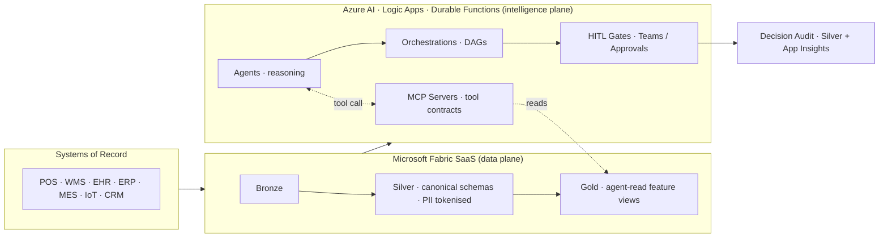
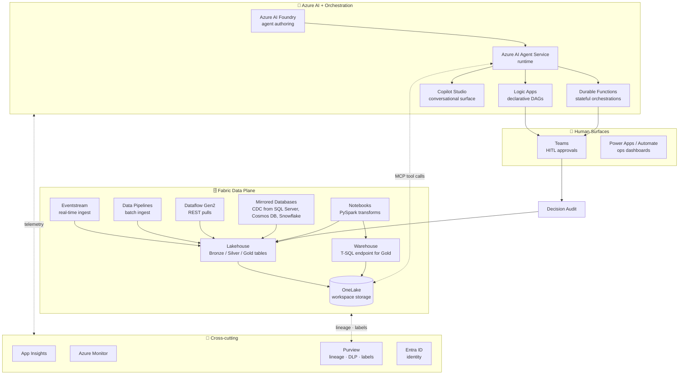
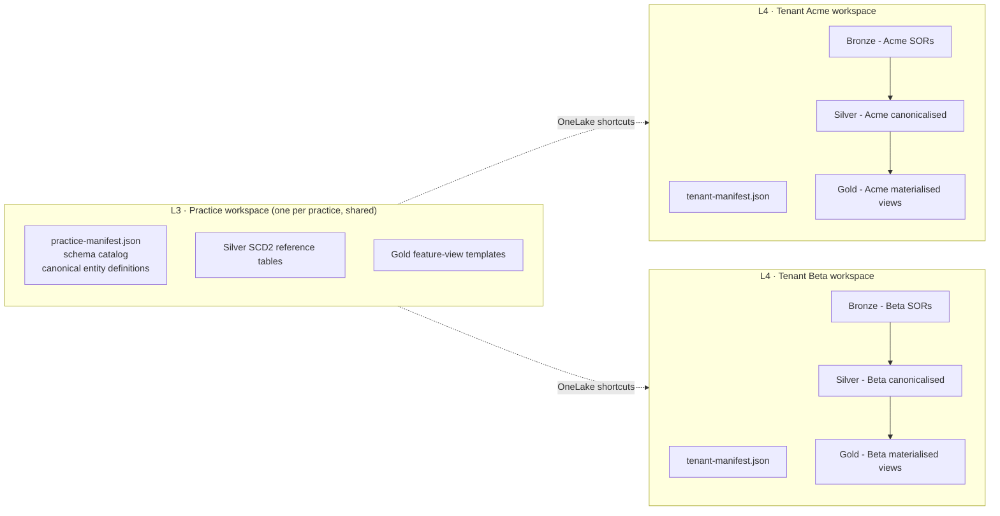

# APEX Developer Implementation Guide

**APEX Core v1.2 · Developer Guide v1.0 · 2026-04-18**

> **Audience:** mixed — executives, architects, and developers. This spine is the one-stop overview. When you need depth, jump to the companion that covers your topic.

---

## 1. Executive TL;DR

**APEX is a manifest-driven, agentic framework for enterprise decision automation.** It lives on top of **Microsoft Fabric SaaS** (the data plane) and **Azure AI Agent Service** (the intelligence plane), and it turns lines-of-business events into resolved decisions through a versioned contract between schemas, agents, MCP tools, orchestrations, and human-in-the-loop (HITL) gates.

Where traditional analytics answers *"what happened?"*, APEX answers *"what should happen next, who should approve it, and under what rules?"* — reliably, repeatedly, and auditable.

This guide shows a development team how to build with APEX on a client's Fabric tenant. It is organised as a **spine** (this document) plus **seven companion deep-dives**, one per major topic. Read the spine end-to-end. Open the companion that matches your task.

### What you get from APEX

- **A four-layer manifest model** (Contract → Edition → Practice → Tenant) that makes every deployment reproducible and every change reviewable.
- **SemVer bump classification** that maps every schema or agent change to a HITL gate (HITL / ACK_ONLY / ZERO_TOUCH / ESCALATION) — so governance is a code property, not a meeting.
- **Canonical Silver-layer schemas** across domains (SCML supply chain, MERML merchandising, CXML customer experience, plus industry-specific families for HLS, ER, and AXLE) that decouple agents from the thousand shapes of the source-of-record systems.
- **A service catalogue** of subscribable SKUs — scenario-driven, persona-targeted, KPI-measured — so a client doesn't buy "agents" or "schemas"; they buy *"Cold Chain Excursion Response, Pro tier, for 412 stores."*
- **Continuous observability** with trace IDs from the triggering event all the way through the DAG, the HITL gate, the decision, and the downstream effects.

### The 60-second picture



Three things to notice:

1. **APEX agents never touch the SOR directly.** They read from **Gold feature views** via **MCP tools**. This is deliberate — it keeps the contract thin, the blast radius small, and the schema the single source of truth.
2. **Every decision ends in an audit record.** Not a log line — a first-class Silver-layer row with trace IDs, decider identity, rationale, and rollback pointer.
3. **Fabric holds the data. Azure holds the intelligence.** APEX is the contract that binds them.

### Who reads which companion

| If you are… | Start with… | Then… |
|---|---|---|
| **Executive / sponsor** | This spine §1, §2, §6 | Companion 07 (Service Catalog) |
| **Architect** | This spine end-to-end | Companion 01 (Fabric) + Companion 04 (Lifecycle) |
| **Data engineer** | Spine §2–5 | Companion 02 (Medallion + SOR) |
| **Agent / MCP developer** | Spine §2–5 | Companion 03 (MCP) + Companion 04 (Agents) |
| **SRE / platform engineer** | Spine §2–5 | Companion 05 (Observability) + Companion 06 (Testing & topology) |
| **Client account / commercial** | Spine §1, §6 | Companion 07 (Service Catalog) |

Each companion opens with a **one-page TL;DR** for drop-in readers. You don't need to read the spine first if you already know APEX.

---

## 2. How APEX layers on Fabric SaaS

APEX draws a hard line between the **data plane** (Microsoft Fabric) and the **intelligence plane** (Azure AI + orchestration). The contract between them is the APEX manifest.

### 2.1 The component map



### 2.2 Where each APEX concept lives

| APEX concept | Lives in Fabric as… | Lives in Azure as… |
|---|---|---|
| **Schema** (SCML.COLD_CHAIN_TELEMETRY, MERML.STORE_INVENTORY_POSITION, …) | Delta tables in a Lakehouse; OneLake shortcuts expose to tenants | Strongly-typed DTOs in MCP tool contracts |
| **Manifest** (practice-manifest.json) | JSON item in the Practice workspace; also held in Git-backed source | Read by the deployer at provisioning time |
| **Agent** | — | Agent definition in Azure AI Agent Service; versioned via agent-manifest.json |
| **MCP tool** | — | Container App / Function App exposing an MCP server; reads Fabric via OneLake SQL endpoint |
| **Orchestration** (ORCH-03 Cold Chain, …) | — | Logic Apps standard workflow **or** Durable Functions orchestrator |
| **HITL gate** | Decision audit row in Silver | Teams adaptive card **or** Power Automate approval flow |
| **Service** (APEX-RC-CXP-01, …) | — | Service manifest JSON in Git; provisions L4 tenant bindings |
| **Trace** | Gold-layer query log | App Insights operation_Id threaded across every tool call and HITL step |

**One rule you can memorise:** *data is in Fabric, decisions are in Azure, contracts are in Git.*

### 2.3 Tenant topology — the L3 Practice workspace → L4 Tenant workspace binding



- **L3 Practice workspace** holds the *canonical* schemas, reference tables, and Gold feature-view templates. It is the single source of truth for a practice (RC, HLS, ER, AXLE).
- **L4 Tenant workspaces** are one per client. Tenant data stays in the tenant workspace — never mixed with other tenants. L4 *shortcuts* L3's reference tables and *pins* a specific Practice release version.
- **Dev / Test / Prod** multiply the picture: each environment gets its own L3 + its own set of L4s. Promotion is a manifest-pin + data-pipeline re-run, not a schema migration.

Companion 01 (Fabric Layering) walks through the provisioning scripts, the Git integration, and the OneLake shortcut model in depth.

---

## 3. Developer mental model

APEX rewards developers who internalise two things: the **four lifecycle layers** and the **five lanes**.

### 3.1 The four lifecycle layers (L1 → L4)

```
┌──────────────────────────────────────────────────────────┐
│  L1  CONTRACT    apex-core                               │
│                  The specification. JSON schemas for     │
│                  manifests, canonical envelope fields,   │
│                  SemVer bump rules, HITL gate taxonomy.  │
│                  Changes here ripple everywhere.         │
├──────────────────────────────────────────────────────────┤
│  L2  EDITION     versioned Core release                  │
│                  apex-core v1.2.0 is an edition. It      │
│                  pins the contract. Downstream manifests │
│                  declare which edition they need.        │
├──────────────────────────────────────────────────────────┤
│  L3  PRACTICE    apex-rc, apex-hls, apex-er, apex-axle   │
│                  A complete vertical bundle: schemas +   │
│                  agents + MCP tools + orchestrations +   │
│                  gates + services + personas + KPIs.     │
│                  This is what a client subscribes to.    │
├──────────────────────────────────────────────────────────┤
│  L4  TENANT      a client's instance                     │
│                  Walmart on RC Practice v1.2.0.          │
│                  Data is tenant-scoped; config is        │
│                  tenant-scoped; decisions are audited    │
│                  per tenant. Never mixed.                │
└──────────────────────────────────────────────────────────┘
```

A change at any layer has a **reach** that the next layer down has to deal with:

- Change L1 contract → all L2 editions must re-validate.
- Release new L2 edition → all L3 practices choose when to adopt.
- Release new L3 practice version → all L4 tenants choose when to pin-up.
- Change L4 tenant config → only that tenant re-provisions.

This layering is why APEX can ship confidently without freezing everyone. The L4 pin is what gives a client stability.

> **Terminology note.** In earlier APEX material L3 was called a **"Fleet"**. As of Core v1.2.1 it is called a **"Practice"** to better reflect that L3 bundles much more than agents — schemas, MCP tools, orchestrations, gates, services, personas, KPIs. `validate-fleet.js` is retained as a backward-compat shim; new code should use `validate-practice.js`.

### 3.2 The five lanes

Within a Practice, APEX organises artifacts into five **lanes**. Each lane has its own versioning, validation, and HITL-gate semantics.

| Lane | Example artifacts | Validator | Gate-relevant changes |
|---|---|---|---|
| **Schema** | `SCML.COLD_CHAIN_TELEMETRY`, `MERML.STORE_INVENTORY_POSITION` | `validate-manifest.js` | add/remove/rename entities or columns; SCD2 toggle; PII reclassification |
| **Agent** | `SCM-A04 Cold Chain Monitor` | `validate-agent.js` *(roadmap)* | system-prompt rewrites; new tool allow-list; model swap |
| **Orchestration** | `ORCH-03 Cold Chain Response` | `validate-orchestration.js` *(roadmap)* | DAG topology, HITL gate kind, timeout |
| **Gate** | `HITL`, `ACK_ONLY`, `ZERO_TOUCH`, `ESCALATION` | contract-level | only by contract change |
| **Service** | `APEX-RC-CXP-01 Cold Chain Response` | `validate-service-manifest.js` | scenario, persona, KPI, tier, artifact set |

Services are the outermost lane — a service bundles schemas + agents + MCP tools + orchestration + gate into one subscribable unit.

### 3.3 The "what-changed?" question — the heart of APEX dev work

Every APEX code change answers the same three questions:

1. **What did I change?** (schema column? agent prompt? orchestration step? HITL gate?)
2. **Is that a MAJOR / MINOR / PATCH bump?** (`apex-core/tools/classify-bump.js` tells you deterministically — no debate, no politics)
3. **What HITL gate does that bump map to at each downstream consumer?** (the tenant's `auto_upgrade_policy` says how it wants to absorb each bump level)

This is the engine. Every PR should be readable as: *"This change adds column X to SCML.COLD_CHAIN_TELEMETRY. `classify-bump` says MINOR. Tenants with MINOR → ACK_ONLY auto-upgrade on next merge; tenants with MINOR → HITL get an approval card. No tenant gets silent drift."*

### 3.4 SemVer bump → HITL gate mapping

```
┌─────────────────────┬─────────────────────────────────────────────┐
│ Bump                │ Default gate (tenant can override policy)   │
├─────────────────────┼─────────────────────────────────────────────┤
│ MAJOR  (breaking)   │ HITL — human must approve, roll plan        │
│ MINOR  (additive)   │ ACK_ONLY — tenant is notified, auto-applies │
│ PATCH  (fix)        │ ZERO_TOUCH — silent upgrade                 │
└─────────────────────┴─────────────────────────────────────────────┘
```

Policy is per-tenant. A high-risk tenant (e.g., a HIPAA health system) can set `MINOR → HITL` globally. A low-risk tenant (e.g., a small retail pilot) can set `MINOR → ZERO_TOUCH`. The default matrix above is conservative.

---

## 4. Repository & workspace layout

APEX is deployed across **three kinds of repos** and **three kinds of Fabric workspaces**. Knowing which is which eliminates 80 % of new-dev confusion.

### 4.1 Repos

```
apex-core/                  ← L1 + L2
├── apex-core-build-spec.md    normative spec
├── apex-core-v1.X-amendment.md
├── conventions/
│   └── schema-versioning.md
├── data/
│   ├── schema-manifest-contract.json
│   ├── practice-manifest-contract.json
│   ├── service-manifest-contract.json
│   └── persona-catalog.json
└── tools/
    ├── validate-manifest.js / .test.js
    ├── validate-practice.js / .test.js
    ├── validate-service-manifest.js / .test.js
    ├── classify-bump.js / .test.js
    ├── apex-validate.js          CLI umbrella
    ├── apex-sync.js              tenant sync
    ├── release-bundler.js
    └── ddl-driver.js             Bronze/Silver/Gold emitters

apex-<practice>/            ← L3, one per practice
apex-rc/  apex-hls/  apex-er/  apex-axle/
├── apex-<practice>-build-spec.md
├── data/
│   ├── practice-manifest.json
│   ├── schemas.manifest.json
│   ├── agents.manifest.json
│   ├── orchestrations.manifest.json
│   └── services/
│       └── *.json                service manifests
├── agents/                        agent-def files (prompts + tool lists)
├── mcp/                           MCP server code
├── orchestrations/                Logic Apps / Durable Functions
├── notebooks/                     Medallion transforms
└── fixtures/                      seed events, anonymised payloads

client-<client>-tenant/     ← L4, one per client
├── tenant-manifest.json          pins practice version, lists subscribed services
├── sor-connections/              per-SOR config
├── bindings/                      identity groups, workspaces, capacity
└── runbooks/                      ops docs
```

### 4.2 Fabric workspaces

A single client's deployment looks like:

```
workspace: apex-rc-practice-dev       (shared, all devs)
workspace: apex-rc-practice-test      (shared, integration)
workspace: apex-rc-practice-prod      (shared, production)

workspace: apex-<client>-tenant-dev
workspace: apex-<client>-tenant-test
workspace: apex-<client>-tenant-prod
```

Naming convention:
- Practice workspaces: `apex-<practice>-practice-<env>`
- Tenant workspaces: `apex-<client>-tenant-<env>`

`<client>` is always **an opaque ID**, never a human-readable brand. Use `acct-a7f2c…` not `walmart`. The account-opacity rule is enforced by `validate-practice.js` (rule `PRACTICE-ACCOUNT-ID`). This is compliance hygiene — it makes screenshots and logs shareable without leaking who's who.

### 4.3 Manifest file conventions

| File | Lives in | Describes |
|---|---|---|
| `schema-manifest.json` | `apex-<practice>/data/` | every schema in the practice; one file total, arrays of schemas |
| `practice-manifest.json` | `apex-<practice>/data/` | practice metadata, pinned edition, included services |
| `service-manifest.json` | `apex-<practice>/data/services/<svc>.json` | one per service SKU |
| `agent-manifest.json` | `apex-<practice>/agents/<agent-id>/manifest.json` | per-agent definition |
| `orchestration-manifest.json` | `apex-<practice>/orchestrations/<orch-id>/manifest.json` | per-orchestration DAG and gate |
| `tenant-manifest.json` | `client-<client>-tenant/` | pinned practice release, subscribed services, SOR bindings, identity groups |

All manifests validate against contracts in `apex-core/data/` via `node apex-core/tools/apex-validate.js`.

### 4.4 Where custom code goes

Rules of thumb:

- **PySpark transforms** → `apex-<practice>/notebooks/` (one notebook per Silver entity; Gold views are T-SQL, not PySpark)
- **MCP servers** → `apex-<practice>/mcp/<server-name>/` (one directory per server; can be Python FastMCP or C# .NET MCP SDK)
- **Agent prompts + configs** → `apex-<practice>/agents/<agent-id>/` (system-prompt.md, manifest.json, tool-allow-list.json)
- **Orchestrations** → `apex-<practice>/orchestrations/<ORCH-id>/` (workflow.json for Logic Apps, or Python/C# source for Durable Functions)
- **Medallion DDL** → generated by `apex-core/tools/ddl-driver.js`, checked into `apex-<practice>/ddl/` for review but regenerated from manifests
- **Tenant overrides** → `client-<client>-tenant/overrides/` (sparingly; never fork the practice)

Companion 06 (Testing & Topology) covers the per-environment variant of this layout.

---

## 5. The 7-step developer workflow

Every feature a dev ships in APEX traces the same seven steps. Memorise these — they're the unit of work.

| # | Step | Where you do it | Which companion |
|---|---|---|---|
| **1** | **Read the contract** — what's the change request, who asks for it, which service/scenario is affected? | `apex-<practice>/data/services/*.json` + issue tracker | 07 Service Catalog |
| **2** | **Author / modify the schema** — add the column, the entity, the PII classification | `apex-<practice>/data/schemas.manifest.json` | 02 Medallion + SOR |
| **3** | **Implement Medallion transforms** — Bronze ingest, Silver canonicalisation, Gold feature view | `apex-<practice>/notebooks/` + `ddl-driver.js` | 02 Medallion + SOR |
| **4** | **Wire the MCP tool** — expose the data the agent needs as a typed MCP tool | `apex-<practice>/mcp/<server>/` | 03 MCP Servers |
| **5** | **Declare the orchestration** — DAG topology, sub-agent order, error paths | `apex-<practice>/orchestrations/<ORCH>/` | 04 Agent Lifecycle |
| **6** | **Bind the HITL gate** — pick `HITL` / `ACK_ONLY` / `ZERO_TOUCH` / `ESCALATION`; wire Teams card or Power Automate flow | Agent manifest + orchestration manifest | 04 Agent Lifecycle |
| **7** | **Classify the bump and ship** — run `classify-bump`, verify it matches the intended gate, commit, push | `apex-core/tools/classify-bump.js` + CI | 04 Agent Lifecycle |

### Step 0 for new features: write a service-manifest

If your change creates a new capability (not a modification of an existing one), **start by drafting the service manifest**. That crystallises scenario, personas, KPIs, and artifact set before you write a line of code. See Companion 07.

### Anti-pattern: skipping step 7

A common new-dev mistake is "the schema change is backwards-compatible, I don't need to classify." Wrong. `classify-bump` is how tenants decide whether to auto-upgrade or gate. Skipping step 7 means a tenant gets silent drift — the exact failure mode APEX exists to prevent.

---

## 6. Service-first view

APEX is sold as **subscribable services**, not as a framework with a-la-carte parts. A dev who understands services will ship the right thing the first time; a dev who doesn't will ship "features" that have no commercial shape.

### 6.1 What a service is

A **service** is a bundled SKU — one entry in the catalog — containing **everything** needed to deliver one measurable business outcome:

- A **scenario** (the business trigger and pain)
- A primary **persona** (who decides) and secondary personas (who is informed)
- **KPIs** (outcome metrics with targets and direction)
- **SLOs** (detection latency, decision latency, false-positive rate, availability)
- An **artifact set** (schemas + agents + MCP tools + orchestration + HITL gate)
- **Prerequisites** (pinned practice release, required SOR connections, Fabric capacity, identity groups)
- **Commercial terms** (tier, subscription model, support level, onboarding days)

The `service-manifest.json` schema makes all of this **machine-readable and validated**. See Companion 07 for the full contract.

### 6.2 Services map cleanly onto the 7 steps

| Service component | Produced in which of the 7 steps |
|---|---|
| Schemas | step 2 |
| MCP tools | step 4 |
| Agents | (authored between steps 2 and 5) |
| Orchestration | step 5 |
| HITL gate | step 6 |
| KPIs + SLOs | authored up-front in step 1 |

### 6.3 When a change touches a service

Every PR should answer:

1. **Which service(s) does this change ship in?**
2. **Does it change the service's commitments** (KPI targets, SLOs, tier, personas)?
3. **If yes, does it require a service-manifest version bump?**

A schema change that affects `APEX-RC-CXP-01` *and* `APEX-RC-OSA-04` touches two services; both manifests bump; both tenant subscriptions are re-evaluated for gate resolution.

### 6.4 When to create a new service vs extend an existing one

**New service if:** new scenario, new primary persona, or the SLO/KPI profile differs materially.

**Extend existing if:** same scenario, same primary persona, same SLO profile — you're adding a capability to a decision the persona already owns.

### 6.5 The 24-service catalog at a glance

Companion 07 holds the full catalog with every field per service. At 30 000 ft:

| Practice | Services | Primary personas |
|---|---|---|
| **RC** (Retail & Consumer) | 8 (CXP, RVD, ESL, OSA, RCL, BPX, SHK, CXI) | Store MOD, Regional Director, Merch Analyst, LP Lead, Care Agent |
| **HLS** (Healthcare & Life Sciences) | 6 (DSR, SEP, RVC, SUP, CTM, PSI) | Charge Nurse, Informaticist, Rev-Cycle Analyst, Pharm Supply Lead, Trial Coordinator, PSO |
| **ER** (Energy & Resources) | 5 (MTR, GRD, BIL, FWO, REG) | Grid Eng, Meter Ops Lead, Billing Ops, Field Dispatcher, Regulatory Affairs |
| **AXLE** (Industrial & Manufacturing) | 5 (LDT, QEX, SCD, RCL, KPI) | Plant Supervisor, Quality Eng, Supply Planner, Plant Mgr, Recall Coord |

---

## 7. Guide to the companions

Seven companions, each standalone with its own TL;DR, progressive depth, and worked examples in Python + C# side-by-side.

| # | Title | Length | Who reads it | Open when you… |
|---|---|---|---|---|
| **01** | Fabric Layering | ~18 pp | Architects · Platform eng | stand up a Fabric workspace · shortcut L3 tables · provision a new tenant |
| **02** | Medallion + SOR Integration | ~22 pp | Data engineers | connect a new SOR · author a Silver transform · evolve a schema |
| **03** | MCP Servers & Tooling | ~20 pp | Agent / MCP devs | write an MCP server · wire auth · register tools with Agent Service |
| **04** | Agent Lifecycle + HITL | ~20 pp | Agent devs · SREs | author/version an agent · declare an orchestration · bind a HITL gate |
| **05** | Observability & Security | ~18 pp | SREs · security | set up telemetry · tokenise PII · build the Azure Monitor dashboard |
| **06** | Testing & Environment Topology | ~15 pp | Platform eng · SREs | set up dev/test/prod · write integration tests · plan capacity |
| **07** | Service Catalog | ~25 pp | Commercial · architects · everyone | pick services to ship · author a new service-manifest · understand pricing shape |

### 7.1 Navigation rules

- **Every companion opens with a one-page TL;DR.** You do not need to read the spine before opening a companion.
- **Every companion has a "Worked example" section** at the end. Start there if you learn best by reading code.
- **Cross-references use relative links** (`[Medallion](./dev-guide/02-medallion-sor.md)`). In the Word renders, these become hyperlinks.
- **The Glossary (§8 below) is the single definition** for every APEX, Fabric, and MCP term. Companions link back; they don't redefine.

---

## 8. Glossary

Terms used across the spine and companions. Defined once here; referenced elsewhere.

**Agent.** A reasoning component that runs in Azure AI Agent Service. Has a system prompt, a tool allow-list, a model selection, and a manifest. Versioned with SemVer. Never touches SORs directly — reads via Gold feature views through MCP tools.

**ACK_ONLY.** A HITL gate kind meaning "notify the responsible human; apply the change anyway." Used for MINOR bumps by default.

**Bronze.** The Medallion layer where SOR data lands in SOR-native shape. No transforms, no tokenisation. One-way: Bronze writes never mutate; replays are by re-ingest.

**Canonical envelope.** The five universal fields every Silver row carries: `event_id`, `event_ts`, `entity_id`, `source_system`, `source_system_ts`. Mandated by `apex-core/data/schema-manifest-contract.json`.

**Classify-bump.** The deterministic SemVer classifier at `apex-core/tools/classify-bump.js`. Given a pre-change and post-change schema, returns `MAJOR`, `MINOR`, or `PATCH`. Never debates; never politics.

**Contract (L1).** The normative spec at `apex-core/`. JSON-schema contracts for every manifest plus the prose spec documents.

**Durable Functions.** Azure's stateful orchestrator runtime. APEX uses it for long-running orchestrations (recalls that span days, trial-matching windows).

**Edition (L2).** A versioned release of Core. `apex-core v1.2.0` is an edition. Downstream manifests pin the edition they require.

**Entra ID.** Microsoft's identity platform (formerly Azure AD). Used for user identity, service principals, and managed identity.

**ESCALATION.** A HITL gate kind meaning "this decision leaves the local responder; send it up the chain." Used for cross-functional decisions (Legal, Comms, Regulatory).

**Event stream.** Real-time ingest path: Fabric Eventstream → Bronze Delta. For high-frequency data (IoT, POS, ADT).

**Fabric.** Microsoft's unified SaaS data platform. APEX's data plane.

**Fleet.** **Deprecated** — see *Practice* (L3). The term `fleet` appears in legacy code (`apex-fleet/`, `validate-fleet.js`) for backward-compatibility through Core v1.2.x; it will be removed in Core v1.3.

**Gold.** The Medallion layer containing **agent-read** materialised feature views. Latency budget: p95 ≤ 500 ms for any tool-driven read.

**HITL.** "Human in the Loop." The gate kind where a human approves before the change applies. Default for MAJOR bumps.

**L1 / L2 / L3 / L4.** The four APEX lifecycle layers — Contract, Edition, Practice, Tenant. See §3.1.

**Lakehouse.** A Fabric item type unifying Delta-table storage and a T-SQL endpoint. Where Bronze and Silver physically live.

**Logic Apps.** Azure's declarative workflow runtime. APEX uses it for short orchestrations where state fits in the workflow instance (cold-chain response, receiving variance).

**Managed identity.** An Azure-managed service principal tied to a resource (Function App, Container App, Agent Service instance). Used for service-to-service auth without secrets.

**Manifest.** A JSON document declaring the shape/version/content of an APEX artifact (schema, practice, agent, orchestration, service, tenant). Validated against a contract in `apex-core/data/`.

**MCP.** Model Context Protocol. The open standard for how agents call tools. See Companion 03 for the APEX implementation.

**Medallion.** The three-tier data architecture (Bronze / Silver / Gold) APEX uses in Fabric.

**MERML.** Merchandising Markup Language — the canonical schema family for retail merchandising data (prices, inventory, markdowns, promotions, shrink, voids).

**OneLake.** Fabric's cross-workspace storage layer. Lakehouses and warehouses write through OneLake; shortcuts expose tables across workspaces without copying.

**Orchestration.** A DAG of agent calls, branching on outputs, with a HITL gate at the decision point. Named `ORCH-nn`.

**Persona.** A role that interacts with an APEX service. Catalogued in `apex-core/data/persona-catalog.json`. Has a stable ID (`store-mod`), a human name (`Store Manager on Duty`), and a practice affinity.

**Practice (L3).** An industry-specific bundle of schemas + agents + MCP tools + orchestrations + gates + services + personas + KPIs. APEX RC Practice, APEX HLS Practice, etc. (Renamed from "Fleet" in Core v1.2.1.)

**Purview.** Microsoft's data-governance product. APEX uses it for lineage, DLP, and sensitivity labels applied during Silver tokenisation.

**SCD2.** Slowly Changing Dimension Type 2 — a historical-record pattern where updates insert a new row with `effective_from` / `effective_to` rather than overwriting.

**SCML.** Supply Chain Markup Language — the canonical schema family for supply-chain data (telemetry, receiving, recalls, lot trace).

**Service.** A subscribable SKU — one entry in the catalog. Bundles schemas + agents + MCP tools + orchestration + gate into one business offering. Identified as `APEX-<practice>-<domain>-<nn>` (e.g., `APEX-RC-CXP-01`).

**Shim (the fleet shim).** `apex-core/tools/validate-fleet.js`. A 19-line backward-compat wrapper around `validate-practice.js` that translates `PRACTICE-*` rule codes back to `FLEET-*` on output. Removed in Core v1.3.

**Silver.** The Medallion layer holding canonicalised, PII-tokenised, contract-compliant data. The source-of-truth layer.

**SLO.** Service Level Objective. APEX standard SLO keys: `detection_p95_sec`, `decision_p95_min`, `false_positive_rate`, `availability_pct`.

**SOR.** System of Record. The upstream operational system APEX ingests from (Manhattan WMS, Epic EHR, SAP ISU, Plex MES, Monnit IoT, POS).

**Tenant (L4).** A client's instance. One client = one or more tenant workspaces. Pins a Practice release. Never shares data with another tenant.

**Tokenisation.** Replacing a PII value with a stable opaque token at the Silver boundary. Token → cleartext is reversible only through a Purview-governed unlock (audit-logged).

**Trace.** An App Insights operation chain that stitches every call from triggering event through the DAG, HITL gate, decision, and downstream effect. Used for debugging and compliance audits.

**Workspace.** A Fabric organisational unit. APEX uses per-practice and per-tenant workspaces, multiplied by dev/test/prod.

**ZERO_TOUCH.** A HITL gate kind meaning "apply the change silently." Used for PATCH bumps by default.

---

*End of spine. Open a companion to go deep.*

