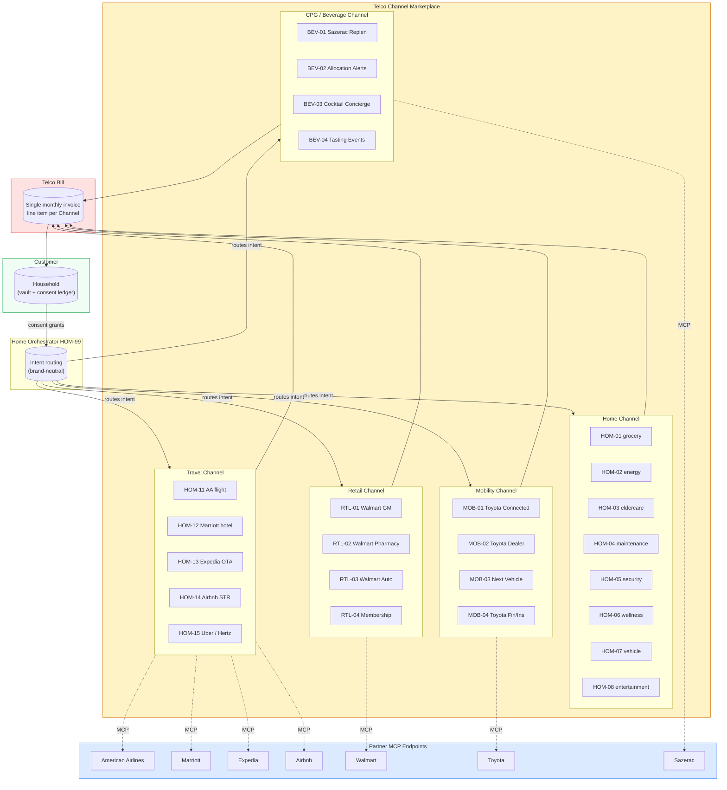

# Marketplace Architecture

## Read this diagram as

- The **household** holds the vault and grants consents
- The **Home Orchestrator** (HOM-99) sits between the household and the marketplace
- Each **Channel** is a band in the marketplace, named for its category, populated with service-code sub-agents
- Partner **MCP endpoints** sit outside the Telco's runtime; the orchestrator talks to them via the open partner protocol
- The single **Telco bill** rolls up subscriptions across every Channel
- **Action commerce** flow (not shown) closes the loop between Channels and partners outside the diagram
