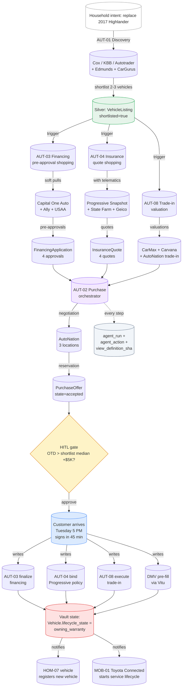

# Purchase Orchestration — End-to-End Flow

> Saturday-research to Tuesday-drive-home. Multi-anchor partnership (AutoNation + Cox Automotive + Progressive + Capital One Auto) orchestrated through the household vault, with HITL gates at every commitment.

## Why this is the wedge

- **Emotional + financial stakes maximal** — vehicle purchase is the second-largest household transaction after home
- **Time savings visceral** — 6 hours over 3 days vs typical 20-40 hours over weeks
- **Money savings auditable** — financing APR + insurance premium + dealer markup deltas are explicit
- **Trust-building durable** — a successful purchase creates a multi-year retention anchor
- **Cross-Channel anchor** — touches Home (HVAC + EV charging), Mobility (OEM connected), Retail (Walmart Auto Care)
