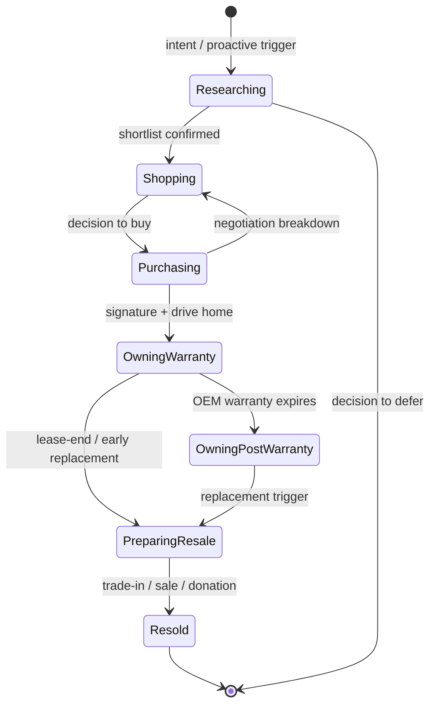

# Automobile Lifecycle State Machine

```mermaid
stateDiagram-v2
    [*] --> Researching : intent / proactive trigger
    Researching --> Shopping : shortlist confirmed
    Shopping --> Purchasing : decision to buy
    Purchasing --> OwningWarranty : signature + drive home
    OwningWarranty --> OwningPostWarranty : OEM warranty expires
    OwningWarranty --> PreparingResale : lease-end / early replacement
    OwningPostWarranty --> PreparingResale : replacement trigger
    PreparingResale --> Resold : trade-in / sale / donation
    Resold --> [*]

    Researching --> [*] : decision to defer
    Purchasing --> Shopping : negotiation breakdown
```

## Per-state active sub-agents

```mermaid
flowchart LR
    subgraph Researching
        R1[AUT-01 Discovery]
        R2[HOM-07 vehicle telematics]
    end
    subgraph Shopping
        S1[AUT-01 continues]
        S2[AUT-03 pre-approval]
        S3[AUT-04 quote shopping]
        S4[AUT-08 trade-in valuation]
    end
    subgraph Purchasing
        P1[AUT-02 purchase orchestrator]
        P2[AUT-03 final financing]
        P3[AUT-04 insurance bind]
        P4[AUT-08 trade-in execution]
    end
    subgraph Owning
        O1[HOM-07 + MOB-02 + RTL-03 service]
        O2[AUT-04 ongoing insurance]
        O3[AUT-05 aftermarket]
        O4[AUT-06 fueling / charging]
        O5[AUT-07 fleet log]
    end
    subgraph PreparingResale
        E1[AUT-08 resale]
        E2[AUT-01 next-vehicle]
    end

    Researching --> Shopping --> Purchasing --> Owning --> PreparingResale --> Researching
```

The state machine + per-state agent set is the operational core of the Channel.
