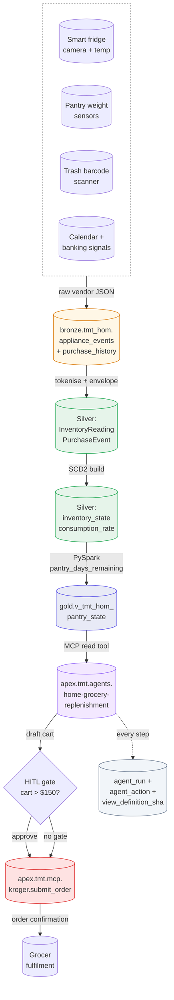

# Grocery Replenishment — End-to-End Flow

> Bronze → Silver → Gold → Agent → Partner → Audit for `TMT-TEL-HOM-01`. The same shape repeats for the other seven sub-agents with different anchor devices and different write-side tools.

## Signal contributions

| Source | What it tells the agent | Where it shows up |
|---|---|---|
| Fridge camera | Item-level inventory (visual recognition, expiry stamps) | `InventoryReading.product_upc`, `expires_on` |
| Pantry weight sensors | Continuous quantity decay → consumption rate | `consumption_rate`, `avg_daily_consumption` |
| Trash barcode scanner | "We threw this out → reorder" trigger | `InventoryReading` with `quantity = 0` |
| Purchase history | Anchor SKU + brand preference | `PurchaseEvent` → `consumption_rate` calibration |
| Calendar | Demand-side anomaly ("dinner party Saturday") | Context passed to the agent at run time |
| Banking / budget | Spending guardrail | Context, applied at HITL gate threshold logic |

## Audit chain

Every step writes to `agent_run` / `agent_action` with:

- `run_id` linking back to the parent orchestrator run (if invoked via `TMT-TEL-HOM-99`)
- `view_definition_sha` proving which Gold-view DDL produced the inputs
- `tools_called.result_hash` proving what the partner API returned
- `state` transitions: `proposed` → `user-approved` (or auto-approved if under HITL threshold) → `executed` / `failed`

The household can audit every order back to the inventory signals that triggered it. This is the "we tell you which agent did what, when, and what it cost" commitment from [`../09-portability-open-home.md`](../09-portability-open-home.md).
