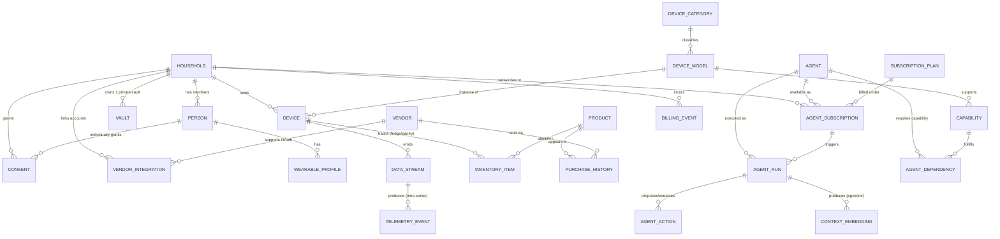

# ERD — Telco Home Agentic

> Mermaid ER diagram for the logical schema in [`../03-erd-and-postgres.md`](../03-erd-and-postgres.md).

## How to read this diagram

- **HOUSEHOLD** is the tenant root. Every tenant-scoped table has a `household_id` enforced by Row-Level Security.
- **DEVICE_CATEGORY**, **DEVICE_MODEL**, and **CAPABILITY** are the shared catalog — they are not tenant-scoped. The Matter device library populates them.
- **DEVICE** and **DATA_STREAM** are per-household instances of the shared catalog.
- **TELEMETRY_EVENT** is the time-series hypertable (TimescaleDB). All raw telemetry lands here; domain projections fan out from it.
- **AGENT** + **AGENT_DEPENDENCY** + **AGENT_SUBSCRIPTION** + **AGENT_RUN** + **AGENT_ACTION** form the agentic lineage — every household action is traceable end-to-end.
- **VAULT** is the per-household private-cloud root. The customer holds its KMS key.
