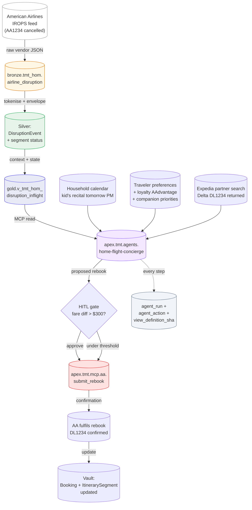

# IROPS Recovery — End-to-End Flow

> American Airlines disruption signal → Home Flight Concierge agent → preferred alternate routing submitted back to AA via MCP, with HITL gate. The wedge event for the entire travel pack.

## Signal contributions

| Source | What it tells the agent | Where it shows up |
|---|---|---|
| AA disruption feed | Flight cancelled, alt-routings offered by AA | `DisruptionEvent`, `ItinerarySegment.status=disrupted` |
| Household calendar | Kid's recital tomorrow 4 PM — hard constraint | Context passed to agent |
| Traveler preferences | AAdvantage Executive Platinum status, companion in row 11 | `LoyaltyAccount`, `Person` preferences |
| Expedia partner search | Delta DL 1234 returning 4:15 PM with 2 First Class seats | Partner-side MCP search result |

## Why this is the wedge

- **Emotional stakes high** — missed family event, kid's recital
- **Visible value** — customer remembers this rebook forever
- **Hard for competitors** — no airline-direct app can recommend Delta when you're stranded on AA
- **Cheap to deliver** — once the agent is built, marginal cost per IROPS = inference + partner-API quota

A single successful IROPS recovery in year 1 of subscription typically produces a customer who refers 2–3 other households.
