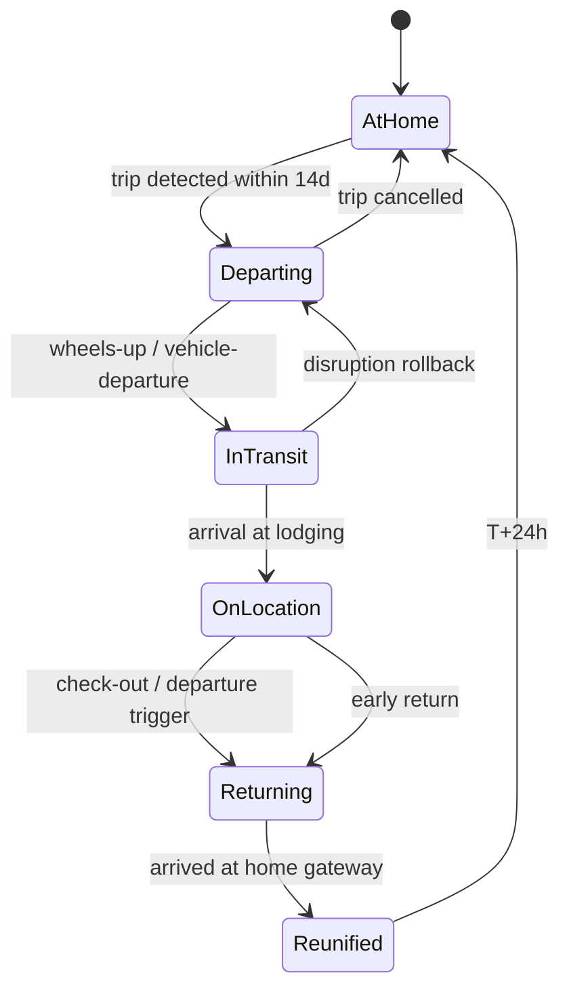

# Trip State Machine

```mermaid
stateDiagram-v2
    [*] --> AtHome
    AtHome --> Departing : trip detected within 14d
    Departing --> InTransit : wheels-up / vehicle-departure
    InTransit --> OnLocation : arrival at lodging
    OnLocation --> Returning : check-out / departure trigger
    Returning --> Reunified : arrived at home gateway
    Reunified --> AtHome : T+24h
    Departing --> AtHome : trip cancelled
    InTransit --> Departing : disruption rollback
    OnLocation --> Returning : early return
```

## Per-state agent posture

```mermaid
flowchart LR
    subgraph AtHome
        H1[HOM-01..08 normal]
    end
    subgraph Departing
        D1[HOM-01..08 stage vacation posture]
        D2[HOM-10 active]
        D3[HOM-13/14 finalize bookings]
    end
    subgraph InTransit
        T1[HOM-11 flight active]
        T2[HOM-15 ground active]
        T3[HOM-01..08 vacation posture]
    end
    subgraph OnLocation
        L1[HOM-12 / 14 active]
        L2[HOM-16 active]
        L3[HOM-03 keeps running]
    end
    subgraph Returning
        R1[HOM-11/15 reverse leg]
        R2[HOM-17 pre-arrival prep]
    end
    subgraph Reunified
        F1[HOM-17 finalize]
        F2[HOM-01..08 resume]
    end

    AtHome --> Departing --> InTransit --> OnLocation --> Returning --> Reunified --> AtHome
```
