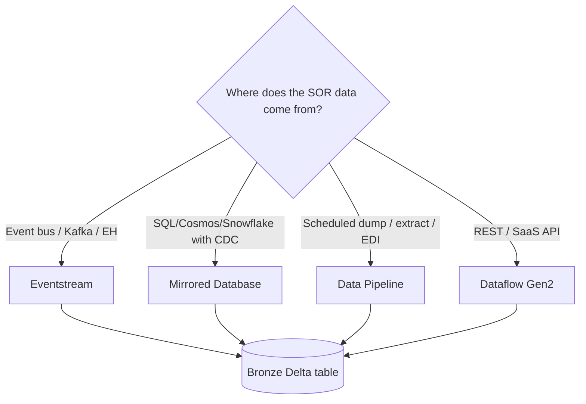
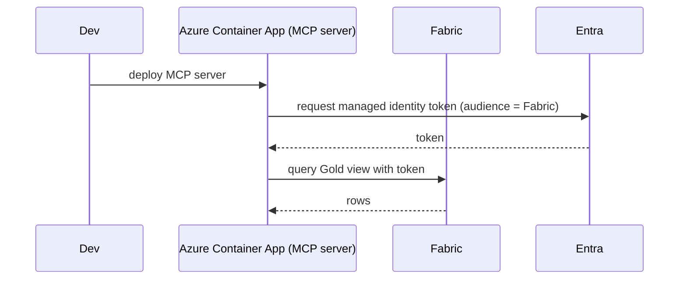

# Companion 01 — Fabric Layering

**APEX Core v1.2 · Developer Guide v1.0 · 2026-04-18**

> **Parent:** [`APEX-developer-guide.md`](../APEX-developer-guide.md) · **Siblings:** [02 Medallion + SOR](./02-medallion-sor.md) · [03 MCP Servers](./03-mcp-servers.md) · [04 Agent Lifecycle](./04-agent-lifecycle.md) · [05 Observability & Security](./05-observability-security.md) · [06 Testing & Topology](./06-testing-topology.md) · [07 Service Catalog](./07-service-catalog.md)

---

## TL;DR

APEX runs on **Microsoft Fabric SaaS** as the data plane and **Azure AI + Logic Apps + Durable Functions** as the intelligence plane. Fabric holds the Bronze / Silver / Gold data; Azure holds the agents, orchestrations, and gates; Git holds the manifest contracts that bind them. This companion tells you how to provision workspaces, shortcut shared tables, wire identities, and stand up a new tenant.

**What you'll leave with:**
- A mental model for where each APEX concept physically runs in Fabric vs. Azure
- Workspace naming and topology rules (Dev/Test/Prod × Practice/Tenant)
- A worked end-to-end example: provisioning a new L4 tenant workspace
- Fabric-specific gotchas that will eat your Tuesday if you don't know them

---

## 1. The Fabric surface area APEX uses

Fabric is a large product. APEX uses a focused subset. Knowing what each piece is for — and what it *isn't* — saves you from building the wrong thing.

| Fabric item | APEX uses it for | APEX **doesn't** use it for |
|---|---|---|
| **OneLake** | The storage substrate under all APEX data; cross-workspace shortcuts | Anything that needs a compute runtime |
| **Lakehouse** | Bronze and Silver tables (Delta) + PySpark notebooks | Gold reads (use Warehouse) |
| **Warehouse** | T-SQL endpoint for Gold feature views read by agents via MCP | Heavy PySpark transforms |
| **Eventstream** | Real-time ingest from Event Hubs / Kafka / Custom endpoints → Bronze Delta | Batch scheduling |
| **Data Pipeline** | Scheduled batch ingest (Copy Activity, orchestration of notebooks) | Streaming |
| **Notebook** | Bronze→Silver transforms in PySpark; ad-hoc exploration | Agent runtime (agents run in Azure AI Agent Service, not Fabric) |
| **Dataflow Gen2** | REST-pull ingest from SaaS SORs (ServiceNow, Coupa) | High-volume or low-latency paths |
| **Mirrored Database** | CDC mirror of SQL Server / Cosmos DB / Snowflake → Bronze Delta | Systems without CDC (use Data Pipeline) |
| **SQL endpoint** | Target for MCP tool reads of Gold | Row-level writes (writes go through notebooks + pipelines) |
| **Fabric Git** | Source-of-truth for workspace items (pipelines, notebooks, manifests) | Runtime config (use tenant-manifest.json) |

### Rule of thumb for choosing the ingest pattern



---

## 2. Workspace topology

### 2.1 The grid

APEX organises Fabric workspaces along two axes: **role** (Practice vs. Tenant) and **environment** (Dev / Test / Prod).

```
                  Dev                      Test                     Prod
                  ───                      ────                     ────
 Practice    apex-<pr>-practice-dev   apex-<pr>-practice-test   apex-<pr>-practice-prod
 Tenant A    apex-<A>-tenant-dev      apex-<A>-tenant-test      apex-<A>-tenant-prod
 Tenant B    apex-<A>-tenant-dev      apex-<B>-tenant-test      apex-<B>-tenant-prod
 …
```

For a practice with 10 client tenants, that's **33 workspaces** total (3 practice + 30 tenant). Capacity planning isn't per-workspace; Fabric capacity is shared across the workspaces bound to it. Production typically gets its own capacity; Dev and Test share a smaller capacity.

### 2.2 Naming — enforce it in code

```
apex-<practice>-practice-<env>      apex-rc-practice-prod
apex-<client>-tenant-<env>          apex-a7f2c-tenant-prod
```

Two non-negotiable rules:

1. **`<client>` is an opaque ID, never a brand name.** Use `acct-a7f2c-001` (the same ID validated by `validate-practice.js` rule `PRACTICE-ACCOUNT-ID`). This is compliance hygiene — it means screenshots, logs, and dashboards are safely shareable.
2. **Environment suffix is literal `dev` / `test` / `prod`.** Don't invent `uat`, `stg`, `preprod`. Fabric Git integration and the APEX promoter assume those three names.

### 2.3 What lives in each workspace

**Practice workspace (L3):**
- `schemas.manifest.json` as a workspace item
- The L3 Silver *reference* tables (lookups, enums, SCD2 dimension tables — shared across tenants)
- The L3 Gold *template* views (what each feature view should look like)
- The build artifacts produced by `ddl-driver.js`

**Tenant workspace (L4):**
- `tenant-manifest.json` (pins practice release; lists subscribed services; declares SOR bindings)
- All tenant Bronze tables (tenant SOR data)
- All tenant Silver tables (canonicalised, tokenised)
- Tenant Gold feature views (instantiated from the templates)
- Tenant-specific pipelines and eventstreams

---

## 3. APEX on top of Fabric — where every concept physically lives

| APEX concept | Physical Fabric/Azure home | Identity |
|---|---|---|
| **L1 contract** | Git repo `apex-core/` | — |
| **L2 edition** | Git tag `v1.2.0` on apex-core | — |
| **L3 practice manifest** | Lakehouse workspace item `practice-manifest.json` in `apex-<practice>-practice-<env>` | — |
| **L4 tenant manifest** | Lakehouse workspace item `tenant-manifest.json` in `apex-<client>-tenant-<env>` | — |
| **Canonical Silver schema** | Delta table in the tenant Lakehouse, shortcut'd from the Practice reference tables where appropriate | Table-level ACL + OneLake path ACL |
| **Gold feature view** | View over Silver in the tenant Warehouse | RLS on the Warehouse |
| **Agent** | Azure AI Agent Service resource | Managed identity per Agent Service instance |
| **MCP server** | Azure Container App (or Function App) | Managed identity per MCP server |
| **Orchestration (declarative)** | Logic Apps Standard workflow | Workflow identity = managed identity |
| **Orchestration (stateful)** | Durable Functions in a Function App | Managed identity |
| **HITL gate** | Teams adaptive card sent via Graph + Power Automate approval | Entra user identity of the approver |
| **Decision audit row** | Delta table `apex_audit_log` in the tenant Lakehouse | Append-only; write-once ACLs |
| **Telemetry** | App Insights + Log Analytics | Managed identity writes telemetry |

### Critical separation

**Fabric holds the data. Azure holds the intelligence.**

Agents never query Fabric tables directly. They query *MCP tools*, which query the tenant Warehouse (for Gold) or Lakehouse SQL endpoint (for Silver, rarely). The tool is the seam. Breaking that seam — having an agent hit a Fabric table directly — is an anti-pattern that breaks tenant isolation, observability, and version pinning.

---

## 4. Identity & access

### 4.1 Three identity classes

| Identity class | Example | Used for |
|---|---|---|
| **User (Entra ID)** | `marisol@walmart.com` | HITL approvals; dashboard access; no direct Fabric data reads |
| **Managed identity** | `mi-apex-mcp-fabric-prod` | MCP server → Fabric; Agent Service → MCP server; orchestration runtime → tools |
| **Service principal (SP)** | `sp-apex-ci-cd` | CI/CD pipelines; manifest deploys; Fabric Git integration |

### 4.2 OneLake path-level ACLs

PII segregation is enforced at the OneLake path level (not just at the table level). A typical tenant:

```
/apex-<client>-tenant-prod/
├── lakehouse/
│   ├── Tables/bronze_*                 (read: ingest-mi only)
│   ├── Tables/silver_*                 (read: silver-reader-mi, agent-tool-mi-readonly-tokens)
│   ├── Tables/silver_pii_cleartext     (read: pii-unlock-mi only; audit-logged)
│   └── Tables/apex_audit_log           (read: observability-mi + compliance-user-group)
```

The `silver_pii_cleartext` path has its own managed identity (`pii-unlock-mi`), a Purview DLP policy on outbound traffic, and append-only audit logging on every access. MCP tools — the normal path agents take — are given `agent-tool-mi-readonly-tokens`, which can read tokenised Silver but **cannot** see the cleartext path.

### 4.3 Code example — binding a managed identity to an MCP server



**Python (FastMCP bootstrap):**

```python
# mcp/fabric-mcp/server.py
from azure.identity.aio import DefaultAzureCredential
from azure.data.tables.aio import TableServiceClient  # illustrative
from fastmcp import FastMCP

mcp = FastMCP("fabric-mcp")
cred = DefaultAzureCredential()  # uses the Container App's managed identity

@mcp.tool()
async def read_telemetry(since: str, store_id: str) -> dict:
    token = (await cred.get_token("https://api.fabric.microsoft.com/.default")).token
    # ... call Fabric SQL endpoint with the token ...
    return {"rows": [...]}
```

**C# (.NET MCP SDK bootstrap):**

```csharp
// mcp/fabric-mcp/Program.cs
using Azure.Identity;
using ModelContextProtocol.Server;

var builder = WebApplication.CreateBuilder(args);
builder.Services.AddMcpServer()
    .WithName("fabric-mcp")
    .WithStdioTransport();

var cred = new DefaultAzureCredential(); // uses Container App managed identity

app.MapMcpTool("read_telemetry",
    async (string since, string storeId) => {
        var token = await cred.GetTokenAsync(
            new TokenRequestContext(new[] { "https://api.fabric.microsoft.com/.default" }));
        // call Fabric SQL endpoint
        return new { rows = new object[] { /* ... */ } };
    });
```

---

## 5. Fabric-specific gotchas (the list that will save your Tuesday)

1. **Shortcut vs. copy.** Shortcuts are pointers; they don't duplicate storage. Use shortcuts from tenant workspaces to practice reference tables. Don't copy them — you'll drift.
2. **Mirrored Databases lag.** CDC via Mirrored DB is typically < 60 seconds but can drift to minutes under load. If your agent SLO is "decision within 2 minutes," you need end-to-end latency budgets that include mirror lag.
3. **Capacity bursting isn't free.** Fabric capacity auto-bursts but accrues "smoothing debt." An agent fleet that bursts at 15:00 every weekday will pay for smoothing on weekends. Right-size base capacity for the p95 concurrent agent invocations.
4. **Workspace Git integration is one-way at a time.** You can't develop in two workspaces bound to the same Git branch. Use feature branches per dev.
5. **OneLake file paths are case-sensitive** in shortcuts, even though Windows clients aren't. `Bronze/raw_events` ≠ `bronze/raw_events`. Decide on lowercase-only early.
6. **`%` in identifiers breaks SQL endpoint queries** even when escaped. If your SOR uses `%` in IDs, tokenise them at Bronze.
7. **The SQL endpoint caches schema aggressively.** After a `MINOR` bump adds a column, queries from existing connections don't see it until the connection is recycled. Include a `sql_endpoint_recycle` step in your Silver migration notebooks.
8. **Purview labels don't auto-propagate through SELECT queries.** If you SELECT from a labelled Silver table into an unlabelled Gold view, the label is lost. Apply labels explicitly on the view.
9. **Fabric capacity units ≠ Azure reserved capacity.** They bill differently. CFO and infra architect both need the bill layout before go-live.
10. **The `fabric_capacity` field on a service-manifest is advisory**, not enforced at deploy time. A practice admin has to verify capacity is sufficient before accepting a new tenant subscription.

---

## 6. Worked example — stand up a new L4 tenant workspace

Scenario: a new client `acct-a7f2c-001` has subscribed to `APEX-RC-CXP-01` (Cold Chain Excursion Response). They need Dev, Test, Prod workspaces provisioned.

### Step 1 — Provision the three tenant workspaces

**Python (using the Fabric REST API):**

```python
# tools/provision-tenant.py
import httpx
from azure.identity import DefaultAzureCredential

FABRIC_API = "https://api.fabric.microsoft.com/v1"
CLIENT_ID = "acct-a7f2c-001"
CAPACITY_ID = "cap-apex-prod-f8"  # configured Fabric capacity

cred = DefaultAzureCredential()
token = cred.get_token("https://api.fabric.microsoft.com/.default").token
headers = {"Authorization": f"Bearer {token}"}

for env in ["dev", "test", "prod"]:
    body = {
        "displayName": f"apex-{CLIENT_ID}-tenant-{env}",
        "capacityId": CAPACITY_ID,
        "description": f"APEX L4 tenant workspace ({env})"
    }
    r = httpx.post(f"{FABRIC_API}/workspaces", json=body, headers=headers)
    r.raise_for_status()
    print(f"Provisioned {body['displayName']} → workspace {r.json()['id']}")
```

**C# (.NET 8):**

```csharp
// Tools/ProvisionTenant/Program.cs
using Azure.Identity;
using System.Net.Http.Json;

const string FabricApi = "https://api.fabric.microsoft.com/v1";
const string ClientId = "acct-a7f2c-001";
const string CapacityId = "cap-apex-prod-f8";

var cred = new DefaultAzureCredential();
var token = await cred.GetTokenAsync(new TokenRequestContext(
    new[] { "https://api.fabric.microsoft.com/.default" }));

var http = new HttpClient();
http.DefaultRequestHeaders.Authorization =
    new AuthenticationHeaderValue("Bearer", token.Token);

foreach (var env in new[] { "dev", "test", "prod" })
{
    var body = new {
        displayName = $"apex-{ClientId}-tenant-{env}",
        capacityId = CapacityId,
        description = $"APEX L4 tenant workspace ({env})"
    };
    var resp = await http.PostAsJsonAsync($"{FabricApi}/workspaces", body);
    resp.EnsureSuccessStatusCode();
    var result = await resp.Content.ReadFromJsonAsync<dynamic>();
    Console.WriteLine($"Provisioned {body.displayName} → workspace {result.id}");
}
```

### Step 2 — Shortcut the L3 Practice reference tables

Inside each new tenant workspace, create OneLake shortcuts to the Practice workspace's reference tables:

```
Target:  /apex-rc-practice-prod/lakehouse/Tables/ref_store_master
Shortcut in: /apex-acct-a7f2c-001-tenant-prod/lakehouse/Tables/ref_store_master
```

Repeat for every `ref_*` table in the practice lakehouse. Do it via the Fabric API (same pattern as workspace creation; endpoint is `/workspaces/{id}/items/{lakehouse-id}/shortcuts`).

### Step 3 — Deploy the tenant-manifest

```json
{
  "tenant_id": "acct-a7f2c-001",
  "practice": "RC",
  "practice_pinned_version": "1.2.0",
  "subscribed_services": ["APEX-RC-CXP-01"],
  "sor_connections": {
    "monnit-iot": { "workspace_resource": "eventstream-monnit-prod" },
    "manhattan-wms": { "workspace_resource": "mirrored-db-wms-prod" }
  },
  "identity_groups": {
    "store-mod": "aad-acct-a7f2c-001-store-mods",
    "regional-ops-director": "aad-acct-a7f2c-001-regional-ops"
  },
  "auto_upgrade_policy": { "PATCH": "ZERO_TOUCH", "MINOR": "ACK_ONLY", "MAJOR": "HITL" }
}
```

Upload as a workspace item and validate:

```bash
node apex-core/tools/apex-validate.js --tenant /path/to/tenant-manifest.json
```

### Step 4 — Provision the SOR connectors

For `monnit-iot`: create an Eventstream in the tenant workspace pointing at the client's Monnit Event Hub, sink to `bronze_cold_chain_telemetry`.

For `manhattan-wms`: create a Mirrored Database item pointing at the client's WMS SQL Server, enabling CDC, sink to `bronze_store_inventory_position`.

### Step 5 — Run the Medallion DDL driver

```bash
node apex-core/tools/ddl-driver.js \
    --tenant acct-a7f2c-001 \
    --env prod \
    --services APEX-RC-CXP-01
```

This emits and executes Bronze → Silver → Gold DDL for just the services the tenant subscribed to.

### Step 6 — Bind the agent fleet

In Azure AI Agent Service, create (or attach to) the RC Practice agent fleet and grant `agent-tool-mi-readonly-tokens` on the tenant workspace.

### Step 7 — Smoke test

Trigger a synthetic cold-chain excursion event against the Monnit Eventstream. Verify:
- Bronze row lands within 60 s (p95)
- Silver row (canonical) lands within 90 s
- Agent `SCM-A04` invocation appears in App Insights with a trace ID
- Teams adaptive card arrives in the `aad-acct-a7f2c-001-store-mods` channel

If all four succeed, the tenant is live on `APEX-RC-CXP-01`.

---

## 7. Cross-references

- Deploying the Silver transforms: [Companion 02 — Medallion + SOR](./02-medallion-sor.md)
- Writing the `read_telemetry` MCP tool used above: [Companion 03 — MCP Servers](./03-mcp-servers.md)
- Wiring the Teams adaptive card: [Companion 04 — Agent Lifecycle + HITL](./04-agent-lifecycle.md)
- App Insights and managed identity hardening: [Companion 05 — Observability & Security](./05-observability-security.md)
- Cross-env promotion playbook: [Companion 06 — Testing & Topology](./06-testing-topology.md)
- `APEX-RC-CXP-01` service manifest: [Companion 07 — Service Catalog](./07-service-catalog.md)
