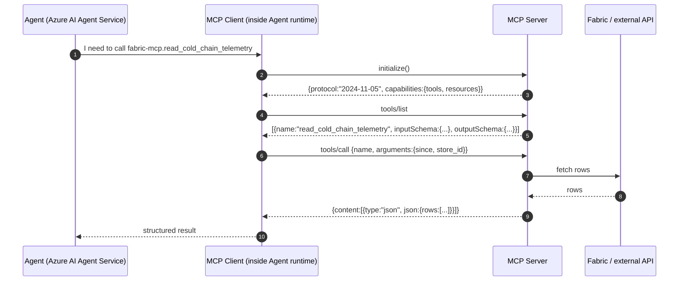

# Companion 03 — MCP Servers & Tooling

**APEX Core v1.2 · Developer Guide v1.0 · 2026-04-18**

> **Parent:** [`APEX-developer-guide.md`](../APEX-developer-guide.md) · **Previous:** [02 Medallion + SOR](./02-medallion-sor.md) · **Next:** [04 Agent Lifecycle + HITL](./04-agent-lifecycle.md)

---

## TL;DR

APEX agents reach the outside world through **MCP (Model Context Protocol)** — an open standard for typed tool contracts between an LLM-based agent and a tool-provider server. APEX runs a **taxonomy of MCP servers**: domain servers per schema family, utility servers for policy/telemetry/approvals, a Fabric-MCP for canonical-data reads, and external-facing servers for regulated sources (FDA, FERC). Managed identity is the only auth mechanism between Agent Service and MCP servers; tenant scoping is carried in the tool call headers. This companion shows you how to write, deploy, and operate an MCP server in both Python (FastMCP) and C# (.NET MCP SDK), side-by-side.

**What you'll leave with:**
- A mental model of the MCP protocol (tools / resources / prompts; stdio / SSE / streamable-HTTP)
- The full APEX MCP server taxonomy and why it's shaped this way
- A project skeleton for a new MCP server in Python and C#
- Auth wiring via managed identity with tenant scoping
- Hosting guidance (Container Apps vs. Functions vs. App Service)
- A worked end-to-end example: building `fabric-mcp.read_cold_chain_telemetry` from scratch in both languages

---

## 1. MCP in one picture



### 1.1 Three primitives

| Primitive | APEX uses it for | Example |
|---|---|---|
| **Tools** | Read/query/stage-write calls agents make | `read_cold_chain_telemetry(since, store_id) → TelemetryReading[]` |
| **Resources** | Stream/iterate content agents read linearly (logs, long docs) | `telemetry-stream://store/100/24h` |
| **Prompts** | Parameterised prompt templates agents can discover | `scenario-preamble/cold-chain` |

APEX uses **tools** for 95 % of server surface. **Resources** are used for large-but-streamable data (a full telemetry window, a case file). **Prompts** are used sparingly (agent-local prompt libraries are easier to version).

### 1.2 Three transports

| Transport | When APEX uses it |
|---|---|
| **stdio** | Local dev (MCP Inspector, VS Code debug) |
| **SSE** | Legacy deployments where the HTTP client can't hold open a long connection |
| **streamable-HTTP** | Default for all Azure-hosted APEX MCP servers; bidirectional over a single HTTP connection |

Production = streamable-HTTP hosted in Azure Container Apps. Dev = stdio with `npx @modelcontextprotocol/inspector`.

---

## 2. APEX's MCP server taxonomy

```
┌───────────────────────────────────────────────────────────────────┐
│                 AGENT (Azure AI Agent Service)                    │
└──────────────────────────────────┬────────────────────────────────┘
                                   │  MCP client inside
          ┌────────────────────────┼────────────────────────┐
          │                        │                        │
          ▼                        ▼                        ▼
  ┌────────────────┐      ┌────────────────┐      ┌────────────────┐
  │  Domain MCPs   │      │  Utility MCPs  │      │  External MCPs │
  │  (per schema   │      │                │      │  (3rd-party)   │
  │   family)      │      │                │      │                │
  ├────────────────┤      ├────────────────┤      ├────────────────┤
  │ scml-mcp       │      │ fabric-mcp     │      │ fda-mcp        │
  │ merml-mcp      │      │ policy-mcp     │      │ ferc-mcp       │
  │ cxml-mcp       │      │ telemetry-mcp  │      │ edi-mcp        │
  │ hlscml-mcp     │      │ approvals-mcp  │      │ vendor-portal  │
  │ ercml-mcp      │      │ tokenizer-mcp  │      │ pharma-recall  │
  │ axlecml-mcp    │      │ ledger-mcp     │      │ ...            │
  └────────────────┘      └────────────────┘      └────────────────┘
```

### 2.1 Domain MCPs

**One server per canonical schema family.** `scml-mcp` exposes typed reads/writes over SCML entities; `hlscml-mcp` does the same for healthcare schemas; etc.

Why split by schema family rather than one big server? Three reasons:
1. **Isolation.** A crash or deploy in `hlscml-mcp` doesn't take down `scml-mcp`.
2. **Identity separation.** `hlscml-mcp` runs under a managed identity that has PHI-read grants; `scml-mcp` runs under one that doesn't. Defence in depth.
3. **Tool discoverability.** An agent's allow-list names a server; keeping domains separate makes the allow-list readable.

### 2.2 Utility MCPs

| Server | Purpose |
|---|---|
| `fabric-mcp` | Generic Gold-view read gateway (when an agent needs a single Gold view not covered by a domain MCP) |
| `policy-mcp` | HITL gate resolution, tenant-scoped upgrade-policy lookup, RBAC checks |
| `telemetry-mcp` | Write trace events to App Insights with proper operation_Id threading |
| `approvals-mcp` | Send Teams adaptive cards; poll approval status; return decision |
| `tokenizer-mcp` | Tokenise / reverse-tokenise (reverse is audit-logged) |
| `ledger-mcp` | Stage write-offs, corrections, adjustments in an audit-logged staging table |

### 2.3 External MCPs

Third-party or government sources that APEX wraps behind the MCP interface so the agent sees one protocol:

- `fda-mcp` — FDA recall feed
- `ferc-mcp` — FERC regulatory notices
- `edi-mcp` — vendor EDI gateway
- `pharma-recall-mcp` — class-II/III pharma recall feeds

---

## 3. Writing an MCP server

### 3.1 Project skeleton — Python (FastMCP)

```
apex-rc/mcp/fabric-mcp/
├── pyproject.toml
├── Dockerfile
├── server.py                 # entry point
├── tools/
│   ├── __init__.py
│   ├── cold_chain.py         # read_cold_chain_telemetry
│   ├── inventory.py          # read_store_inventory_position
│   └── ...
├── schemas/                   # Pydantic models that match the Silver/Gold contracts
│   ├── __init__.py
│   └── telemetry.py
└── tests/
    ├── test_cold_chain.py
    └── fixtures/
```

**`server.py`:**
```python
from fastmcp import FastMCP
from tools.cold_chain import read_cold_chain_telemetry
from tools.inventory import read_store_inventory_position

mcp = FastMCP(
    name="fabric-mcp",
    version="1.2.0",
    description="APEX canonical Gold-view reads over Fabric",
)

# Register tools — FastMCP introspects type hints to build the inputSchema
mcp.tool()(read_cold_chain_telemetry)
mcp.tool()(read_store_inventory_position)

if __name__ == "__main__":
    # Defaults to stdio for local dev; production uses streamable-http via Dockerfile CMD
    mcp.run()
```

**`tools/cold_chain.py`:**
```python
from datetime import datetime
from typing import List
from pydantic import BaseModel, Field
from azure.identity.aio import DefaultAzureCredential
from .fabric_client import FabricSqlClient

class TelemetryReading(BaseModel):
    sensor_id: str
    lot_id: str
    temp_f: float
    threshold_f: float
    event_ts: datetime
    is_breaching: bool

_cred = DefaultAzureCredential()
_fabric = FabricSqlClient(_cred, audience="https://api.fabric.microsoft.com/.default")

async def read_cold_chain_telemetry(
    since: datetime = Field(..., description="Earliest event_ts to return"),
    store_id: str = Field(..., description="Opaque store identifier"),
) -> List[TelemetryReading]:
    """Return cold-chain telemetry readings for a store since the given timestamp."""
    query = """
        SELECT sensor_id, lot_id, current_temp_f AS temp_f,
               threshold_f, event_ts, is_breaching
        FROM   gold_cold_chain_state_v1
        WHERE  store_id = ? AND event_ts >= ?
        ORDER  BY event_ts DESC
    """
    rows = await _fabric.query(query, [store_id, since])
    return [TelemetryReading(**r) for r in rows]
```

### 3.2 Project skeleton — C# (.NET MCP SDK)

```
apex-rc/mcp/fabric-mcp/
├── FabricMcp.csproj
├── Dockerfile
├── Program.cs
├── Tools/
│   ├── ColdChainTools.cs
│   └── InventoryTools.cs
├── Schemas/
│   └── TelemetryReading.cs
├── Infrastructure/
│   └── FabricSqlClient.cs
└── Tests/
    └── ColdChainToolsTests.cs
```

**`Program.cs`:**
```csharp
using Microsoft.Extensions.DependencyInjection;
using Microsoft.Extensions.Hosting;
using ModelContextProtocol.Server;
using Azure.Identity;

var builder = Host.CreateApplicationBuilder(args);

builder.Services
    .AddSingleton(new DefaultAzureCredential())
    .AddSingleton<FabricSqlClient>()
    .AddMcpServer(opts => {
        opts.ServerName = "fabric-mcp";
        opts.ServerVersion = "1.2.0";
    })
    .WithTools<ColdChainTools>()
    .WithTools<InventoryTools>()
    .WithStreamableHttpTransport();   // or .WithStdioTransport() for local dev

await builder.Build().RunAsync();
```

**`Tools/ColdChainTools.cs`:**
```csharp
using ModelContextProtocol.Server;
using System.ComponentModel;

public sealed class ColdChainTools(FabricSqlClient fabric)
{
    [McpServerTool, Description("Return cold-chain telemetry readings for a store since the given timestamp.")]
    public async Task<IReadOnlyList<TelemetryReading>> ReadColdChainTelemetry(
        [Description("Earliest event_ts to return")]    DateTimeOffset since,
        [Description("Opaque store identifier")]        string          storeId)
    {
        const string sql = """
            SELECT sensor_id, lot_id, current_temp_f AS temp_f,
                   threshold_f, event_ts, is_breaching
            FROM   gold_cold_chain_state_v1
            WHERE  store_id = @storeId AND event_ts >= @since
            ORDER  BY event_ts DESC
        """;
        return await fabric.QueryAsync<TelemetryReading>(sql, new { storeId, since });
    }
}

public sealed record TelemetryReading(
    string SensorId, string LotId,
    decimal TempF, decimal ThresholdF,
    DateTimeOffset EventTs, bool IsBreaching);
```

### 3.3 Error model

Return errors through MCP's standard error channel, not by string-formatting into the result. Agents branch on error codes.

**Python:**
```python
from fastmcp.exceptions import ToolError

async def read_cold_chain_telemetry(since, store_id):
    if not store_id.startswith("acct-") and not re.match(r"^\d+$", store_id):
        raise ToolError(code=-32602, message="Invalid store_id format", data={"given": store_id})
    ...
```

**C#:**
```csharp
if (!storeId.StartsWith("acct-") && !Regex.IsMatch(storeId, @"^\d+$"))
    throw new McpException(-32602, "Invalid store_id format", new { given = storeId });
```

APEX error-code convention:
- `-32602` — invalid tool arguments
- `-32000` — tenant scoping violation (caller's tenant ≠ requested tenant)
- `-32001` — Fabric/data-plane transient error (retry-safe)
- `-32002` — data not found (not-an-error, but agent needs to handle)

---

## 4. Auth & tenant scoping

### 4.1 Identity chain

```
  ┌─────────────────────────────────────────────────┐
  │  Agent runtime in Azure AI Agent Service        │
  │  — assumes managed identity mi-apex-rc-agent    │
  └──────────────────┬──────────────────────────────┘
                     │  MCP streamable-HTTP call + bearer token
                     ▼
  ┌─────────────────────────────────────────────────┐
  │  MCP server in Azure Container App              │
  │  — validates token audience = mi-apex-rc-agent  │
  │  — reads tenant_id from request header          │
  │  — uses its own managed identity mi-apex-rc-mcp │
  │    to call Fabric SQL endpoint                  │
  └──────────────────┬──────────────────────────────┘
                     ▼
  ┌─────────────────────────────────────────────────┐
  │  Fabric SQL endpoint                            │
  │  — checks mi-apex-rc-mcp has READ on the        │
  │    requested tenant's Gold views                │
  │  — RLS on tenant_id column as secondary control │
  └─────────────────────────────────────────────────┘
```

### 4.2 Per-tenant scoping

Every tool call carries a `X-APEX-Tenant-Id` header set by the agent runtime. The MCP server:
1. Verifies the caller's managed identity is authorised for that tenant (via `policy-mcp` — cached)
2. Uses the tenant ID in the SQL WHERE clause (parameterised)
3. Emits a telemetry event with the tenant ID

**Python:**
```python
from fastmcp import FastMCP, Context

mcp = FastMCP("fabric-mcp")

@mcp.tool()
async def read_cold_chain_telemetry(ctx: Context, since, store_id):
    tenant_id = ctx.request_headers.get("x-apex-tenant-id")
    if not tenant_id:
        raise ToolError(-32000, "Missing X-APEX-Tenant-Id")
    await _verify_tenant_access(ctx.caller_identity, tenant_id)
    # ... continue with tenant-scoped query
```

**C#:**
```csharp
[McpServerTool]
public async Task<IReadOnlyList<TelemetryReading>> ReadColdChainTelemetry(
    McpContext ctx, DateTimeOffset since, string storeId)
{
    var tenantId = ctx.RequestHeaders["X-APEX-Tenant-Id"]
        ?? throw new McpException(-32000, "Missing X-APEX-Tenant-Id");
    await policyClient.VerifyTenantAccessAsync(ctx.CallerIdentity, tenantId);
    // ...
}
```

---

## 5. Hosting & deployment

### 5.1 Picking the host

| Host | When to use | When not |
|---|---|---|
| **Azure Container Apps** | **Default for APEX MCP servers.** Scale-to-zero, streamable-HTTP friendly, managed identity native | N/A |
| **Azure Functions (Premium/Elastic)** | Bursty, low-steady-state traffic; you already have a Functions shop | Long-lived connections (streamable-HTTP does *not* love cold starts) |
| **Azure App Service** | You have existing App Service infra and want minimal new platform | Cold-start-sensitive workloads |
| **AKS** | You're already AKS-shop and want fleet-level control | Overkill for most MCP servers |

### 5.2 Container Apps deployment (typical)

```yaml
# infra/container-apps/fabric-mcp.yaml
name: fabric-mcp
properties:
  managedEnvironmentId: /subscriptions/.../mes/apex-rc-prod-mes
  configuration:
    ingress: { external: false, targetPort: 8080, transport: http2 }
    identity: { type: UserAssigned, userAssignedIdentities:
      { /subscriptions/.../mi-apex-rc-mcp: {} } }
  template:
    containers:
      - name: fabric-mcp
        image: apexregistry.azurecr.io/fabric-mcp:1.2.0
        resources: { cpu: 0.5, memory: 1Gi }
        env:
          - { name: AZURE_CLIENT_ID,
              value: <managed-identity-client-id> }
          - { name: FABRIC_SQL_ENDPOINT,
              value: apex-rc-practice-prod-xxx.datawarehouse.fabric.microsoft.com }
    scale: { minReplicas: 1, maxReplicas: 10,
             rules: [{ name: http, http: { concurrent-requests: 20 } }] }
```

### 5.3 Local dev

**Python:**
```bash
cd apex-rc/mcp/fabric-mcp
pip install -e .
# Run with MCP Inspector
npx @modelcontextprotocol/inspector python server.py
```

**C#:**
```bash
cd apex-rc/mcp/fabric-mcp
dotnet run -- --stdio
# In another terminal:
npx @modelcontextprotocol/inspector dotnet run --project ./FabricMcp.csproj
```

The MCP Inspector gives you a UI to list tools, call them with arbitrary arguments, and see the raw JSON-RPC exchange.

### 5.4 Azure AI Agent Service registration

Once deployed, register the MCP server with Agent Service so agents can see it:

```python
from azure.ai.projects import AIProjectClient
from azure.identity import DefaultAzureCredential

client = AIProjectClient.from_connection_string(
    conn_str=os.environ["AI_FOUNDRY_CONN_STR"],
    credential=DefaultAzureCredential())

client.agents.add_mcp_server(
    name="fabric-mcp",
    endpoint="https://fabric-mcp.apex-rc-prod.internal",
    transport="streamable-http",
    auth={"type": "managed_identity", "client_id": "<mi-apex-rc-agent>"},
    tool_allow_list=["read_cold_chain_telemetry", "read_store_inventory_position"],
)
```

Rate limits and per-tool allow-lists are enforced at registration time by Agent Service.

---

## 6. Observability

Every MCP tool call emits a span in App Insights, threaded under the agent invocation's `operation_Id`:

```
operation_Id: 3fa9...
├── agent.invoke              (Agent Service)
│   ├── tool.call              fabric-mcp.read_cold_chain_telemetry
│   │   ├── fabric.sql.query   gold_cold_chain_state_v1      120ms
│   │   └── tokenizer.get      (cached)                       2ms
│   └── tool.call              policy-mcp.verify_tenant       8ms
└── hitl.prompt                approvals-mcp.send_teams_card  840ms
```

Agents trace end-to-end. Tool failures appear as span attributes `error.code` and `error.message`. Companion 05 covers dashboards and alerts.

---

## 7. Worked example — `fabric-mcp.read_cold_chain_telemetry` end-to-end

**Goal:** Ship a new MCP tool that reads the last 24 h of cold-chain telemetry for a store and register it with Agent Service so `SCM-A04 Cold Chain Monitor` can call it.

### Step 1 — Confirm the Gold view exists

```sql
SELECT TOP 5 * FROM gold_cold_chain_state_v1 WHERE store_id = 'acct-a7f2c-001';
```

If it doesn't, go to Companion 02 §4; come back when it does.

### Step 2 — Add the tool to `fabric-mcp`

Python or C# — pick one, both shown above in §3.1 / §3.2.

### Step 3 — Add a unit test

**Python (`tests/test_cold_chain.py`):**
```python
import pytest, httpx
from tools.cold_chain import read_cold_chain_telemetry

@pytest.mark.asyncio
async def test_read_returns_rows_for_valid_store(mock_fabric):
    mock_fabric.seed("gold_cold_chain_state_v1", [
        {"sensor_id":"S1","lot_id":"L1","temp_f":52.3,"threshold_f":41,
         "event_ts":"2026-04-14T06:00:00Z","is_breaching":True}
    ])
    rows = await read_cold_chain_telemetry("2026-04-13T00:00:00Z", "acct-a7f2c-001")
    assert len(rows) == 1 and rows[0].is_breaching
```

**C# (`Tests/ColdChainToolsTests.cs`):**
```csharp
[Fact]
public async Task ReadReturnsRowsForValidStore() {
    var fabric = new FabricSqlClientFake();
    fabric.Seed("gold_cold_chain_state_v1", new[] {
        new TelemetryReading("S1","L1", 52.3m, 41m, DateTimeOffset.Parse("2026-04-14T06:00:00Z"), true)
    });
    var tools = new ColdChainTools(fabric);
    var rows = await tools.ReadColdChainTelemetry(
        DateTimeOffset.Parse("2026-04-13T00:00:00Z"), "acct-a7f2c-001");
    Assert.Single(rows);
    Assert.True(rows[0].IsBreaching);
}
```

### Step 4 — Run MCP Inspector locally

```bash
npx @modelcontextprotocol/inspector python server.py        # or dotnet run
```

In the Inspector UI, click `read_cold_chain_telemetry`, fill in `since` and `store_id`, click Call. Verify you get a JSON response with the expected row shape.

### Step 5 — Build & push the container image

```bash
docker build -t apexregistry.azurecr.io/fabric-mcp:1.2.0 .
docker push  apexregistry.azurecr.io/fabric-mcp:1.2.0
```

### Step 6 — Deploy to Container Apps

```bash
az containerapp update \
  --name fabric-mcp \
  --resource-group apex-rc-prod \
  --image apexregistry.azurecr.io/fabric-mcp:1.2.0
```

### Step 7 — Register the new tool with Agent Service

Update the Agent Service MCP registration — extend the `tool_allow_list` to include `read_cold_chain_telemetry`. Agents whose manifest references `fabric-mcp` pick up the new tool on their next invocation.

### Step 8 — Verify from a live agent session

In Azure AI Foundry playground, load `SCM-A04 Cold Chain Monitor`, send the trigger event, watch the trace — the new tool call appears with a span, a result, and a tenant-scoped row count.

Ship.

---

## 8. Cross-references

- Gold views the tools read: [Companion 02 — Medallion + SOR](./02-medallion-sor.md)
- Agent manifests that reference MCP tools: [Companion 04 — Agent Lifecycle](./04-agent-lifecycle.md)
- How tool-call spans show up in App Insights: [Companion 05 — Observability & Security](./05-observability-security.md)
- Unit/integration testing of MCP servers: [Companion 06 — Testing & Topology](./06-testing-topology.md)
- Which services include which tools: [Companion 07 — Service Catalog](./07-service-catalog.md)
