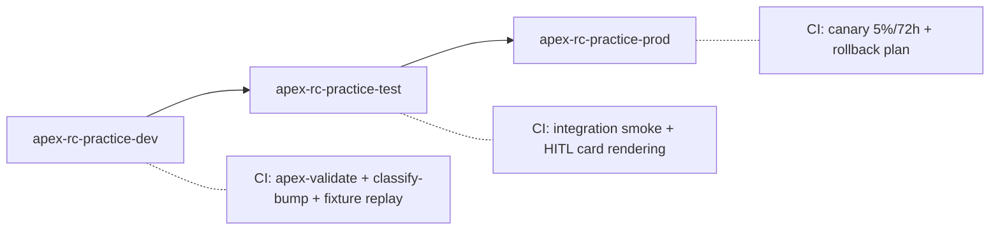

# Companion 04 — Agent & Orchestration Lifecycle + HITL

**APEX Core v1.2 · Developer Guide v1.0 · 2026-04-18**

> **Parent:** [`APEX-developer-guide.md`](../APEX-developer-guide.md) · **Previous:** [03 MCP Servers](./03-mcp-servers.md) · **Next:** [05 Observability & Security](./05-observability-security.md)

---

## TL;DR

APEX agents are built, versioned, and deployed the same way APEX schemas are — through **manifest-driven SemVer** that deterministically maps changes to HITL gates. Orchestrations (named `ORCH-nn`) are either **declarative Logic Apps workflows** (short-running, < 5 min) or **Durable Functions orchestrators** (long-running, stateful). Every HITL gate resolves through a **Teams adaptive card** or **Power Automate approval** with timeout-escalation; every decision becomes an auditable Silver-layer row. This companion shows the complete lifecycle from local authoring to canary release, with parallel Python + C# examples.

**What you'll leave with:**
- The anatomy of an agent manifest and system-prompt convention
- The local dev loop (Foundry playground, fixture replay, diff tests)
- Orchestration authoring in both Logic Apps (declarative) and Durable Functions (stateful)
- HITL gate wiring with Teams adaptive cards
- CI/CD patterns: pre-commit validation, canary release, rollback
- Service-impact reasoning — when you edit an agent, which service SKUs ship the change

---

## 1. Anatomy of an APEX agent

An agent is four things:

1. A **manifest** describing id, name, version, allowed MCP tools, HITL gate, orchestration role
2. A **system prompt** (the "contract preamble" — stable, versioned, peer-reviewed)
3. A **tool allow-list** (names from registered MCP servers)
4. A **model selection** (gpt-4-family for narrative; o-family for deep reasoning)

### 1.1 The agent manifest

```json
{
  "agent_id": "SCM-A04",
  "agent_name": "Cold Chain Telemetry Monitor",
  "version": "1.2.0",
  "practice": "RC",
  "schemas_read": ["SCML.COLD_CHAIN_TELEMETRY", "SCML.TEMPERATURE_EXCURSION"],
  "mcp_tools_allowed": [
    "fabric-mcp.read_cold_chain_telemetry",
    "fda-mcp.lookup_threshold"
  ],
  "model": { "family": "gpt-4.1", "reasoning_tier": "standard" },
  "orchestration_role": {
    "orchestration": "ORCH-03",
    "position": 1,
    "fanout": false
  },
  "hitl": {
    "default_gate": "ACK_ONLY",
    "escalation_timeout_min": 15,
    "escalation_gate": "HITL"
  },
  "telemetry": {
    "operation_name": "scm.a04.monitor_cold_chain",
    "kpis_tracked": ["writeoff_avoided_pct", "time_to_brief_min"]
  },
  "ships_in_services": ["APEX-RC-CXP-01", "APEX-RC-RCL-05"]
}
```

### 1.2 System-prompt convention: the contract preamble

Every APEX agent system prompt opens with the **contract preamble** — four fixed sections the agent can rely on:

```
You are SCM-A04 Cold Chain Telemetry Monitor, an APEX agent.

CONTRACT
--------
You read these schemas (canonical, tokenised Silver/Gold, never raw SOR):
  - SCML.COLD_CHAIN_TELEMETRY  via fabric-mcp.read_cold_chain_telemetry
  - SCML.TEMPERATURE_EXCURSION via fabric-mcp.read_excursion_events

You MAY call these tools, no others:
  - fabric-mcp.read_cold_chain_telemetry
  - fda-mcp.lookup_threshold

You produce one of these outputs:
  - { classification: "HEALTHY", details: {...} }
  - { classification: "EXCURSION_CONFIRMED", severity: "...", details: {...} }
  - { classification: "UNCERTAIN", reason: "...", needs_human: true }

You NEVER:
  - contact customers directly
  - write to Bronze, Silver, or Gold tables
  - make disposition decisions (that is SCM-A05's role)

REASONING STYLE
---------------
Be terse, specific, and numeric. No narrative filler.

SCENARIO CONTEXT
----------------
(dynamic — injected per invocation)

INSTRUCTIONS
------------
(task-specific, authored below this line)
```

The preamble is **boilerplate-free** on purpose — it's the fence, not the lesson. Everything in the preamble is validated against the manifest at build time (the allowed-tools list is generated from `mcp_tools_allowed`; the output schemas are generated from the contract).

### 1.3 Model selection

| Model family | APEX uses it for |
|---|---|
| **gpt-4.1 standard** | Monitors, classifiers, structured-output generators (most agents) |
| **gpt-4.1 reasoning (o-tier)** | Disposition, correlation, case-build agents (deep-reason few) |
| **gpt-4o-mini / lightweight** | High-volume stream agents where the decision is narrow (phantom-OOS binary classifier) |

Don't over-reach. An agent that only classifies "excursion vs. healthy" doesn't need a reasoning model. An agent that correlates voids, returns, and CCTV timestamps absolutely does.

---

## 2. Local authoring loop

### 2.1 Two paths

| Path | When |
|---|---|
| **Azure AI Foundry playground** | You're tweaking the prompt; you want fast iteration with a UI |
| **Code-first (Agent SDK)** | You're building the manifest, testing with fixtures, running diff tests |

Most dev loops combine both: Foundry for prompt exploration, code-first for committing.

### 2.2 The fixture-replay discipline

Every prompt change is tested by **replaying a canonical fixture set** of real (anonymised) events against the candidate prompt and diffing the outputs against the current production prompt.

**Python (pytest-style):**
```python
# apex-rc/agents/SCM-A04/tests/test_prompt_diff.py
import json, pytest
from apex_harness import replay_fixtures, compare_outputs

@pytest.mark.parametrize("fixture", [
    "fixtures/healthy_steady_state.json",
    "fixtures/single_excursion_4h.json",
    "fixtures/sensor_dropout_3h.json",
    "fixtures/compressor_soft_start_fail.json",
])
def test_prompt_no_regression(fixture):
    out_prod = replay_fixtures("prompt.v1.1.md", fixture)
    out_cand = replay_fixtures("prompt.v1.2.md", fixture)
    compare_outputs(
        expected_classification=out_prod["classification"],
        actual_classification=out_cand["classification"],
        allow_diff_fields=["details.rationale"]  # narrative drift is acceptable
    )
```

**C# (xUnit-style):**
```csharp
[Theory]
[InlineData("fixtures/healthy_steady_state.json")]
[InlineData("fixtures/single_excursion_4h.json")]
[InlineData("fixtures/sensor_dropout_3h.json")]
public async Task PromptDiff_NoClassificationRegression(string fixturePath)
{
    var prod = await ReplayFixtures("prompt.v1.1.md", fixturePath);
    var cand = await ReplayFixtures("prompt.v1.2.md", fixturePath);
    Assert.Equal(prod.Classification, cand.Classification);
    // narrative drift in rationale is acceptable; classification is the contract
}
```

**Rule: no prompt change ships without a fixture-replay test.** The fixture set is versioned alongside the agent.

---

## 3. Versioning an agent

### 3.1 SemVer rules for agents

| Change | Bump |
|---|---|
| Tweak wording, add an example to the prompt | **PATCH** |
| Swap the model (gpt-4.1 → gpt-4.1-reasoning) | **MINOR** |
| Add a new tool to the allow-list | **MINOR** |
| Remove a tool from the allow-list | **MAJOR** |
| Rewrite the reasoning approach (e.g., one-shot → chain-of-thought) | **MAJOR** |
| Change the output schema (add/remove/rename field) | **MAJOR** |
| Replace the agent with a new one | new agent_id |

### 3.2 How the bump cascades from schema changes

If `SCML.COLD_CHAIN_TELEMETRY` adds a column (MINOR), any agent that reads it may or may not need a bump — it depends on whether the agent's prompt references the new column. The rule of thumb: **if the agent's contract preamble or output depends on the change, bump the agent too**.

Run `apex-validate --agent-impact` to get an automated answer:
```bash
node apex-core/tools/apex-validate.js --agent-impact SCML.COLD_CHAIN_TELEMETRY
# → SCM-A04 (reads schema)  : no impact (new column not referenced)
# → SCM-A05 (reads schema)  : PATCH recommended (new column referenced in prompt examples)
```

---

## 4. Orchestration authoring

### 4.1 Logic Apps (declarative DAG)

Best for orchestrations that:
- Complete in < 5 minutes
- Have a linear or low-fan-out topology
- Need declarative visibility in the Azure portal

**Example (`ORCH-03 Cold Chain Response` as Logic Apps Standard workflow JSON, abbreviated):**

```json
{
  "definition": {
    "triggers": {
      "when_excursion_silver_row_inserted": {
        "type": "eventgrid",
        "inputs": { "topic": "silver-cold-chain-excursion" }
      }
    },
    "actions": {
      "invoke_SCM_A04": {
        "type": "AzureAIAgent",
        "inputs": {
          "agentId": "SCM-A04",
          "version": "1.2.0",
          "input": "@triggerBody()"
        }
      },
      "invoke_SCM_A05": {
        "runAfter": { "invoke_SCM_A04": [ "Succeeded" ] },
        "type": "AzureAIAgent",
        "inputs": {
          "agentId": "SCM-A05",
          "version": "1.2.0",
          "input": "@{outputs('invoke_SCM_A04').body}"
        }
      },
      "invoke_SCM_A06": {
        "runAfter": { "invoke_SCM_A05": [ "Succeeded" ] },
        "type": "AzureAIAgent",
        "inputs": { "agentId": "SCM-A06", "version": "1.2.0" }
      },
      "present_HITL_gate": {
        "runAfter": { "invoke_SCM_A06": [ "Succeeded" ] },
        "type": "ApiConnection",
        "inputs": {
          "method": "post",
          "host": { "connection": { "name": "@parameters('$connections')['teams']['connectionId']" } },
          "path": "/flowbot/actions/adaptivecard/requestInChannel",
          "body": {
            "recipient": "@outputs('invoke_SCM_A06').body.owner",
            "adaptiveCard": "@body('build_hitl_card')"
          }
        }
      }
    }
  }
}
```

### 4.2 Durable Functions (stateful orchestrator)

Best for orchestrations that:
- Span hours or days (recall traceability, trial matching)
- Need fan-out / fan-in / waits on external signals
- Have complex error compensation

**Python (`durable_functions`):**
```python
# apex-rc/orchestrations/ORCH-05/orchestrator.py
import azure.durable_functions as df

def orchestrator(ctx: df.DurableOrchestrationContext):
    # 1. Pull recall details + lot trace
    recall    = yield ctx.call_activity("invoke_SCM_A01", ctx.get_input())
    lot_trace = yield ctx.call_activity("invoke_SCM_A02", recall)

    # 2. Fan out to cross-store correlation (parallel)
    tasks = [ctx.call_activity("invoke_MER_A11", {"store": s, "lot": recall["lot_id"]})
             for s in lot_trace["affected_stores"]]
    correlations = yield ctx.task_all(tasks)

    # 3. Build the case (may take a while — external approvals)
    case = yield ctx.call_activity("invoke_MER_A12", {"recall": recall, "correlations": correlations})

    # 4. Wait for HITL decision (up to 4 h, then escalate)
    hitl = yield ctx.wait_for_external_event_with_timeout(
        "hitl_decision",
        timeout=ctx.current_utc_datetime + df.timedelta(hours=4),
        timeout_value={"decision": "timeout_escalated"})

    if hitl["decision"] == "timeout_escalated":
        yield ctx.call_activity("invoke_escalation", case)

    return {"case_id": case["id"], "final_decision": hitl["decision"]}

main = df.Orchestrator.create(orchestrator)
```

**C# (`Microsoft.Azure.WebJobs.Extensions.DurableTask`):**
```csharp
[Function(nameof(Orch05Recall))]
public async Task<object> Orch05Recall(
    [OrchestrationTrigger] TaskOrchestrationContext ctx)
{
    var input = ctx.GetInput<RecallTrigger>();
    var recall   = await ctx.CallActivityAsync<RecallDetails>("InvokeSCMA01", input);
    var lotTrace = await ctx.CallActivityAsync<LotTrace>("InvokeSCMA02", recall);

    var tasks = lotTrace.AffectedStores
        .Select(s => ctx.CallActivityAsync<Correlation>(
            "InvokeMERA11", new { Store = s, Lot = recall.LotId }))
        .ToArray();
    var correlations = await Task.WhenAll(tasks);

    var case_ = await ctx.CallActivityAsync<CaseFile>(
        "InvokeMERA12", new { Recall = recall, Correlations = correlations });

    using var cts = new CancellationTokenSource(TimeSpan.FromHours(4));
    var hitl = await ctx.WaitForExternalEvent<HitlDecision>("hitl_decision", cts.Token)
                 ?? new HitlDecision("timeout_escalated");

    if (hitl.Decision == "timeout_escalated")
        await ctx.CallActivityAsync("InvokeEscalation", case_);

    return new { CaseId = case_.Id, FinalDecision = hitl.Decision };
}
```

---

## 5. HITL gate wiring

### 5.1 Gate kinds

| Gate | Behaviour | Typical bump |
|---|---|---|
| **ZERO_TOUCH** | Apply silently; log the decision as auto-taken | PATCH |
| **ACK_ONLY** | Apply + send a notification; acknowledgement optional | MINOR |
| **HITL** | Present the decision + wait for approve/reject/modify | MAJOR |
| **ESCALATION** | Route to a cross-functional owner (Legal, Comms, Regulatory) | any |

### 5.2 The Teams adaptive-card pattern (HITL)

**Card JSON (send via Graph + Power Automate):**
```json
{
  "type": "AdaptiveCard",
  "version": "1.5",
  "body": [
    { "type": "TextBlock", "text": "Cold Chain Excursion — Reefer 14",
      "size": "large", "weight": "bolder" },
    { "type": "TextBlock",
      "text": "412 units at risk · $1,847 retail exposure · 4h 12m duration",
      "wrap": true },
    { "type": "FactSet", "facts": [
      { "title": "Save-viable", "value": "291 units ($1,313)" },
      { "title": "Destroy",     "value": "121 units ($534)"  },
      { "title": "Agent recommendation", "value": "Approve split disposition" }
    ]}
  ],
  "actions": [
    { "type": "Action.Submit", "title": "Approve",
      "data": { "decision": "approve", "orchestration_id": "${ctx.orch_id}" }},
    { "type": "Action.Submit", "title": "Modify",
      "data": { "decision": "modify",  "orchestration_id": "${ctx.orch_id}" }},
    { "type": "Action.Submit", "title": "Reject",
      "data": { "decision": "reject",  "orchestration_id": "${ctx.orch_id}" }}
  ]
}
```

**Submit handler (Python Function):**
```python
# apex-rc/orchestrations/handlers/teams_submit.py
import azure.functions as func
import azure.durable_functions as df

app = func.FunctionApp()

@app.function_name("TeamsDecisionSubmit")
@app.route("decision")
@app.durable_client_input("client")
async def handler(req: func.HttpRequest, client: df.DurableOrchestrationClient):
    body = req.get_json()
    await client.raise_event(body["orchestration_id"], "hitl_decision", {
        "decision": body["decision"],
        "decider_oid": req.headers["x-ms-client-principal-id"],
        "decided_at": datetime.utcnow().isoformat() + "Z",
    })
    return func.HttpResponse(status_code=202)
```

**Submit handler (C# Function):**
```csharp
[Function("TeamsDecisionSubmit")]
public async Task<HttpResponseData> Handler(
    [HttpTrigger(AuthorizationLevel.Function, "post")] HttpRequestData req,
    [DurableClient] DurableTaskClient client)
{
    var body = await req.ReadFromJsonAsync<TeamsSubmitBody>();
    await client.RaiseEventAsync(body.OrchestrationId, "hitl_decision", new {
        decision     = body.Decision,
        decider_oid  = req.Headers.GetValues("x-ms-client-principal-id").First(),
        decided_at   = DateTimeOffset.UtcNow
    });
    return req.CreateResponse(HttpStatusCode.Accepted);
}
```

### 5.3 The decision audit row

Every HITL decision becomes a row in `silver_decision_audit`:

```sql
INSERT INTO silver_decision_audit (
    event_id, event_ts, entity_id, source_system, source_system_ts,
    orchestration_id, agent_chain, decider_oid, decision, gate_kind,
    input_hash, output_hash, rationale, rollback_pointer
) VALUES (
    uuid(), getutcdate(), @store_id, 'APEX-RC', getutcdate(),
    @orch_id, 'SCM-A04→SCM-A05→SCM-A06', @decider_oid, 'approve', 'HITL',
    @input_hash, @output_hash, @rationale, @rollback_orch_id
);
```

Audit rows are append-only, ACL-restricted, and retained per practice compliance policy.

---

## 6. Deployment

### 6.1 Dev → Test → Prod



### 6.2 Canary release

New agent versions take **5 % of traffic for 72 hours** before full cutover. Traffic split is enforced at Agent Service registration level (not at orchestration) — Agent Service honours `version_weight` on the agent deployment.

```yaml
# release/canary.yaml
agent_id: SCM-A04
from_version: 1.1.0
to_version:   1.2.0
canary:
  weight_pct: 5
  duration_hours: 72
  rollback_criteria:
    - metric: false_positive_rate
      op: ">="
      threshold: 0.05
      window_hours: 24
    - metric: p95_decision_latency_min
      op: ">="
      threshold: 12
      window_hours: 4
```

If any rollback criterion trips, Agent Service rolls weight back to 0 and pages the owning team.

### 6.3 Rollback

```bash
# In an emergency, pin tenants to previous version
node apex-core/tools/apex-sync.js \
    --tenant acct-a7f2c-001 \
    --pin "SCM-A04@1.1.0"
# Tenants currently running 1.2.0 roll back on their next agent invocation
```

---

## 7. CI/CD patterns

### 7.1 Pre-commit hook

```bash
# .husky/pre-commit
node apex-core/tools/apex-validate.js --all    || exit 1
node apex-core/tools/classify-bump.js --check  || exit 1
npm run test -- --bail                         || exit 1
```

### 7.2 PR gate (Azure DevOps YAML, abbreviated)

```yaml
trigger: none
pr: [ main ]

stages:
- stage: validate
  jobs:
  - job: manifests
    steps:
      - task: NodeTool@0
        inputs: { versionSpec: '20.x' }
      - script: npm ci
      - script: node apex-core/tools/apex-validate.js --all
      - script: node apex-core/tools/classify-bump.js --against origin/main
  - job: fixture_replay
    steps:
      - script: pytest apex-rc/agents/*/tests/test_prompt_diff.py
```

### 7.3 Release bundler

```bash
node apex-core/tools/release-bundler.js \
    --practice rc \
    --version 1.2.0 \
    --out dist/apex-rc-1.2.0.tar.gz
```

The bundle contains: all manifests, all agent prompts, all MCP images (digest-pinned), all orchestration definitions, the ddl-driver output, and the CHANGELOG entry. Tenants upgrade by pinning the bundle.

---

## 8. Service impact

Every agent lists `ships_in_services` in its manifest. When you modify an agent, that list tells you which service SKUs are affected.

**Example:**
```bash
git diff HEAD~1 -- apex-rc/agents/SCM-A04/manifest.json
# → model changed: gpt-4.1 → gpt-4.1-reasoning (MINOR)
#
# ships_in_services: ["APEX-RC-CXP-01", "APEX-RC-RCL-05"]
# → Both services bump to 1.2.0
# → Tenants subscribed to either: MINOR → ACK_ONLY (default policy)
```

Service-manifest versioning follows the same SemVer rules. See Companion 07 for the full service contract.

---

## 9. Cross-references

- Manifest contracts the CI validates: [Companion 02 — Medallion + SOR](./02-medallion-sor.md) §6
- MCP tool allow-list enforcement: [Companion 03 — MCP Servers](./03-mcp-servers.md) §5.4
- App Insights trace threading across the DAG: [Companion 05 — Observability & Security](./05-observability-security.md)
- Fixture-replay infrastructure: [Companion 06 — Testing & Topology](./06-testing-topology.md)
- The service SKUs this agent ships in: [Companion 07 — Service Catalog](./07-service-catalog.md)
