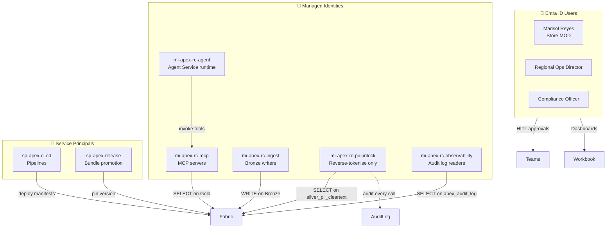

# Companion 05 — Observability & Security

**APEX Core v1.2 · Developer Guide v1.0 · 2026-04-18**

> **Parent:** [`APEX-developer-guide.md`](../APEX-developer-guide.md) · **Previous:** [04 Agent Lifecycle](./04-agent-lifecycle.md) · **Next:** [06 Testing & Topology](./06-testing-topology.md)

---

## TL;DR

APEX bakes observability and security into the contract, not bolts them on. Every agent invocation is a **traceable operation** in App Insights with the trigger event, DAG steps, MCP tool calls, HITL wait, decision, and rollback pointer all stitched under one `operation_Id`. Every data access is governed by **managed identity + OneLake path-ACL + Purview label**. PII tokenisation is contractual at the Silver boundary; reverse-tokenisation is audit-logged. This companion gives you the telemetry model, the dashboard and alert library, the identity architecture, the PII regime, and the compliance posture per practice.

**What you'll leave with:**
- The trace model (how a single excursion becomes one operation tree)
- An Azure Monitor workbook layout and the five KPIs every APEX dashboard ships with
- KQL queries for the five dashboards
- A full identity map (users, managed identities, service principals) with code samples
- PII tokenisation and the right-to-erasure replay pattern
- A compliance matrix (HIPAA / SOX / PCI / GDPR) per practice

---

## 1. Telemetry model

### 1.1 One excursion = one operation tree

Every trigger event gets a single `operation_Id` that stitches together *all* downstream work:

```
operation_Id: 3fa9b4c2-…-e1f7c09b
│
├── ingest.bronze_write             15 ms
├── silver.transform                82 ms
├── eventgrid.publish               4 ms
│
├── orchestration.start (ORCH-03)
│   │
│   ├── agent.invoke (SCM-A04)      2,140 ms
│   │   ├── tool.call (fabric-mcp.read_cold_chain_telemetry)   120 ms
│   │   │   └── fabric.sql.query                                94 ms
│   │   └── tool.call (fda-mcp.lookup_threshold)                42 ms
│   │
│   ├── agent.invoke (SCM-A05)      2,980 ms
│   │   ├── tool.call (fabric-mcp.read_lot_exposure)            180 ms
│   │   └── tool.call (tokenizer-mcp.lookup_consent)            18 ms
│   │
│   ├── agent.invoke (SCM-A06)      1,620 ms
│   │   └── tool.call (ledger-mcp.stage_writeoff)               73 ms
│   │
│   └── hitl.prompt (Teams card)    pending → 84,322 ms (user decision)
│       └── audit.insert            12 ms
│
└── rollback_pointer_ready          orch_id_5c8d (reversible within 7 days)
```

### 1.2 Span attributes

Every span carries:

| Attribute | Purpose |
|---|---|
| `tenant_id` | Per-tenant scoping; required in every span |
| `practice` | RC / HLS / ER / AXLE |
| `service_id` | Which service SKU this invocation belongs to |
| `agent_id` + `agent_version` | What reasoned |
| `orchestration_id` + `version` | What orchestrated |
| `gate_kind` | HITL / ACK_ONLY / ZERO_TOUCH / ESCALATION (on the gate span) |
| `decider_oid` | Entra object ID of the approver (on the gate span, post-decision) |
| `input_hash` / `output_hash` | SHA-256 of the canonical input/output for reproducibility |
| `rollback_pointer` | ID of the compensating orchestration |

### 1.3 Instrumenting an agent (code)

**Python:**
```python
# apex-rc/agents/SCM-A04/runtime.py
from opentelemetry import trace
from opentelemetry.trace import Status, StatusCode

tracer = trace.get_tracer("apex-rc.scm-a04")

async def invoke(ctx, event):
    with tracer.start_as_current_span("agent.invoke") as span:
        span.set_attribute("tenant_id",     ctx.tenant_id)
        span.set_attribute("agent_id",      "SCM-A04")
        span.set_attribute("agent_version", "1.2.0")
        span.set_attribute("service_id",    ctx.service_id)
        try:
            result = await reason(event)
            span.set_attribute("output_hash", sha256(result))
            return result
        except Exception as ex:
            span.set_status(Status(StatusCode.ERROR, str(ex)))
            raise
```

**C#:**
```csharp
// apex-rc/agents/SCM-A04/Runtime.cs
private static readonly ActivitySource Source = new("apex-rc.scm-a04");

public async Task<AgentResult> InvokeAsync(AgentContext ctx, ExcursionEvent ev)
{
    using var activity = Source.StartActivity("agent.invoke");
    activity?.SetTag("tenant_id",     ctx.TenantId);
    activity?.SetTag("agent_id",      "SCM-A04");
    activity?.SetTag("agent_version", "1.2.0");
    activity?.SetTag("service_id",    ctx.ServiceId);
    try {
        var result = await ReasonAsync(ev);
        activity?.SetTag("output_hash", Sha256(result));
        return result;
    } catch (Exception ex) {
        activity?.SetStatus(ActivityStatusCode.Error, ex.Message);
        throw;
    }
}
```

---

## 2. Dashboards

### 2.1 The APEX workbook — five panels

Every APEX deployment ships with one Azure Monitor workbook. The five panels are non-negotiable:

```
┌──────────────────────────────────────────────────────────────────┐
│ 1. ORCH SUCCESS RATE (24h, by orchestration_id)                  │
│    target: ≥ 98.5 %                                              │
│ ──────────────────────────────────────────────────────────────── │
│ 2. MEAN TIME TO DECISION (24h, p50 / p95 / p99)                  │
│    target: p95 ≤ service SLO                                     │
│ ──────────────────────────────────────────────────────────────── │
│ 3. HITL QUEUE DEPTH (real-time, per gate owner)                  │
│    alert: > 10 pending for > 30 min                              │
│ ──────────────────────────────────────────────────────────────── │
│ 4. SCHEMA DRIFT INCIDENTS (7d, count by rule)                    │
│    target: 0 critical; minor incidents reviewed weekly           │
│ ──────────────────────────────────────────────────────────────── │
│ 5. MCP TOOL FAILURE RATE (24h, by tool name)                     │
│    alert: > 1 % over 15-min window                               │
└──────────────────────────────────────────────────────────────────┘
```

### 2.2 KQL — orchestration success rate

```kql
// 1. ORCH SUCCESS RATE
customEvents
| where name == "orchestration.complete"
| where timestamp > ago(24h)
| extend tenant = tostring(customDimensions.tenant_id),
         orch   = tostring(customDimensions.orchestration_id),
         status = tostring(customDimensions.status)
| summarize
    success = countif(status == "SUCCEEDED"),
    failed  = countif(status in ("FAILED","TIMEOUT","CANCELLED")),
    total   = count()
  by tenant, orch, bin(timestamp, 1h)
| extend rate = todouble(success) / todouble(total)
| project timestamp, tenant, orch, success, failed, total, rate
| render timechart
```

### 2.3 KQL — mean time to decision

```kql
// 2. MEAN TIME TO DECISION
customEvents
| where name == "hitl.decision"
| where timestamp > ago(24h)
| extend
    tenant   = tostring(customDimensions.tenant_id),
    service  = tostring(customDimensions.service_id),
    duration = todouble(customDimensions.wait_duration_sec)
| summarize
    p50 = percentile(duration, 50),
    p95 = percentile(duration, 95),
    p99 = percentile(duration, 99)
  by tenant, service, bin(timestamp, 1h)
| render timechart
```

### 2.4 KQL — HITL queue depth

```kql
// 3. HITL QUEUE DEPTH (real-time)
customEvents
| where timestamp > ago(2h)
| where name in ("hitl.prompt", "hitl.decision")
| extend orch_id = tostring(customDimensions.orchestration_id),
         gate_owner = tostring(customDimensions.gate_owner)
| summarize has_decision = countif(name == "hitl.decision") by orch_id, gate_owner
| where has_decision == 0
| summarize pending = count() by gate_owner
| order by pending desc
```

### 2.5 KQL — schema drift incidents

```kql
// 4. SCHEMA DRIFT INCIDENTS
customEvents
| where name == "manifest.validate.finding"
| where timestamp > ago(7d)
| extend severity = tostring(customDimensions.severity),
         rule     = tostring(customDimensions.rule)
| where severity == "critical"
| summarize count() by rule, bin(timestamp, 1d)
| render columnchart
```

### 2.6 KQL — MCP tool failure rate

```kql
// 5. MCP TOOL FAILURE RATE
dependencies
| where type == "MCP Tool"
| where timestamp > ago(24h)
| extend tool = tostring(customDimensions.tool_name)
| summarize
    calls    = count(),
    failures = countif(success == false)
  by tool, bin(timestamp, 15m)
| extend rate = todouble(failures) / todouble(calls)
| where rate > 0
| render timechart
```

---

## 3. Alerting

The five alerts every APEX deployment ships with:

| Alert | Trigger | Page who | SLO tie |
|---|---|---|---|
| **ManifestDrift** | Any `manifest.validate.finding` with `severity=critical` | Practice SRE | contract-level |
| **SloBurnHITL** | HITL p95 > service SLO for 3 consecutive 15-min windows | Practice SRE + service owner | per-service SLO |
| **SloBurnAgent** | Agent p95 response > 8 s for 3 consecutive 15-min windows | Agent owner | per-agent SLO |
| **DecisionBacklog** | HITL queue depth > threshold for > 30 min | Gate owner (tenant manager) | service SLO |
| **MCPToolFailureSpike** | Tool failure rate > 1 % over 15-min window | Tool owner | availability SLO |

Alerts use Action Groups configured per practice, notifying Teams channels and PagerDuty for on-call rotations.

---

## 4. Identity model

### 4.1 Three classes, one picture



### 4.2 Managed-identity wiring (code)

**Python — Agent Service → Fabric via MCP:**
```python
# The Agent Service runtime sets X-APEX-Tenant-Id on every tool call.
# The MCP server's managed identity handles the token exchange.
from azure.identity.aio import DefaultAzureCredential

credential = DefaultAzureCredential()  # uses mi-apex-rc-mcp

async def query_fabric(sql, params, tenant_id):
    token = await credential.get_token("https://api.fabric.microsoft.com/.default")
    # Include tenant_id in the query's WHERE clause AND as an OTel attribute
    ...
```

**C# — same pattern:**
```csharp
private readonly TokenCredential _cred = new DefaultAzureCredential();
public async Task<IReadOnlyList<T>> QueryAsync<T>(string sql, object parms, string tenantId)
{
    var token = await _cred.GetTokenAsync(
        new TokenRequestContext(new[] { "https://api.fabric.microsoft.com/.default" }),
        CancellationToken.None);
    // ...
}
```

### 4.3 Per-tenant identity segregation

Each L4 tenant has its own managed identity too — `mi-apex-<tenant>-mcp-read` — so a tenant's MCP requests carry a tenant-scoped identity, not a practice-wide one. This is belt-and-suspenders: even if the header-based scoping broke, the identity itself can't read another tenant's data.

---

## 5. PII & data protection

### 5.1 Tokenisation contract

- **Rule:** cleartext PII never crosses Bronze → Silver.
- **Rule:** tokens are stable (same cleartext maps to same token across invocations).
- **Rule:** reverse-tokenisation requires `mi-apex-<practice>-pii-unlock` **and** emits an audit row.

### 5.2 Purview labels and DLP

Every PII column carries a **Purview sensitivity label** applied at Silver write time:

```python
# apex-rc/notebooks/silver/apply_purview_label.py
from apex_purview import PurviewLabeler

labeler = PurviewLabeler(workspace="apex-rc-practice-prod")
labeler.label_table(
    table="silver_customer_incident",
    label="confidential-pii-tokenised",
    properties={ "regulation": "GDPR,CCPA",
                 "retention_years": 7 })
```

When an agent tries to return cleartext customer data in an outbound response, Purview DLP **blocks the response** and the agent gets a `-32003 DLP_VIOLATION` error instead.

### 5.3 Right-to-erasure (GDPR / CCPA replay pattern)

1. Customer exercises right to erasure — identifies by PII (email or phone).
2. `tokenizer-mcp.reverse_lookup` finds the stable token with audit.
3. Retention-aware erasure workflow:
   - Mark all rows referencing that token as `erasure_requested_ts = now()`
   - For rows past regulatory retention, delete in place
   - For rows still within retention (e.g., 7-year financial), re-tokenise with an unrelated token and mark the original token as "tombstoned"
4. Replay affected orchestrations (last 30 days) with the new token — check no decision outputs depend on now-erased cleartext references
5. Log the erasure in `apex_audit_log` with a retention-exempt flag

Agents never touch the reverse-lookup. They see tokens. Erasure is a pipeline-level concern.

### 5.4 "Consent-gated" field convention

Some fields are read-only when consent is absent. E.g., `loyalty_state.consent_contact` — if false, tools that would generate customer outreach refuse to return the token. Implemented in the tokenizer-mcp's lookup path, not in each agent.

---

## 6. Compliance posture

### 6.1 Practice × regulation matrix

| Regulation | RC | HLS | ER | AXLE |
|---|---|---|---|---|
| **HIPAA** | n/a | **required** | n/a | n/a |
| **SOX** | partial | partial | **required** | **required** |
| **PCI DSS** | **required** | n/a | n/a | n/a |
| **GDPR / CCPA** | **required** | **required** | **required** | **required** |
| **FDA 21 CFR Part 11** | partial (recalls) | **required** | n/a | partial (recalls) |
| **FERC reliability standards** | n/a | n/a | **required** | n/a |
| **ISO 27001** | **required** | **required** | **required** | **required** |

### 6.2 Controls per regulation

| Regulation | APEX control | Where it lives |
|---|---|---|
| HIPAA | PHI tokenisation + `mi-*-pii-unlock` audit | Silver transforms + tokenizer-mcp |
| SOX | Decision audit log (immutable, 7y retention, customer-managed keys) | `silver_decision_audit` with Fabric CMK |
| PCI DSS | No card data in schemas; segregated card data lives in a PCI enclave | Practice-level; enforced by `validate-manifest.js` rule `MANIFEST-PCI-FORBIDDEN` |
| GDPR | Right-to-erasure replay; consent-gated fields | tokenizer-mcp + erasure workflow |
| FDA 21 CFR Part 11 | Electronic signature on every HITL approval; system-generated audit trail | Decision audit row + Entra signed-in identity |
| FERC | Access logs + change control for grid-anomaly orchestrations | Practice-level |
| ISO 27001 | Change management via Fabric Git + manifest validation | Cross-cutting |

### 6.3 Audit log retention & immutability

- `silver_decision_audit` table — **append-only** (no UPDATE, no DELETE), ACL write-once, **customer-managed keys** (Fabric CMK), retention per practice compliance policy (7 years for HLS/ER, 5 years for RC/AXLE unless regulation requires longer).
- Monthly Purview audit reports are auto-generated and delivered to compliance officers.

### 6.4 Independence (Deloitte) notes

- Deloitte personnel deploying/operating APEX on client tenants use **client-issued identities**, not Deloitte SPs.
- Code artifacts owned by Deloitte (apex-core, apex-<practice> source) are Deloitte IP; the deployed manifests and tenant data are client-owned.
- `validate-practice.js` rule `PRACTICE-ACCOUNT-ID` enforces opaque account IDs to keep client identity out of code artifacts and logs.

---

## 7. Cross-references

- Where tenant data physically lives: [Companion 01 — Fabric Layering](./01-fabric-layering.md) §4
- Where PII tokenisation happens in the pipeline: [Companion 02 — Medallion + SOR](./02-medallion-sor.md) §3.2
- How MCP tools acquire tokens: [Companion 03 — MCP Servers](./03-mcp-servers.md) §4
- Decision audit row schema: [Companion 04 — Agent Lifecycle](./04-agent-lifecycle.md) §5.3
- Testing the observability instrumentation: [Companion 06 — Testing & Topology](./06-testing-topology.md)
- Per-service SLO commitments: [Companion 07 — Service Catalog](./07-service-catalog.md)
