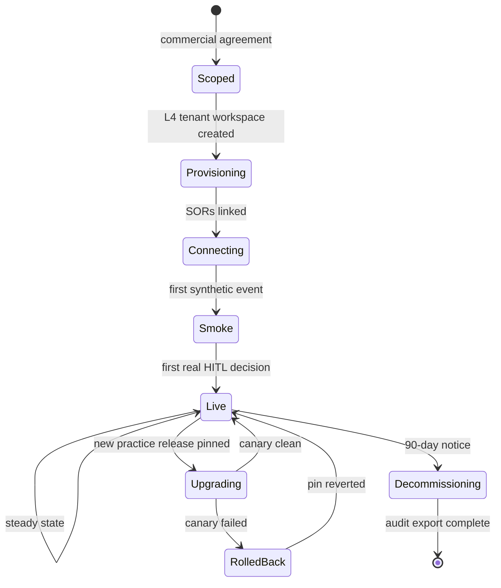

# Companion 07 — Service Catalog

**APEX Core v1.2 · Developer Guide v1.0 · 2026-04-18**

> **Parent:** [`APEX-developer-guide.md`](../APEX-developer-guide.md) · **Previous:** [06 Testing & Topology](./06-testing-topology.md)

---

## TL;DR

APEX is delivered as **subscribable services**, not as a framework. Each service is one packaged SKU: a scenario + primary persona + KPIs + SLOs + an artifact bundle (schemas + agents + MCP tools + orchestration + HITL gate) + prerequisites + commercial terms. This catalogue holds **24 services across four practices** (RC 8, HLS 6, ER 5, AXLE 5). Every entry is authored to a consistent template; every entry maps to a `service-manifest.json` that will be machine-validated by `validate-service-manifest.js`. Clients don't subscribe to "APEX" — they subscribe to services.

**What you'll leave with:**
- Service taxonomy, tiers, lifecycle states
- How a service composes the technical artifacts described in Companions 02–04
- The persona + KPI model
- The full 24-service catalogue in a consistent format
- Composition patterns (bundles, custom mixes)
- Subscription lifecycle and commercial model placeholders

---

## 1. Service taxonomy

### 1.1 Naming

```
APEX-<practice>-<domain>-<nn>
  │       │         │      │
  │       │         │      └── sequence number in that domain
  │       │         └── 2-4 letter domain abbreviation
  │       └── RC | HLS | ER | AXLE | TMT | TH | ICE
  └── constant
```

Examples: `APEX-RC-CXP-01` (Cold Chain Response), `APEX-HLS-SEP-02` (Sepsis Early Warning), `APEX-ER-GRD-02` (Grid Anomaly Response).

### 1.2 Tiers

| Tier | Who it's for | Support | Bundled options |
|---|---|---|---|
| **Essentials** | Pilot / single-site | 9×5 via portal | Core artifacts only |
| **Pro** | Multi-site operations | 24×5 · 4h P1 SLA | Core artifacts + a dedicated CSM shared across the customer's services |
| **Enterprise** | Full enterprise rollout | 24×7 · 1h P1 SLA | All of the above + dedicated CSM + custom SLAs + named technical account manager |

### 1.3 Lifecycle states

- **Preview** — publicly listed but under-evolution; no SLA, pricing is at-cost
- **GA** — stable, SLO-committed, tiered pricing
- **Deprecated** — no new subscriptions; existing subscribers have 18 months to migrate

---

## 2. Service anatomy

Every service is the same shape:

```
SERVICE ID / NAME / TIER / STATUS
  ├── SCENARIO        trigger · business pain · cadence
  ├── PERSONAS        primary · secondary · consumer
  ├── KPIs            outcome metrics with targets and direction
  ├── SLOs            detection p95 · decision p95 · false-positive rate · availability
  ├── ARTIFACTS       schemas · agents · MCP tools · orchestration · HITL gate
  ├── PREREQUISITES   practice min version · SOR connections · Fabric capacity · identity groups
  └── COMMERCIAL      subscription model · support tier · onboarding days
```

The **`service-manifest.json`** contract formalises this shape. See `apex-core/data/service-manifest-contract.json` for the JSON-schema (when implemented in Phase 1).

### 2.1 The persona catalogue

Personas are catalogued at `apex-core/data/persona-catalog.json` (master list below). Every service's personas field references persona IDs:

| ID | Name | Practices |
|---|---|---|
| `store-mod` | Store Manager on Duty | RC |
| `regional-ops-director` | Regional Operations Director | RC |
| `compliance-officer` | Compliance Officer | RC · HLS · ER |
| `merchandising-analyst` | Merchandising Analyst | RC |
| `loss-prevention-lead` | Loss Prevention Lead | RC |
| `customer-care-agent` | Customer Care Agent | RC · HLS · ER |
| `charge-nurse` | Charge Nurse | HLS |
| `clinical-informaticist` | Clinical Informaticist | HLS |
| `revenue-cycle-analyst` | Revenue Cycle Analyst | HLS |
| `supply-chain-pharm` | Pharmacy Supply Lead | HLS |
| `trial-coordinator` | Clinical Trial Coordinator | HLS |
| `patient-safety-officer` | Patient Safety Officer | HLS |
| `grid-ops-engineer` | Grid Operations Engineer | ER |
| `field-dispatcher` | Field Dispatcher | ER |
| `meter-ops-lead` | Meter Operations Lead | ER |
| `billing-ops-analyst` | Billing Operations Analyst | ER |
| `regulatory-affairs` | Regulatory Affairs Officer | ER · HLS |
| `plant-supervisor` | Plant Floor Supervisor | AXLE |
| `quality-engineer` | Quality Engineer | AXLE |
| `supply-chain-planner` | Supply Chain Planner | AXLE · RC |
| `plant-manager` | Plant Manager | AXLE |
| `recall-coordinator` | Recall Coordinator | AXLE · RC · HLS |

### 2.2 KPI model

KPIs have four fields: `id`, `target`, `direction` (maximize/minimize), and an implicit business meaning. Common IDs across the catalogue:

- `writeoff_avoided_pct`, `time_to_brief_min`, `manager_touch_sec` (RC)
- `length_of_stay_hours`, `readmission_pct`, `denial_recovery_usd` (HLS)
- `outage_minutes`, `revenue_leakage_usd`, `dispatch_time_min` (ER)
- `line_down_minutes`, `scrap_pct`, `yield_pct`, `oee_pct` (AXLE)

---

## 3. RC Practice — 8 services

### `APEX-RC-CXP-01` — Cold Chain Excursion Response
**Tier:** Pro / Enterprise · **Status:** GA v1.2
- **Scenario** — refrigeration unit breaches threshold > 2h; write-offs delay, compliance risk; continuous cadence
- **Personas** — primary: Store MOD · secondary: Regional Ops Director
- **KPIs** — `writeoff_avoided_pct` ≥ 65 % · `time_to_brief_min` ≤ 10 · `manager_touch_sec` ≤ 90
- **SLOs** — detection p95 ≤ 60s · decision p95 ≤ 8 min · FPR ≤ 3 % · availability 99.5 %
- **Artifacts** — SCML.COLD_CHAIN_TELEMETRY, SCML.TEMPERATURE_EXCURSION, MERML.STORE_INVENTORY_POSITION; SCM-A04, SCM-A05, SCM-A06; fabric-mcp, fda-mcp, ledger-mcp; ORCH-03; HITL gate
- **Prereqs** — RC Practice ≥ 1.2.0 · SORs: monnit-iot, manhattan-wms · F8 min · `store-mod` identity group
- **Commercial** — per-store-year + per-excursion · 14d onboarding · Pro / Enterprise

### `APEX-RC-RVD-02` — Receiving Variance Dispute
**Tier:** Essentials / Pro / Enterprise · **Status:** GA v1.2
- **Scenario** — RFID/UHF portal reads short of ASN; vendor disputes drift for weeks; episodic (per receipt)
- **Personas** — primary: Store MOD · secondary: Merchandising Analyst
- **KPIs** — `variance_recovered_pct` ≥ 70 % · `days_to_dispute_closure` ≤ 5 · `manager_touch_sec` ≤ 60
- **SLOs** — detection p95 ≤ 120s · decision p95 ≤ 5 min · FPR ≤ 2 % · availability 99.5 %
- **Artifacts** — SCML.ASN, SCML.STORE_RECEIVING_EVENT, SCML.RECEIVING_DISCREPANCY, SCML.DSD_INVOICE; SCM-A01, SCM-A02, MER-A01; fabric-mcp, edi-mcp, ledger-mcp; ORCH-02; ACK_ONLY gate
- **Prereqs** — RC ≥ 1.2.0 · SORs: manhattan-wms, EDI-856 · F8 · `store-mod` group
- **Commercial** — per-store-year + per-dispute · 10d · Essentials+

### `APEX-RC-ESL-03` — ESL Pricing Integrity
**Tier:** Pro / Enterprise · **Status:** GA v1.2
- **Scenario** — electronic shelf label stale vs. ERP schedule; customers ring incorrect price; continuous
- **Personas** — primary: Merchandising Analyst · secondary: Store MOD
- **KPIs** — `stale_tag_count_reduction_pct` ≥ 80 % · `pricing_complaints_pct` ≤ 0.1 % · `time_to_remediate_min` ≤ 30
- **SLOs** — detection p95 ≤ 120s · decision p95 ≤ 3 min · FPR ≤ 1 % · availability 99.5 %
- **Artifacts** — MERML.PRICE_RECORD, MERML.PRICE_TAG_STATUS, MERML.PROMOTION_ACTIVATION; MER-A02, MER-A03; fabric-mcp, esl-mcp; ORCH-04; ACK_ONLY gate
- **Prereqs** — RC ≥ 1.2.0 · SORs: ESL gateway, POS, ERP-Price · F16 · `merchandising-analyst` group
- **Commercial** — per-store-year · 12d · Pro / Enterprise

### `APEX-RC-OSA-04` — Phantom-OOS Detection
**Tier:** Pro / Enterprise · **Status:** GA v1.2
- **Scenario** — shelves empty while perpetual inventory shows stock; walk-away revenue loss; continuous
- **Personas** — primary: Store MOD · secondary: Merchandising Analyst
- **KPIs** — `phantom_oos_caught_pct` ≥ 90 % · `walk_away_revenue_avoided_usd` maximise · `time_to_restock_min` ≤ 35
- **SLOs** — detection p95 ≤ 180s · decision p95 ≤ 5 min · FPR ≤ 4 % · availability 99.5 %
- **Artifacts** — MERML.OSA_EVENT, MERML.STORE_INVENTORY_POSITION, MERML.PRICE_RECORD; MER-A04, MER-A05; fabric-mcp, cv-mcp; ORCH-05; ACK_ONLY gate
- **Prereqs** — RC ≥ 1.2.0 · SORs: POS, manhattan-wms, CV pipeline · F16 · `store-mod` group
- **Commercial** — per-store-year + per-event · 18d · Pro / Enterprise

### `APEX-RC-RCL-05` — Recall Response
**Tier:** Enterprise · **Status:** GA v1.2
- **Scenario** — FDA / USDA / vendor recall issued; affected stores, lots, and customers identified; episodic (rare, high-stakes)
- **Personas** — primary: Compliance Officer · secondary: Store MOD, Customer Care Agent
- **KPIs** — `affected_customers_contacted_pct` ≥ 98 % · `time_to_contain_hours` ≤ 4 · `regulatory_reporting_complete_hours` ≤ 24
- **SLOs** — detection p95 ≤ 300s (from feed) · decision p95 ≤ 20 min · FPR ≤ 0.5 % · availability 99.9 %
- **Artifacts** — SCML.RECALL_NOTICE, SCML.LOT_TRACE, CXML.LOYALTY_STATE; SCM-A01, SCM-A02, MER-A11, MER-A12, CX-A01; fabric-mcp, fda-mcp, cxml-mcp, comms-mcp; ORCH-07; ESCALATION gate
- **Prereqs** — RC ≥ 1.2.0 · SORs: FDA recall feed, manhattan-wms, POS · F32 · `compliance-officer` group
- **Commercial** — Enterprise flat + per-recall event · 30d · Enterprise only

### `APEX-RC-BPX-06` — BOPIS Exception Handling
**Tier:** Pro / Enterprise · **Status:** GA v1.2
- **Scenario** — BOPIS order item OOS at pick time; substitute, cancel, or wait; episodic per order
- **Personas** — primary: Customer Care Agent · secondary: Store MOD
- **KPIs** — `substitution_acceptance_pct` ≥ 70 % · `order_cancel_pct` ≤ 8 % · `customer_response_sec` ≤ 120
- **SLOs** — detection p95 ≤ 30s · decision p95 ≤ 3 min · FPR ≤ 2 % · availability 99.5 %
- **Artifacts** — CXML.FULFILLMENT_ORDER, CXML.PICK_EXCEPTION, CXML.SUBSTITUTION_EVENT; CX-A03, CX-A04; cxml-mcp, comms-mcp; ORCH-06; HITL gate (customer-facing)
- **Prereqs** — RC ≥ 1.2.0 · SORs: OMS, POS · F16 · `customer-care-agent` group
- **Commercial** — per-store-year + per-exception · 12d · Pro / Enterprise

### `APEX-RC-SHK-07` — Shrink & Void Anomaly
**Tier:** Enterprise · **Status:** GA v1.2
- **Scenario** — correlated void / return / CCTV patterns suggesting internal shrink; episodic
- **Personas** — primary: Loss Prevention Lead · secondary: Compliance Officer
- **KPIs** — `shrink_events_evidence_sealed_pct` ≥ 85 % · `false_accusation_rate_pct` ≤ 1 % · `time_to_case_file_hours` ≤ 24
- **SLOs** — detection p95 ≤ 600s · decision p95 ≤ 30 min · FPR ≤ 1 % · availability 99.5 %
- **Artifacts** — MERML.POS_VOID, MERML.SHRINK_EVENT, MERML.CYCLE_COUNT_VARIANCE; MER-A10, MER-A11, MER-A12 (reasoning-tier); fabric-mcp, cctv-ref-mcp, ledger-mcp; ORCH-08; ESCALATION gate (to Loss Prevention)
- **Prereqs** — RC ≥ 1.2.0 · SORs: POS, CCTV metadata, cycle-count export · F32 · `loss-prevention-lead` group
- **Commercial** — Enterprise flat · 45d (HR + legal review) · Enterprise only

### `APEX-RC-CXI-08` — Customer Incident Triage
**Tier:** Pro / Enterprise · **Status:** GA v1.2
- **Scenario** — customer-reported food-safety or product-safety incident; cross-store correlation; episodic
- **Personas** — primary: Customer Care Agent · secondary: Store MOD, Compliance Officer
- **KPIs** — `tier1_response_min` ≤ 15 · `cross_store_correlation_caught_pct` ≥ 95 % · `regulatory_escalation_accuracy_pct` ≥ 99 %
- **SLOs** — detection p95 ≤ 60s (from portal) · decision p95 ≤ 10 min · FPR ≤ 2 % · availability 99.5 %
- **Artifacts** — CXML.CUSTOMER_INCIDENT, SCML.LOT_TRACE, CXML.LOYALTY_STATE; CX-A01, CX-A02, SCM-A02; cxml-mcp, fda-mcp, ledger-mcp; ORCH-09; HITL gate (with ESCALATION escalator)
- **Prereqs** — RC ≥ 1.2.0 · SORs: incident portal, POS, CCTV metadata · F16 · `customer-care-agent` group
- **Commercial** — per-store-year + per-incident · 15d · Pro / Enterprise

---

## 4. HLS Practice — 6 services

### `APEX-HLS-DSR-01` — Discharge Ready Surveillance
**Tier:** Pro / Enterprise · **Status:** GA v1.2
- **Scenario** — predict discharge readiness 24h ahead; capacity planning, transport coordination; continuous
- **Personas** — primary: Charge Nurse · secondary: Clinical Informaticist
- **KPIs** — `discharge_prediction_accuracy_pct` ≥ 85 % · `los_reduction_hours` maximise · `readmission_pct` ≤ 8 %
- **SLOs** — detection p95 ≤ 300s · decision p95 ≤ 20 min · FPR ≤ 10 % · availability 99.9 %
- **Artifacts** — HLSCML.PATIENT_ENCOUNTER, HLSCML.CLINICAL_OBSERVATION, HLSCML.CARE_PLAN; HLS-A01, HLS-A02; hlscml-mcp, fhir-mcp; ORCH-10; ACK_ONLY gate
- **Prereqs** — HLS ≥ 1.2.0 · SORs: Epic EHR (CDC + ADT stream) · F32 · `charge-nurse` group · HIPAA
- **Commercial** — per-bed-year + per-discharge · 60d (EHR integration) · Pro / Enterprise

### `APEX-HLS-SEP-02` — Sepsis Early Warning
**Tier:** Enterprise · **Status:** GA v1.2
- **Scenario** — vitals + labs triangulation triggers sepsis-risk alert 4-6h ahead of clinical recognition; continuous
- **Personas** — primary: Charge Nurse · secondary: Clinical Informaticist, Patient Safety Officer
- **KPIs** — `sepsis_early_detection_hours` maximise (target 4+) · `FPR` ≤ 8 % · `sensitivity_pct` ≥ 90 %
- **SLOs** — detection p95 ≤ 180s · decision p95 ≤ 5 min · FPR ≤ 8 % · availability 99.95 %
- **Artifacts** — HLSCML.VITALS, HLSCML.LAB_RESULT, HLSCML.PATIENT_ENCOUNTER; HLS-A03, HLS-A04 (reasoning-tier); hlscml-mcp, fhir-mcp; ORCH-11; HITL gate
- **Prereqs** — HLS ≥ 1.2.0 · SORs: Epic ADT + FHIR + labs · F32 · `charge-nurse` group · HIPAA · FDA 21 CFR Part 11
- **Commercial** — Enterprise flat per unit + per-alert · 90d · Enterprise only

### `APEX-HLS-RVC-03` — Revenue-Cycle Denial Recovery
**Tier:** Pro / Enterprise · **Status:** GA v1.2
- **Scenario** — insurance denial received; root cause classified; appeal drafted with evidence; episodic
- **Personas** — primary: Revenue Cycle Analyst · secondary: Compliance Officer
- **KPIs** — `denial_recovery_usd` maximise · `appeal_acceptance_pct` ≥ 55 % · `days_to_appeal` ≤ 10
- **SLOs** — detection p95 ≤ 600s · decision p95 ≤ 60 min · FPR ≤ 3 % · availability 99.5 %
- **Artifacts** — HLSCML.CLAIM_DENIAL, HLSCML.PATIENT_ENCOUNTER, HLSCML.CODING_RECORD; HLS-A05, HLS-A06; hlscml-mcp, rev-cycle-mcp; ORCH-12; HITL gate
- **Prereqs** — HLS ≥ 1.2.0 · SORs: 837/835 feed, EHR coding · F16 · `revenue-cycle-analyst` group · HIPAA · SOX
- **Commercial** — per-provider-year + % of recovered · 45d · Pro / Enterprise

### `APEX-HLS-SUP-04` — Supply Expiry Management
**Tier:** Pro / Enterprise · **Status:** GA v1.2
- **Scenario** — medications and supplies approaching expiry; reallocation, disposal, or recall triage; continuous
- **Personas** — primary: Pharmacy Supply Lead · secondary: Supply Chain Planner
- **KPIs** — `expiry_waste_reduction_pct` ≥ 40 % · `supply_unavailability_events` minimise · `recall_containment_hours` ≤ 2
- **SLOs** — detection p95 ≤ 1800s · decision p95 ≤ 60 min · FPR ≤ 2 % · availability 99.5 %
- **Artifacts** — SCML.LOT_EXPIRATION_STATE, SCML.RECALL_NOTICE, SCML.STORE_INVENTORY_POSITION; SCM-A07, SCM-A08; fabric-mcp, fda-mcp, pharma-recall-mcp; ORCH-13; ACK_ONLY gate (HITL if recall)
- **Prereqs** — HLS ≥ 1.2.0 · SORs: pharmacy inventory system, FDA + pharma recall feeds · F16 · `supply-chain-pharm` group · HIPAA
- **Commercial** — per-hospital-year + per-expiry-event · 30d · Pro / Enterprise

### `APEX-HLS-CTM-05` — Clinical Trial Matching
**Tier:** Pro / Enterprise · **Status:** GA v1.2
- **Scenario** — new patient or changed diagnosis — match against open trials; coordinator notified; episodic
- **Personas** — primary: Clinical Trial Coordinator · secondary: Clinical Informaticist
- **KPIs** — `trial_enrolment_rate_pct` ≥ 15 % · `match_precision_pct` ≥ 90 % · `time_to_outreach_hours` ≤ 48
- **SLOs** — detection p95 ≤ 3600s · decision p95 ≤ 240 min · FPR ≤ 5 % · availability 99.5 %
- **Artifacts** — HLSCML.PATIENT_ENCOUNTER, HLSCML.TRIAL_PROTOCOL, HLSCML.ELIGIBILITY_CRITERIA; HLS-A07 (reasoning-tier); hlscml-mcp, trials-registry-mcp; ORCH-14; HITL gate
- **Prereqs** — HLS ≥ 1.2.0 · SORs: EHR, trials registry · F32 · `trial-coordinator` group · HIPAA
- **Commercial** — per-trial-year + per-match · 60d · Pro / Enterprise

### `APEX-HLS-PSI-06` — Patient Safety Incident
**Tier:** Enterprise · **Status:** GA v1.2
- **Scenario** — near-miss or incident reported; severity triaged; regulatory reporting prepared; episodic
- **Personas** — primary: Patient Safety Officer · secondary: Compliance Officer, Charge Nurse
- **KPIs** — `severe_incident_detection_pct` ≥ 99 % · `regulatory_report_on_time_pct` ≥ 100 % · `time_to_classification_hours` ≤ 4
- **SLOs** — detection p95 ≤ 120s · decision p95 ≤ 60 min · FPR ≤ 2 % · availability 99.9 %
- **Artifacts** — HLSCML.PATIENT_SAFETY_EVENT, HLSCML.INCIDENT_CLASSIFICATION; HLS-A08, HLS-A09; hlscml-mcp, regulatory-mcp; ORCH-15; ESCALATION gate
- **Prereqs** — HLS ≥ 1.2.0 · SORs: incident reporting system, EHR · F16 · `patient-safety-officer` group · HIPAA · FDA 21 CFR Part 11
- **Commercial** — Enterprise flat · 45d · Enterprise only

---

## 5. ER Practice — 5 services

### `APEX-ER-MTR-01` — Meter Outage Detection
**Tier:** Pro / Enterprise · **Status:** GA v1.2
- **Scenario** — AMI meter reads missing or zero for a continuous window; outage vs. meter fault vs. tamper; continuous
- **Personas** — primary: Meter Operations Lead · secondary: Field Dispatcher
- **KPIs** — `outage_detection_accuracy_pct` ≥ 95 % · `false_outage_pct` ≤ 2 % · `time_to_dispatch_min` ≤ 15
- **SLOs** — detection p95 ≤ 600s · decision p95 ≤ 15 min · FPR ≤ 2 % · availability 99.9 %
- **Artifacts** — ERCML.METER_READING, ERCML.OUTAGE_EVENT; ER-A01, ER-A02; ercml-mcp, ami-mcp; ORCH-16; ACK_ONLY gate
- **Prereqs** — ER ≥ 1.2.0 · SORs: SAP ISU, AMI head-end · F16 · `meter-ops-lead` group · SOX
- **Commercial** — per-meter-year + per-outage · 30d · Pro / Enterprise

### `APEX-ER-GRD-02` — Grid Anomaly Response
**Tier:** Enterprise · **Status:** GA v1.2
- **Scenario** — SCADA anomaly signal; classify cause, bound affected customers, recommend operator action; continuous
- **Personas** — primary: Grid Operations Engineer · secondary: Regulatory Affairs
- **KPIs** — `anomaly_classification_accuracy_pct` ≥ 90 % · `customer_minutes_interrupted_pct` minimise · `FERC_report_on_time_pct` ≥ 100 %
- **SLOs** — detection p95 ≤ 30s · decision p95 ≤ 5 min · FPR ≤ 3 % · availability 99.99 %
- **Artifacts** — ERCML.GRID_ANOMALY, ERCML.CUSTOMER_SERVICE_STATE, ERCML.SCADA_TELEMETRY; ER-A03, ER-A04 (reasoning); ercml-mcp, scada-mcp, ferc-mcp; ORCH-17; HITL gate (with ESCALATION for large events)
- **Prereqs** — ER ≥ 1.2.0 · SORs: SCADA, OMS, DMS · F32 · `grid-ops-engineer` group · SOX · FERC
- **Commercial** — Enterprise flat + per-customer-year · 90d · Enterprise only

### `APEX-ER-BIL-03` — Billing Exception Handling
**Tier:** Pro / Enterprise · **Status:** GA v1.2
- **Scenario** — billing anomaly (usage spike, negative read, rate-class mismatch); classify and route; episodic
- **Personas** — primary: Billing Operations Analyst · secondary: Customer Care Agent
- **KPIs** — `exception_auto_resolved_pct` ≥ 60 % · `customer_complaint_rate_pct` ≤ 0.5 % · `time_to_resolution_days` ≤ 3
- **SLOs** — detection p95 ≤ 3600s · decision p95 ≤ 120 min · FPR ≤ 2 % · availability 99.5 %
- **Artifacts** — ERCML.BILLING_EXCEPTION, ERCML.METER_READING, ERCML.RATE_SCHEDULE; ER-A05, ER-A06; ercml-mcp, billing-mcp; ORCH-18; ACK_ONLY gate
- **Prereqs** — ER ≥ 1.2.0 · SORs: SAP ISU, CIS · F16 · `billing-ops-analyst` group · SOX
- **Commercial** — per-customer-year + per-exception · 30d · Pro / Enterprise

### `APEX-ER-FWO-04` — Field Work-Order Optimisation
**Tier:** Pro / Enterprise · **Status:** GA v1.2
- **Scenario** — field crew dispatch optimisation (outage, reconnect, planned work); continuous (tactical)
- **Personas** — primary: Field Dispatcher · secondary: Meter Operations Lead
- **KPIs** — `first_time_fix_rate_pct` ≥ 80 % · `travel_time_reduction_pct` ≥ 15 % · `same_day_completion_pct` ≥ 70 %
- **SLOs** — detection p95 ≤ 120s · decision p95 ≤ 10 min · FPR ≤ 5 % · availability 99.5 %
- **Artifacts** — ERCML.WORK_ORDER, ERCML.CREW_STATE, ERCML.ASSET_HEALTH; ER-A07, ER-A08; ercml-mcp, field-service-mcp; ORCH-19; ACK_ONLY gate (auto-dispatch)
- **Prereqs** — ER ≥ 1.2.0 · SORs: MS Field Service, GIS, SAP PM · F16 · `field-dispatcher` group
- **Commercial** — per-crew-year + per-dispatch · 30d · Pro / Enterprise

### `APEX-ER-REG-05` — Regulatory Event Response
**Tier:** Enterprise · **Status:** GA v1.2
- **Scenario** — FERC / state-PUC regulatory event (reliability, rate case); prepare response; episodic
- **Personas** — primary: Regulatory Affairs · secondary: Compliance Officer
- **KPIs** — `filing_on_time_pct` ≥ 100 % · `data_accuracy_pct` ≥ 99.9 % · `regulatory_penalty_avoided_usd` maximise
- **SLOs** — detection p95 ≤ 1800s · decision p95 ≤ 240 min · FPR ≤ 1 % · availability 99.5 %
- **Artifacts** — ERCML.REGULATORY_EVENT, ERCML.RELIABILITY_METRIC; ER-A09, ER-A10; ercml-mcp, ferc-mcp; ORCH-20; ESCALATION gate
- **Prereqs** — ER ≥ 1.2.0 · SORs: FERC feed, state PUC portals, internal reliability data · F16 · `regulatory-affairs` group · SOX · FERC
- **Commercial** — Enterprise flat · 60d · Enterprise only

---

## 6. AXLE Practice — 5 services

### `APEX-AXLE-LDT-01` — Line-Down Triage
**Tier:** Pro / Enterprise · **Status:** GA v1.2
- **Scenario** — production line halted; classify cause (mechanical, material, quality, operator); continuous
- **Personas** — primary: Plant Floor Supervisor · secondary: Plant Manager
- **KPIs** — `line_down_minutes` minimise · `triage_accuracy_pct` ≥ 90 % · `mean_time_to_diagnose_min` ≤ 10
- **SLOs** — detection p95 ≤ 60s · decision p95 ≤ 8 min · FPR ≤ 4 % · availability 99.9 %
- **Artifacts** — AXLECML.PRODUCTION_EVENT, AXLECML.ASSET_HEALTH, AXLECML.MATERIAL_FLOW; AXLE-A01, AXLE-A02; axlecml-mcp, plex-mcp; ORCH-21; HITL gate
- **Prereqs** — AXLE ≥ 1.2.0 · SORs: Plex MES, SAP PM, MES · F32 · `plant-supervisor` group · SOX
- **Commercial** — per-line-year + per-event · 45d · Pro / Enterprise

### `APEX-AXLE-QEX-02` — Quality Excursion Response
**Tier:** Enterprise · **Status:** GA v1.2
- **Scenario** — SPC chart excursion, genealogy tracing, containment decision; continuous + episodic
- **Personas** — primary: Quality Engineer · secondary: Plant Supervisor, Recall Coordinator
- **KPIs** — `containment_success_pct` ≥ 95 % · `escape_rate_pct` ≤ 0.1 % · `time_to_containment_min` ≤ 60
- **SLOs** — detection p95 ≤ 120s · decision p95 ≤ 30 min · FPR ≤ 2 % · availability 99.9 %
- **Artifacts** — AXLECML.QUALITY_EXCURSION, AXLECML.GENEALOGY, AXLECML.PRODUCT_LOT; AXLE-A03, AXLE-A04; axlecml-mcp, sap-qm-mcp; ORCH-22; HITL gate (ESCALATION for recalls)
- **Prereqs** — AXLE ≥ 1.2.0 · SORs: Plex, SAP QM, LIMS · F32 · `quality-engineer` group · SOX
- **Commercial** — per-plant-year + per-event · 60d · Enterprise

### `APEX-AXLE-SCD-03` — Supply-Chain Disruption
**Tier:** Pro / Enterprise · **Status:** GA v1.2
- **Scenario** — supplier-side delay, shortage, or quality hold; reschedule, source alternate, expedite; episodic
- **Personas** — primary: Supply Chain Planner · secondary: Plant Manager
- **KPIs** — `order_fulfilment_on_time_pct` ≥ 95 % · `expedite_cost_reduction_pct` ≥ 20 % · `stockout_events` minimise
- **SLOs** — detection p95 ≤ 3600s · decision p95 ≤ 240 min · FPR ≤ 3 % · availability 99.5 %
- **Artifacts** — AXLECML.SUPPLIER_EVENT, AXLECML.PURCHASE_ORDER, AXLECML.INVENTORY_POSITION; AXLE-A05, AXLE-A06; axlecml-mcp, supplier-portal-mcp, edi-mcp; ORCH-23; ACK_ONLY gate
- **Prereqs** — AXLE ≥ 1.2.0 · SORs: SAP SCM, supplier portals, EDI · F16 · `supply-chain-planner` group
- **Commercial** — per-plant-year + per-disruption · 45d · Pro / Enterprise

### `APEX-AXLE-RCL-04` — Recall Traceability
**Tier:** Enterprise · **Status:** GA v1.2
- **Scenario** — field quality issue requiring product recall; full forward/backward genealogy; episodic (rare, high-stakes)
- **Personas** — primary: Recall Coordinator · secondary: Quality Engineer, Plant Manager
- **KPIs** — `affected_units_identified_pct` ≥ 99 % · `time_to_notice_hours` ≤ 8 · `regulatory_compliance_pct` ≥ 100 %
- **SLOs** — detection p95 ≤ 300s · decision p95 ≤ 240 min · FPR ≤ 0.5 % · availability 99.9 %
- **Artifacts** — AXLECML.RECALL_NOTICE, AXLECML.GENEALOGY, AXLECML.SHIPMENT; AXLE-A07, AXLE-A08 (reasoning); axlecml-mcp, sap-qm-mcp, nhtsa-mcp; ORCH-24; ESCALATION gate
- **Prereqs** — AXLE ≥ 1.2.0 · SORs: Plex, SAP QM, shipment tracking, NHTSA/regulator feeds · F32 · `recall-coordinator` group · SOX · FDA (if food/pharma)
- **Commercial** — Enterprise flat + per-recall · 90d · Enterprise only

### `APEX-AXLE-KPI-05` — Plant KPI Drift
**Tier:** Pro / Enterprise · **Status:** GA v1.2
- **Scenario** — OEE, yield, scrap, or downtime metrics drifting from target; root-cause hypotheses generated; continuous
- **Personas** — primary: Plant Manager · secondary: Plant Supervisor
- **KPIs** — `oee_improvement_pct` maximise · `drift_detected_pct` ≥ 90 % · `false_alarm_rate_pct` ≤ 5 %
- **SLOs** — detection p95 ≤ 1800s · decision p95 ≤ 60 min · FPR ≤ 5 % · availability 99.5 %
- **Artifacts** — AXLECML.PRODUCTION_EVENT, AXLECML.KPI_SNAPSHOT, AXLECML.ASSET_HEALTH; AXLE-A09, AXLE-A10 (reasoning-tier); axlecml-mcp, plex-mcp; ORCH-25; ACK_ONLY gate
- **Prereqs** — AXLE ≥ 1.2.0 · SORs: Plex, SAP, historian · F16 · `plant-manager` group
- **Commercial** — per-plant-year · 30d · Pro / Enterprise

---

## 7. Composition & bundles

Clients can subscribe to services individually or to pre-built bundles:

| Bundle | Services | Target |
|---|---|---|
| **Store Operations Essentials** | RC-CXP-01, RC-RVD-02, RC-ESL-03, RC-BPX-06 | Mid-market grocers |
| **Store Operations Pro** | All 8 RC services | Full-line retailers |
| **Cold Chain + Compliance** | RC-CXP-01, RC-RCL-05, HLS-SUP-04 | Grocers with pharmacy |
| **Clinical Operations Pro** | HLS-DSR-01, HLS-SEP-02, HLS-PSI-06 | Mid-size hospitals |
| **Revenue Protection** | HLS-RVC-03, RC-SHK-07 | Health systems + chains combined |
| **Grid & Field Pro** | ER-MTR-01, ER-GRD-02, ER-FWO-04 | IOUs and co-ops |
| **Plant-Floor Pro** | All 5 AXLE services | Manufacturing enterprises |

Custom compositions are supported — a client picks any mix, pays per-service, and APEX provisions the union of prerequisites.

---

## 8. Subscription lifecycle



### 8.1 Version upgrades

When the practice releases a new version:
- Tenant's `auto_upgrade_policy` determines gate kind (MAJOR→HITL by default)
- If HITL, tenant's designated approver gets a summary card in Teams
- Canary takes 5 % of traffic for 72h; auto-rollback on SLO burn
- Decision audit logs are stamped with the practice version that produced them

### 8.2 Decommissioning

- 90-day notice; 30-day audit-log export period at end
- Data retention per regulation (7y HLS/ER SOX, 5y RC/AXLE default, longer per contract)
- Customer-managed keys retained in customer keyvault post-decommission

---

## 9. Commercial model placeholders

**Pattern only — actual pricing is contract-specific.**

| Element | Shape |
|---|---|
| **Base fee** | Per-<unit>-per-year (per-store, per-bed, per-meter, per-line) |
| **Usage fee** | Per-invocation / per-excursion / per-recall / per-dispute |
| **Volume tiers** | Standard discounts at 10, 50, 250, 1000 units |
| **Minimum term** | Annual for Essentials/Pro; 3-year for Enterprise |
| **Support** | Essentials 9×5 portal · Pro 24×5 + CSM (shared) · Enterprise 24×7 + TAM |
| **SLA credits** | Per-service SLO miss → 10–25 % of monthly fee, capped at 50 % |

---

## 10. Worked example — subscribing to "Cold Chain + Receiving Variance"

**Client:** regional grocer, 42 stores, existing Manhattan WMS and Monnit IoT fleet.
**Services chosen:** `APEX-RC-CXP-01` + `APEX-RC-RVD-02`.
**Target personas:** Store MOD (primary in both), Regional Ops Director (shared).

### What gets provisioned

1. **L4 tenant workspaces** — apex-acct-xxxxxx-001-tenant-{dev,test,prod}
2. **Bronze ingest** — Monnit IoT Eventstream + Manhattan WMS Mirrored Database
3. **Silver canonical tables** — SCML.COLD_CHAIN_TELEMETRY, SCML.TEMPERATURE_EXCURSION, SCML.ASN, SCML.STORE_RECEIVING_EVENT, SCML.RECEIVING_DISCREPANCY, SCML.DSD_INVOICE, MERML.STORE_INVENTORY_POSITION
4. **Gold feature views** — gold_cold_chain_state_v1, gold_receiving_reconciliation_v1
5. **Agents** — SCM-A04, SCM-A05, SCM-A06 (cold chain); SCM-A01, SCM-A02, MER-A01 (receiving)
6. **MCP servers** — fabric-mcp, fda-mcp, edi-mcp, ledger-mcp
7. **Orchestrations** — ORCH-02 (receiving), ORCH-03 (cold chain)
8. **HITL gates** — HITL + ACK_ONLY, bound to `store-mod` AAD group
9. **Dashboards** — Azure Monitor workbook per tenant with the 5 panels

### First 30-day playbook

| Day | Activity |
|---|---|
| 1–3 | Provision workspaces, connect SORs, run smoke tests |
| 4–7 | Load 7 days of replayed (anonymised) data; verify Silver shape |
| 8–14 | Run ORCH-02 and ORCH-03 in shadow mode (decisions logged, not acted) |
| 15–21 | Calibrate false-positive rate; tune HITL card thresholds |
| 22–30 | First live HITL decisions; monitor SLOs; weekly review with Store MOD + Regional Ops |

By day 30, the client is live on both services with measurable baseline KPIs.

---

*End of the Service Catalogue. Companion 07 is the commercial face of APEX — treat every new scenario as a candidate service and author the manifest first.*
